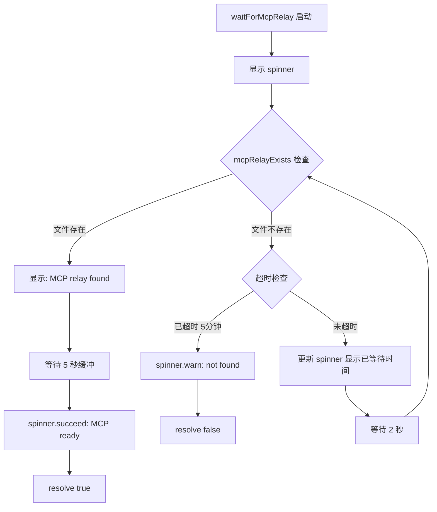
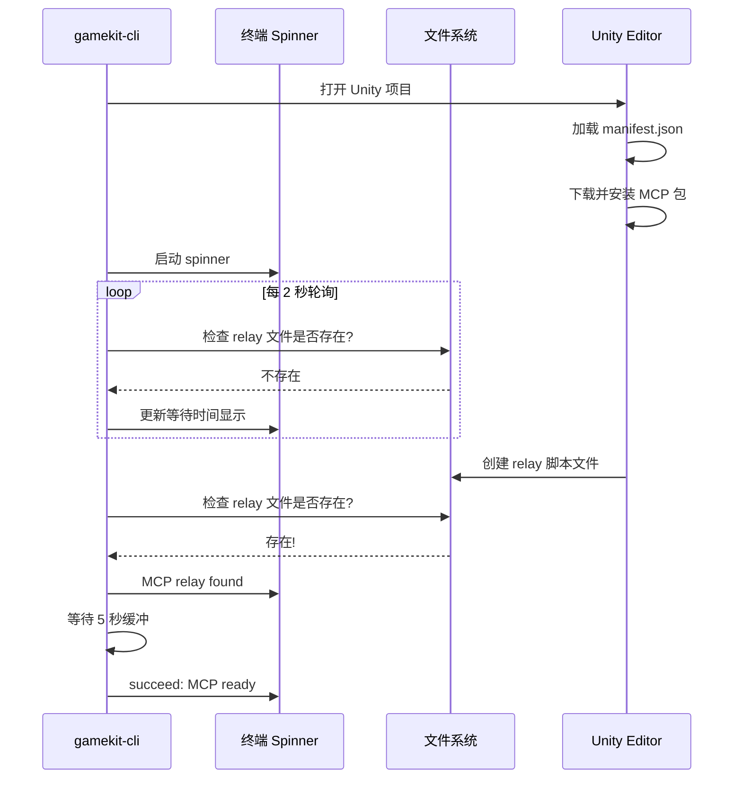

# MCP 包安装等待逻辑分析

## 概述

本文档分析 gamekit-cli 中 "Waiting for Unity to install MCP package" 的完整实现逻辑。该功能用于在 Unity 项目初始化后，等待 Unity 自动安装 MCP 包并确认 MCP relay 服务就绪。

---

## 目录

1. [流程图](#流程图)
2. [核心代码文件](#核心代码文件)
3. [函数详解](#函数详解)
4. [MCP Relay 路径配置](#mcp-relay-路径配置)
5. [调用时机](#调用时机)
6. [工作原理](#工作原理)

---

## 流程图

### 整体等待流程



### 时序图



---

## 核心代码文件

### 文件结构

```
src/
├── commands/
│   └── init.ts          # 调用入口
└── utils/
    ├── mcp.ts           # 核心等待逻辑
    └── platform.ts      # 平台相关路径配置
```

---

## 函数详解

### 1. waitForMcpRelay()

**文件位置**: `src/utils/mcp.ts` (第 115-161 行)

**功能**: 等待 MCP relay 脚本被 Unity 安装完成

**参数**:

| 参数 | 类型 | 默认值 | 说明 |
|-----|------|-------|------|
| `timeoutMs` | number | 300000 (5分钟) | 最大等待时间 |
| `pollIntervalMs` | number | 2000 (2秒) | 轮询间隔 |
| `spinner` | Ora | undefined | 可选的外部 spinner |

**返回值**: `Promise<boolean>` - true 表示找到 relay，false 表示超时

**源码**:

```typescript
export async function waitForMcpRelay(options: {
  timeoutMs?: number;
  pollIntervalMs?: number;
  spinner?: Ora;
} = {}): Promise<boolean> {
  const {
    timeoutMs = 5 * 60 * 1000, // 5 minutes default
    pollIntervalMs = 2000,     // 2 seconds default
    spinner: externalSpinner
  } = options;

  const spinner = externalSpinner || ora('Waiting for Unity to install MCP package...').start();
  const startTime = Date.now();
  let dots = 0;

  const updateSpinnerText = () => {
    const elapsed = Math.floor((Date.now() - startTime) / 1000);
    const dotStr = '.'.repeat((dots % 3) + 1);
    spinner.text = `Waiting for Unity to install MCP package${dotStr} (${elapsed}s)`;
    dots++;
  };

  return new Promise((resolve) => {
    const check = () => {
      if (mcpRelayExists()) {
        // Add 5 second buffer to ensure MCP server is fully ready
        spinner.text = 'MCP relay found, waiting for server to initialize...';
        setTimeout(() => {
          spinner.succeed('MCP relay installed and ready');
          resolve(true);
        }, 5000);
        return;
      }

      if (Date.now() - startTime >= timeoutMs) {
        spinner.warn('MCP relay not found yet (Unity may still be loading)');
        resolve(false);
        return;
      }

      updateSpinnerText();
      setTimeout(check, pollIntervalMs);
    };

    check();
  });
}
```

**关键逻辑点**:

1. **动态点点动画**: 使用 `(dots % 3) + 1` 实现点的循环显示 (1-2-3-1-2-3...)
2. **递归轮询**: 使用 `setTimeout` 递归调用 `check()` 实现轮询
3. **5秒缓冲**: 找到文件后额外等待 5 秒，确保 MCP 服务器完全初始化
4. **优雅超时**: 超时时使用 `warn` 而非 `fail`，因为 Unity 可能仍在加载

---

### 2. mcpRelayExists()

**文件位置**: `src/utils/mcp.ts` (第 96-103 行)

**功能**: 检查 MCP relay 脚本是否已安装

**源码**:

```typescript
export function mcpRelayExists(
  platform: NodeJS.Platform = getPlatform(),
  homeDir: string = getHomeDir(),
  localAppData: string = process.env.LOCALAPPDATA || ''
): boolean {
  const relayPath = getMcpRelayPath(platform, homeDir, localAppData);
  return fs.existsSync(relayPath);
}
```

---

### 3. getMcpRelayPath()

**文件位置**: `src/utils/platform.ts` (第 40-62 行)

**功能**: 获取当前平台的 MCP relay 脚本路径

**源码**:

```typescript
export function getMcpRelayPath(
  platform: NodeJS.Platform = getPlatform(),
  homeDir: string = getHomeDir(),
  localAppData: string = process.env.LOCALAPPDATA || ''
): string {
  if (isMac(platform)) {
    return path.join(
      homeDir,
      'Library/Application Support/CodeMaestro/UnityMcpRelay/launch.sh'
    );
  } else if (isWindows(platform)) {
    // Windows uses LOCALAPPDATA (not APPDATA/Roaming)
    return path.join(
      localAppData,
      'Programs',
      'CodeMaestro',
      'UnityMcpRelay',
      'launch.bat'
    );
  }

  throw new Error('Unsupported platform: only macOS and Windows are supported');
}
```

---

## MCP Relay 路径配置

### 平台路径对照表

| 平台 | 环境变量 | 完整路径 |
|-----|---------|---------|
| **Windows** | `%LOCALAPPDATA%` | `%LOCALAPPDATA%\Programs\CodeMaestro\UnityMcpRelay\launch.bat` |
| **macOS** | `~` (home) | `~/Library/Application Support/CodeMaestro/UnityMcpRelay/launch.sh` |

### 路径选择原因

**Windows 选择 LOCALAPPDATA 而非 APPDATA**:

- `LOCALAPPDATA` = `C:\Users\<user>\AppData\Local` (本地数据)
- `APPDATA` = `C:\Users\<user>\AppData\Roaming` (漫游数据)

MCP relay 是本地安装的程序，不适合放在漫游目录中。

---

## 调用时机

### 在 init.ts 中的调用

**文件位置**: `src/commands/init.ts` (第 304-336 行)

```typescript
// Step 8: Wait for MCP relay to be installed
console.log(chalk.gray('\n  Unity is installing packages. This usually takes 1-2 minutes.\n'));
const mcpReady = await waitForMcpRelay({ timeoutMs: 5 * 60 * 1000 });

// Success!
console.log(chalk.green(`
╔════════════════════════════════════════╗
║         ✓ Project Created!             ║
╚════════════════════════════════════════╝
`));

const cdCmd = `cd ${projectName}`;

if (mcpReady) {
  console.log(chalk.blue('Next steps:\n'));
  console.log(chalk.white(`  1. ${chalk.cyan(cdCmd)}`));
  console.log(chalk.gray('     Navigate to your project\n'));
  console.log(chalk.white(`  2. ${chalk.green('✓')} ${chalk.cyan('Wait for Unity to finish loading')}`));
  console.log(chalk.gray('     Packages installed automatically\n'));
  console.log(chalk.white(`  3. ${chalk.cyan('claude')}`));
  console.log(chalk.gray('     Start building with AI!\n'));
} else {
  // 超时情况下的提示
  console.log(chalk.blue('Next steps:\n'));
  console.log(chalk.white(`  1. ${chalk.cyan(cdCmd)}`));
  console.log(chalk.gray('     Navigate to your project\n'));
  console.log(chalk.white(`  2. ${chalk.cyan('Wait for Unity to finish loading')}`));
  console.log(chalk.gray('     Packages will install automatically (~1-2 min)\n'));
  console.log(chalk.white(`  3. ${chalk.cyan('claude')}`));
  console.log(chalk.gray('     Start building with AI!\n'));
}
```

### 调用前置条件

```
Step 1: 查找 Unity 安装
Step 2: 获取项目详情 (名称、版本)
Step 3: 创建 Unity 项目
Step 4: 复制模板文件
Step 5: 添加 MCP 包到 manifest.json
Step 6: 生成 .mcp.json 配置
Step 7: 打开 Unity
Step 8: 等待 MCP relay 安装  <-- 此处调用
```

---

## 工作原理

### 完整安装流程

```
1. gamekit init 创建新项目
          |
          v
2. 修改 Packages/manifest.json
   添加: "com.codemaestroai.advancedunitymcp": "https://..."
          |
          v
3. 打开 Unity 编辑器
          |
          v
4. Unity 自动检测 manifest.json 变化
          |
          v
5. Unity Package Manager 下载并安装 MCP 包
          |
          v
6. MCP 包安装脚本执行
   在系统目录创建 relay 脚本:
   - Windows: launch.bat
   - macOS: launch.sh
          |
          v
7. waitForMcpRelay() 检测到 relay 文件
          |
          v
8. 等待 5 秒确保服务就绪
          |
          v
9. 返回成功，用户可开始使用
```

### 为什么需要等待

1. **Unity 包安装是异步的**: Unity 打开后不会立即安装所有包
2. **MCP relay 是动态生成的**: 由 Unity MCP 包的安装脚本创建
3. **需要缓冲时间**: 即使文件存在，MCP 服务器可能仍在初始化

### 超时处理策略

- **不抛出错误**: 超时不是致命错误，Unity 可能只是加载较慢
- **显示警告**: 使用 `spinner.warn()` 而非 `spinner.fail()`
- **继续执行**: 即使超时也继续显示后续步骤，用户可以手动等待

---

## 相关函数

### generateMcpConfig()

生成 `.mcp.json` 配置文件，告诉 Claude Code 如何连接 MCP 服务器。

```typescript
export function generateMcpConfig(
  projectPath: string,
  platform: NodeJS.Platform = getPlatform(),
  homeDir: string = getHomeDir(),
  localAppData: string = process.env.LOCALAPPDATA || ''
): void {
  const config = getMcpConfigObject(platform, homeDir, localAppData);
  const configPath = path.join(projectPath, '.mcp.json');
  fs.writeFileSync(configPath, JSON.stringify(config, null, 2) + '\n');
}
```

生成的配置示例:

```json
{
  "mcpServers": {
    "advanced-unity-mcp": {
      "command": "C:\\Users\\...\\launch.bat",
      "args": []
    }
  }
}
```

---

## 配置参数说明

| 参数 | 推荐值 | 说明 |
|-----|-------|------|
| `timeoutMs` | 300000 | 5 分钟足够覆盖大多数网络和机器配置 |
| `pollIntervalMs` | 2000 | 2 秒间隔平衡响应速度和 CPU 占用 |
| 缓冲时间 | 5000 | 5 秒确保 MCP 服务器完全启动 |

---

## 引用说明

本文档基于以下源码文件分析生成:

- `src/utils/mcp.ts` - MCP 等待和配置逻辑
- `src/utils/platform.ts` - 平台相关路径配置
- `src/commands/init.ts` - 命令入口和调用逻辑
