# Unity 执行程序目录设置逻辑分析文档

## 一、概述

### 1.1 文件位置

Unity 执行程序目录的设置逻辑主要位于：

```
src/utils/unity.ts       - Unity 相关工具函数
src/utils/platform.ts    - 平台检测工具
src/commands/init.ts     - 初始化命令（调用 Unity 检测）
src/commands/doctor.ts   - 诊断命令（检查 Unity 安装）
```

### 1.2 功能说明

该模块负责：
1. **检测 Unity 安装**：查找系统中通过 Unity Hub 安装的 Unity 版本
2. **获取可执行文件路径**：根据平台返回正确的 Unity.exe 或 Unity 可执行文件路径
3. **创建 Unity 项目**：通过命令行创建新项目
4. **版本解析**：解析 Unity 版本字符串并判断版本类型

---

## 二、核心数据结构

### 2.1 UnityInstall 接口

```typescript
export interface UnityInstall {
  version: string;      // Unity 版本号，如 "6000.1.12f1"
  path: string;         // Unity 可执行文件的完整路径
  isUnity6: boolean;    // 是否为 Unity 6 或更新版本
}
```

### 2.2 UnityVersion 接口

```typescript
export interface UnityVersion {
  major: number;    // 主版本号 (如 6000 或 2022)
  minor: number;    // 次版本号 (如 1 或 3)
  patch: number;    // 补丁号 (如 12 或 20)
  type: string;     // 发布类型: 'f'=final, 'b'=beta, 'a'=alpha
  build: number;    // 构建号 (如 1)
}
```

### 2.3 版本示例

| 版本字符串 | major | minor | patch | type | build |
|-----------|-------|-------|-------|------|-------|
| 6000.1.12f1 | 6000 | 1 | 12 | f | 1 |
| 2022.3.20f1 | 2022 | 3 | 20 | f | 1 |
| 6000.0.0b1 | 6000 | 0 | 0 | b | 1 |

---

## 三、平台检测逻辑

### 3.1 平台检测流程图

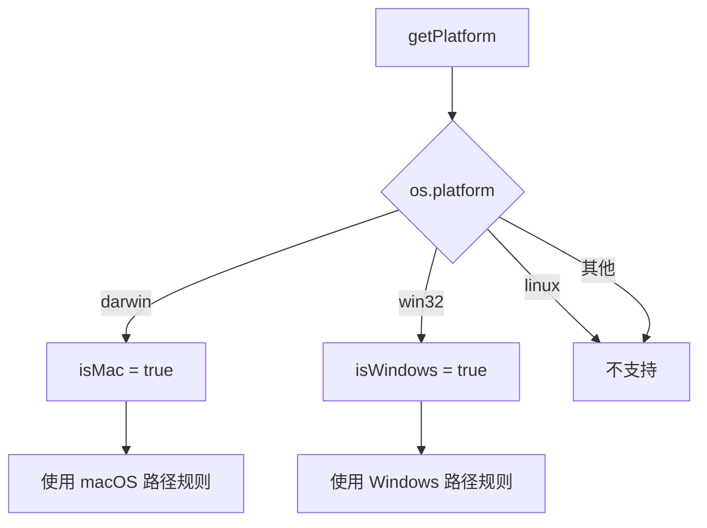

### 3.2 platform.ts 核心函数

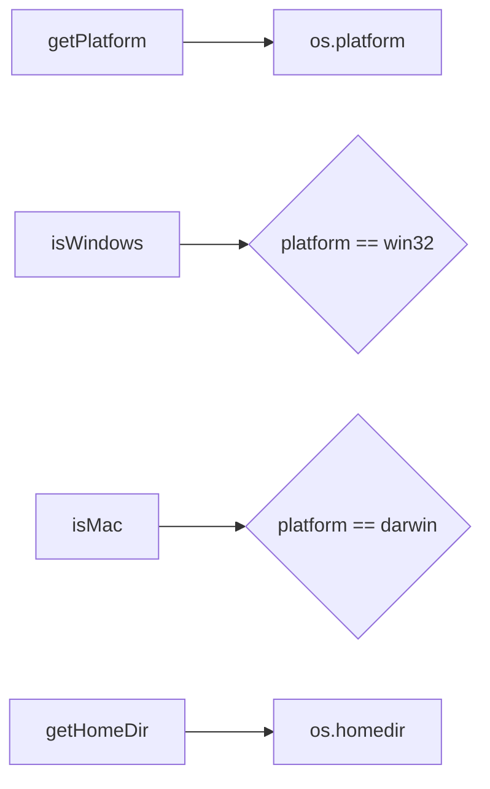

### 3.3 平台判断函数

```typescript
// 获取当前平台
export function getPlatform(): NodeJS.Platform {
  return os.platform();
}

// 判断是否为 Windows
export function isWindows(platform: NodeJS.Platform = getPlatform()): boolean {
  return platform === 'win32';
}

// 判断是否为 macOS
export function isMac(platform: NodeJS.Platform = getPlatform()): boolean {
  return platform === 'darwin';
}
```

---

## 四、Unity Hub 路径配置

### 4.1 路径规则

```mermaid
graph TB
    A[getUnityHubPath] --> B{判断平台}

    B -->|macOS| C[/Applications/Unity/Hub/Editor]
    B -->|Windows| D[C:\Program Files\Unity\Hub\Editor]
    B -->|其他| E[抛出错误]

    style C fill:#6c9
    style D fill:#6c9
    style E fill:#f96
```

### 4.2 代码实现

```typescript
export function getUnityHubPath(platform: NodeJS.Platform = getPlatform()): string {
  if (isMac(platform)) {
    return '/Applications/Unity/Hub/Editor';
  } else if (isWindows(platform)) {
    return 'C:\\Program Files\\Unity\\Hub\\Editor';
  }
  throw new Error('Unsupported platform: only macOS and Windows are supported');
}
```

### 4.3 类比理解

**Unity Hub 路径就像是"软件安装目录的标准地址"**：
- macOS 的 `/Applications/` 类似于 Windows 的 `C:\Program Files\`
- Unity Hub 统一将编辑器安装在 `Unity/Hub/Editor/` 子目录下
- 这就像是"所有 Unity 版本都住在一个大公寓楼里"

---

## 五、Unity 可执行文件路径

### 5.1 可执行文件路径规则

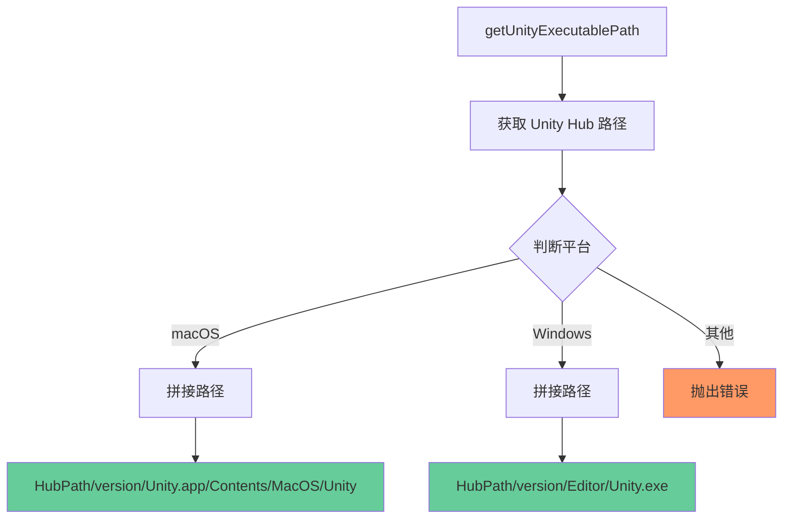

### 5.2 完整路径示例

| 平台 | Unity Hub 路径 | 版本 | 可执行文件路径 |
|------|---------------|------|---------------|
| macOS | `/Applications/Unity/Hub/Editor` | `6000.1.12f1` | `/Applications/Unity/Hub/Editor/6000.1.12f1/Unity.app/Contents/MacOS/Unity` |
| Windows | `C:\Program Files\Unity\Hub\Editor` | `6000.1.12f1` | `C:\Program Files\Unity\Hub\Editor\6000.1.12f1\Editor\Unity.exe` |

### 5.3 代码实现

```typescript
export function getUnityExecutablePath(
  version: string,
  platform: NodeJS.Platform = getPlatform()
): string {
  const hubPath = getUnityHubPath(platform);

  if (isMac(platform)) {
    return path.join(hubPath, version, 'Unity.app', 'Contents', 'MacOS', 'Unity');
  } else if (isWindows(platform)) {
    return path.join(hubPath, version, 'Editor', 'Unity.exe');
  }

  throw new Error('Unsupported platform');
}
```

---

## 六、查找 Unity 安装

### 6.1 查找流程

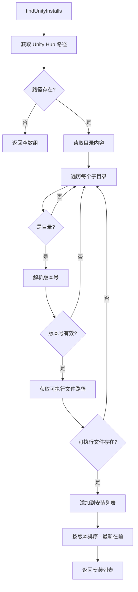

### 6.2 代码实现

```typescript
export function findUnityInstalls(platform: NodeJS.Platform = getPlatform()): UnityInstall[] {
  let hubPath: string;
  try {
    hubPath = getUnityHubPath(platform);
  } catch {
    // 不支持的平台（如 Linux）
    return [];
  }

  if (!fs.existsSync(hubPath)) {
    return [];
  }

  const installs: UnityInstall[] = [];
  const entries = fs.readdirSync(hubPath, { withFileTypes: true });

  for (const entry of entries) {
    if (!entry.isDirectory()) continue;

    const version = entry.name;
    const parsed = parseUnityVersion(version);
    if (!parsed) continue;

    const execPath = getUnityExecutablePath(version, platform);

    // Mac 上检查 .app 是否存在；Windows 上检查 .exe 是否存在
    const checkPath = isMac(platform)
      ? path.join(hubPath, version, 'Unity.app')
      : execPath;

    if (fs.existsSync(checkPath)) {
      installs.push({
        version,
        path: execPath,
        isUnity6: isUnity6OrNewer(version)
      });
    }
  }

  // 按版本排序（最新的在前）
  installs.sort((a, b) => {
    const vA = parseUnityVersion(a.version);
    const vB = parseUnityVersion(b.version);
    if (!vA || !vB) return 0;

    if (vA.major !== vB.major) return vB.major - vA.major;
    if (vA.minor !== vB.minor) return vB.minor - vA.minor;
    if (vA.patch !== vB.patch) return vB.patch - vA.patch;
    return vB.build - vA.build;
  });

  return installs;
}
```

### 6.3 版本排序规则

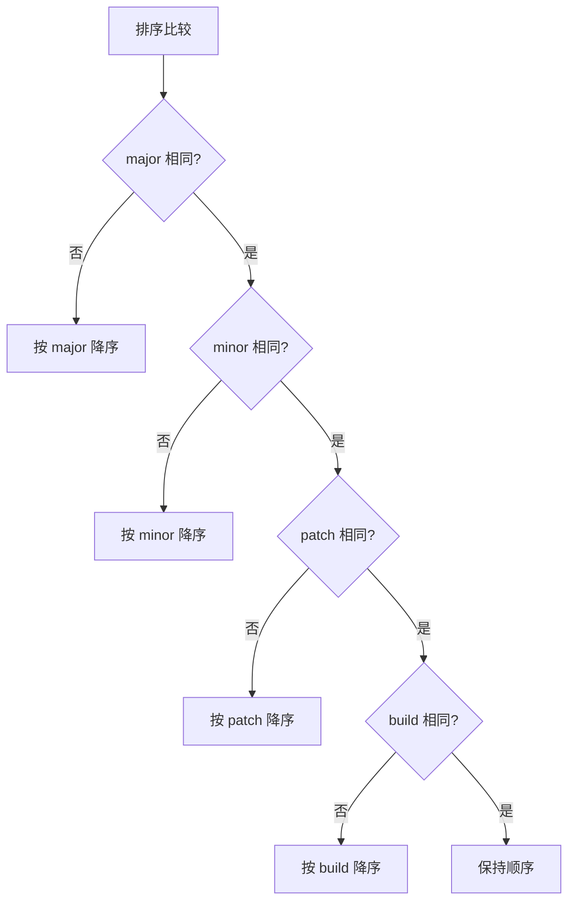

### 6.4 类比理解

**查找 Unity 安装就像是"点名"**：
- 先去"大公寓楼"（Unity Hub 目录）
- 查看"所有住户"（子目录）
- 确认"谁是真正的住户"（验证版本号格式）
- 检查"是否在家"（验证可执行文件存在）
- 按"资历排序"（版本号排序）

---

## 七、版本解析

### 7.1 版本号正则表达式

```mermaid
graph LR
    A[版本字符串] --> B[/^(\d+)\.(\d+)\.(\d+)([a-z])(\d+)$/]

    B --> C[major]
    B --> D[minor]
    B --> E[patch]
    B --> F[type]
    B --> G[build]
```

### 7.2 版本号格式

```
格式: MAJOR.MINOR.PATCH[TYPE][BUILD]

示例:
  6000.1.12f1  -> major=6000, minor=1, patch=12, type=f, build=1
  2022.3.20f1  -> major=2022, minor=3, patch=20, type=f, build=1
  6000.0.0b1   -> major=6000, minor=0, patch=0, type=b, build=1
```

### 7.3 Unity 6 判断

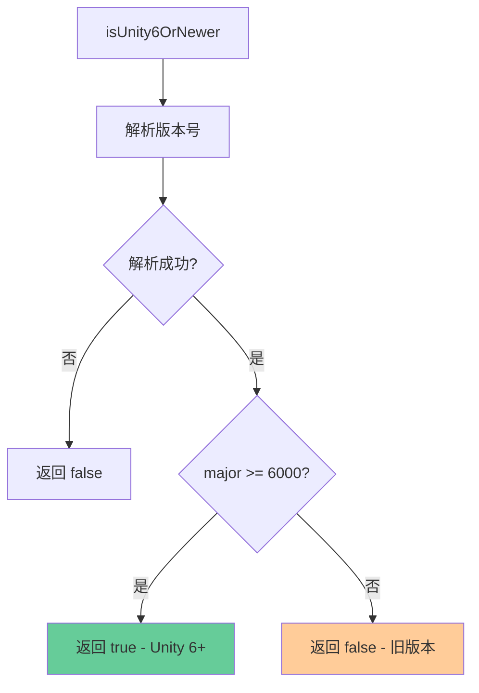

### 7.4 代码实现

```typescript
export function parseUnityVersion(version: string): UnityVersion | null {
  const match = version.match(/^(\d+)\.(\d+)\.(\d+)([a-z])(\d+)$/);
  if (!match) return null;

  return {
    major: parseInt(match[1], 10),
    minor: parseInt(match[2], 10),
    patch: parseInt(match[3], 10),
    type: match[4],
    build: parseInt(match[5], 10)
  };
}

export function isUnity6OrNewer(version: string): boolean {
  const parsed = parseUnityVersion(version);
  if (!parsed) return false;
  return parsed.major >= 6000;
}
```

---

## 八、创建 Unity 项目

### 8.1 创建流程

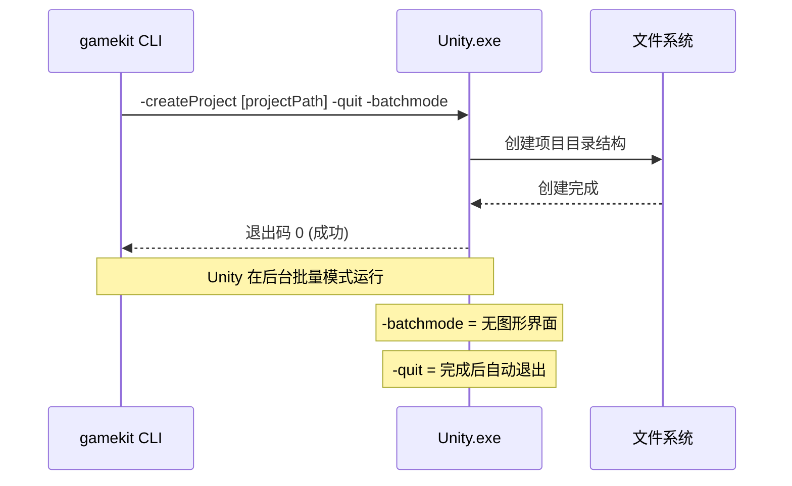

### 8.2 代码实现

```typescript
export function createUnityProject(
  unityPath: string,
  projectPath: string
): Promise<void> {
  return new Promise((resolve, reject) => {
    const args = ['-createProject', projectPath, '-quit', '-batchmode'];

    const child = spawn(unityPath, args, {
      stdio: 'inherit'
    });

    child.on('error', (error) => {
      reject(new Error(`Failed to start Unity: ${error.message}`));
    });

    child.on('close', (code) => {
      if (code === 0) {
        resolve();
      } else {
        reject(new Error(`Unity exited with code ${code}`));
      }
    });
  });
}
```

### 8.3 命令行参数说明

| 参数 | 说明 |
|------|------|
| `-createProject [path]` | 在指定路径创建新项目 |
| `-quit` | 完成后自动退出 Unity |
| `-batchmode` | 批量模式，不显示图形界面 |

### 8.4 类比理解

**创建项目就像是"自动装修"**：
- CLI 给装修队（Unity）一张设计图（参数）
- 装修队在后台默默工作（-batchmode）
- 完工后悄悄离开（-quit）
- 留下一个全新的毛坯房（新项目）

---

## 九、打开 Unity 项目

### 9.1 打开流程

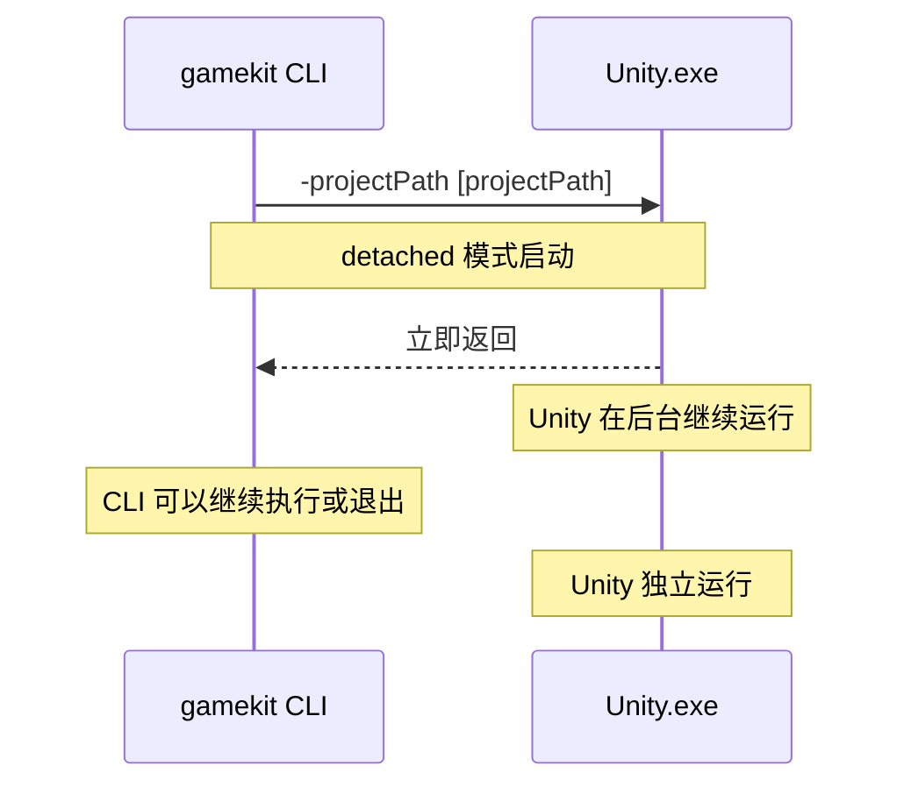

### 9.2 代码实现

```typescript
export function openUnityProject(unityPath: string, projectPath: string): void {
  const args = ['-projectPath', projectPath];

  // 分离模式，Unity 在 CLI 退出后继续运行
  const child = spawn(unityPath, args, {
    detached: true,
    stdio: 'ignore'
  });

  // 取消引用，CLI 可以退出而 Unity 继续运行
  child.unref();
}
```

### 9.3 detached 和 unref 说明

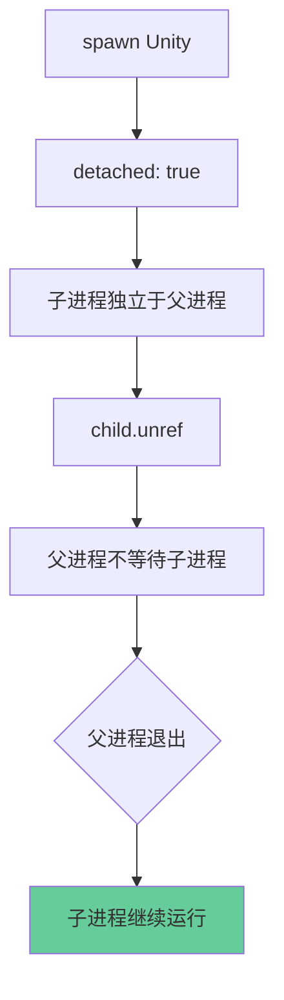

---

## 十、MCP 包 URL 获取

### 10.1 MCP 包版本匹配

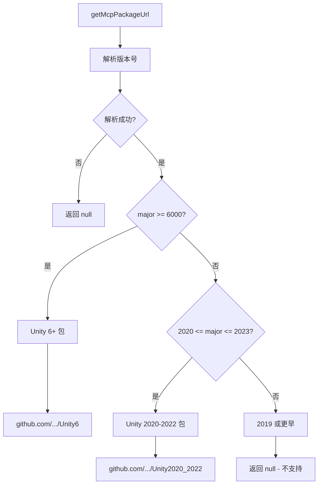

### 10.2 代码实现

```typescript
export function getMcpPackageUrl(version: string): string | null {
  const parsed = parseUnityVersion(version);
  if (!parsed) return null;

  // Unity 6+ (版本号以 6000 开头)
  if (parsed.major >= 6000) {
    return 'https://github.com/codemaestroai/advanced-unity-mcp.git?path=Unity6';
  }

  // Unity 2020-2023
  if (parsed.major >= 2020 && parsed.major <= 2023) {
    return 'https://github.com/codemaestroai/advanced-unity-mcp.git?path=Unity2020_2022';
  }

  // Unity 2019 或更早 - 不支持
  return null;
}
```

### 10.3 版本支持表

| Unity 版本 | MCP 包 URL |
|-----------|------------|
| Unity 6.x (6000.x.x) | `.../Unity6` |
| Unity 2022.x | `.../Unity2020_2022` |
| Unity 2021.x | `.../Unity2020_2022` |
| Unity 2020.x | `.../Unity2020_2022` |
| Unity 2019.x 及更早 | 不支持 (null) |

---

## 十一、Unity 项目验证

### 11.1 验证逻辑

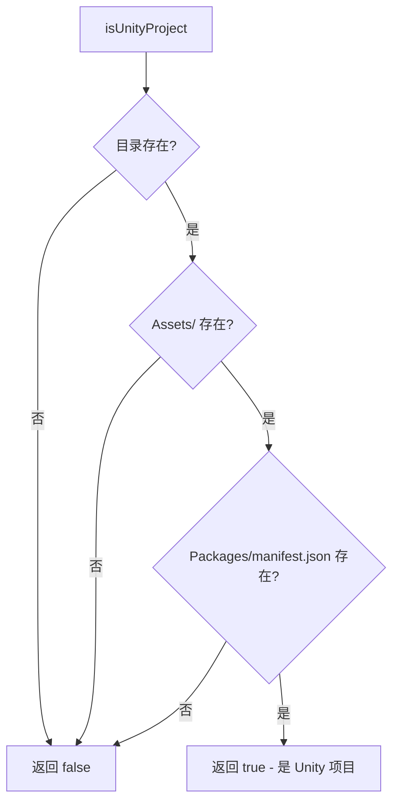

### 11.2 代码实现

```typescript
export function isUnityProject(dir: string): boolean {
  if (!fs.existsSync(dir)) return false;

  const assetsDir = path.join(dir, 'Assets');
  const manifestPath = path.join(dir, 'Packages', 'manifest.json');

  return fs.existsSync(assetsDir) && fs.existsSync(manifestPath);
}
```

### 11.3 Unity 项目结构

```
UnityProject/
├── Assets/              # 必须 - 游戏资源
├── Packages/            # 必须 - 包管理
│   └── manifest.json    # 必须 - 包清单
├── ProjectSettings/     # 项目设置
├── UserSettings/        # 用户设置
└── Library/             # 缓存（自动生成）
```

---

## 十二、调用关系

### 12.1 函数调用关系图

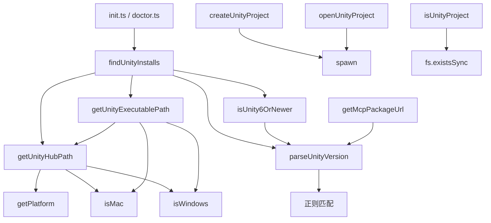

### 12.2 使用场景

| 场景 | 调用函数 | 用途 |
|------|----------|------|
| 初始化项目 | `findUnityInstalls` | 获取可用的 Unity 版本列表 |
| 初始化项目 | `createUnityProject` | 创建新的 Unity 项目 |
| 初始化项目 | `openUnityProject` | 打开 Unity 编辑器 |
| 诊断检查 | `findUnityInstalls` | 检查 Unity 是否已安装 |
| 配置 MCP | `getMcpPackageUrl` | 获取对应版本的 MCP 包 URL |
| 验证项目 | `isUnityProject` | 验证目录是否为 Unity 项目 |

---

## 十三、错误处理

### 13.1 错误类型

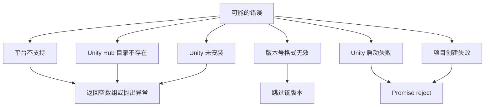

### 13.2 错误处理策略

| 错误场景 | 处理方式 |
|----------|----------|
| 不支持的平台 | 返回空数组，不做后续处理 |
| Unity Hub 路径不存在 | 返回空数组，提示用户安装 |
| 版本号解析失败 | 跳过该目录，继续检查其他 |
| Unity 可执行文件不存在 | 跳过该版本，不添加到列表 |
| Unity 启动失败 | Promise reject，显示错误信息 |
| 项目创建失败 | Promise reject，显示退出码 |

---

## 十四、完整流程示例

### 14.1 查找 Unity 安装示例

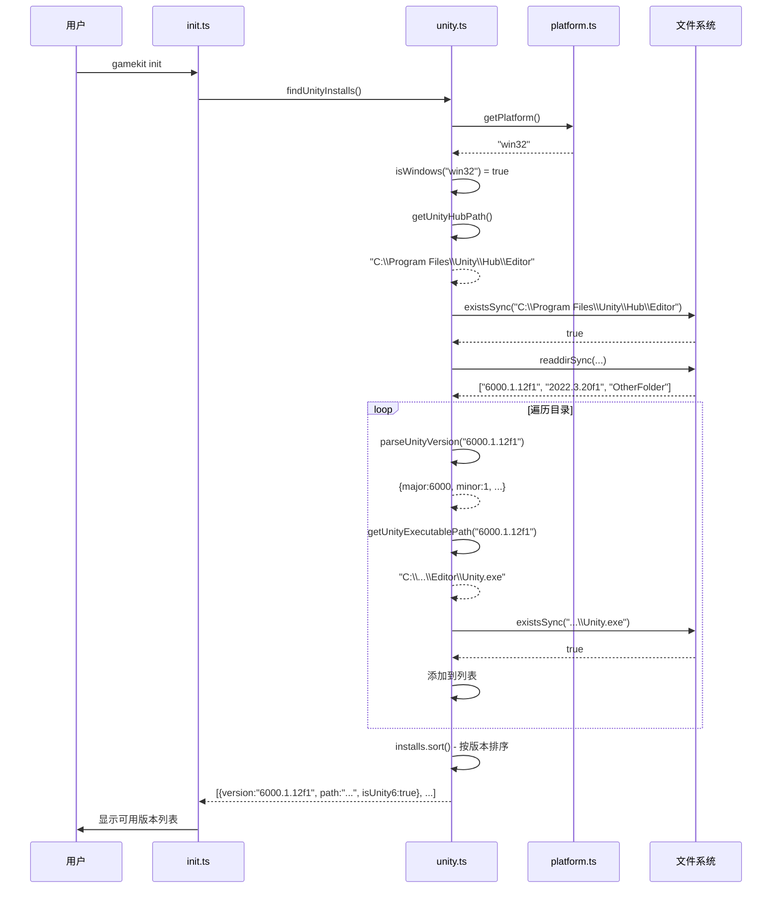

---

## 十五、总结

### 15.1 核心功能总结

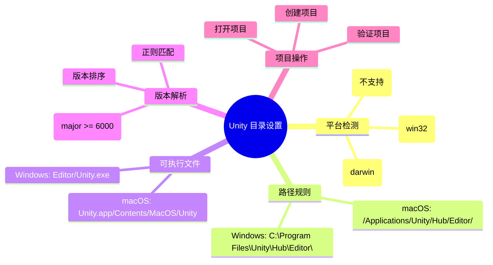

### 15.2 关键代码位置

| 功能 | 文件 | 行号范围 |
|------|------|----------|
| 平台检测 | `src/utils/platform.ts` | 全文件 |
| Unity Hub 路径 | `src/utils/unity.ts` | 29-36 |
| 可执行文件路径 | `src/utils/unity.ts` | 68-81 |
| 查找安装 | `src/utils/unity.ts` | 86-138 |
| 版本解析 | `src/utils/unity.ts` | 42-53 |
| 创建项目 | `src/utils/unity.ts` | 147-170 |
| 打开项目 | `src/utils/unity.ts` | 214-225 |

### 15.3 类比总结

**整个 Unity 执行程序目录设置就像是"地址簿系统"**：
- **platform.ts** = 确定我们在哪个城市（操作系统）
- **getUnityHubPath** = 知道公寓楼的标准地址
- **findUnityInstalls** = 查看公寓里住了哪些人（Unity 版本）
- **parseUnityVersion** = 阅读每个人的身份证（版本号）
- **getUnityExecutablePath** = 找到每个人的具体房间号
- **createUnityProject** = 帮忙在指定地点建新房
- **openUnityProject** = 帮忙打开门让人进去

---

## 十六、参考资源

### 相关文件
- `src/utils/unity.ts` - Unity 相关工具函数
- `src/utils/platform.ts` - 平台检测工具
- `src/commands/init.ts` - 初始化命令
- `src/commands/doctor.ts` - 诊断命令
- `src/__tests__/utils/unity.test.ts` - 单元测试

### Unity 官方文档
- [Unity 命令行参数](https://docs.unity3d.com/Manual/CommandLineArguments.html)
- [Unity Hub 编辑器安装位置](https://docs.unity3d.com/Manual/GettingStartedInstallingHub.html)

### 相关标准
- Node.js `os.platform()` 返回值
- Node.js `child_process.spawn()` API
- Node.js `fs` 文件系统 API

---

**文档生成时间**：2026-02-02
**分析版本**：gamekit-cli v0.0.2
