# asset-finder 代理实现详解

## 一、代理概述

### 1.1 基本信息

| 属性 | 值 |
|------|-----|
| **名称** | asset-finder |
| **描述** | 在线搜索免费游戏资源并下载/导入到 Unity 项目中 |
| **模型** | Haiku（快速处理简单搜索任务） |
| **触发场景** | 需要模型、纹理、声音或任何游戏资源时 |
| **核心能力** | 自动化资源获取和导入 |

### 1.2 核心职责

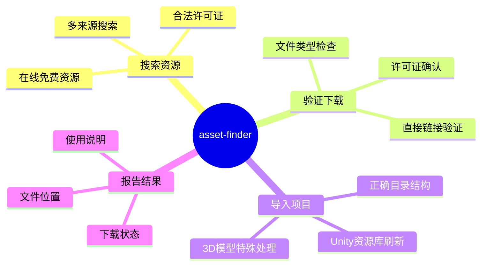

---

## 二、代理配置

### 2.1 YAML 配置结构

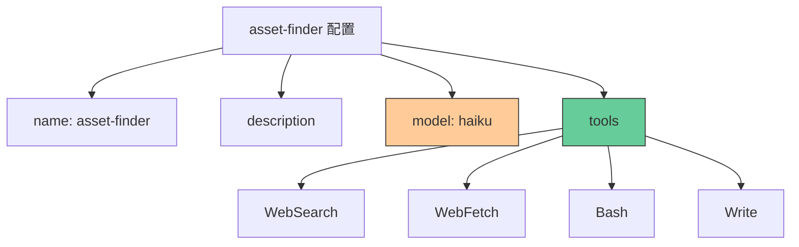

### 2.2 配置详解

```yaml
---
name: asset-finder
description: Searches for free game assets online and downloads/imports them into the Unity project. Use when user needs models, textures, sounds, or any game assets.
model: haiku
tools:
  - WebSearch    # 搜索在线资源
  - WebFetch     # 获取资源页面内容
  - Bash         # 执行下载和文件操作
  - Write        # 创建说明文件
---
```

### 2.3 为什么选择 Haiku 模型

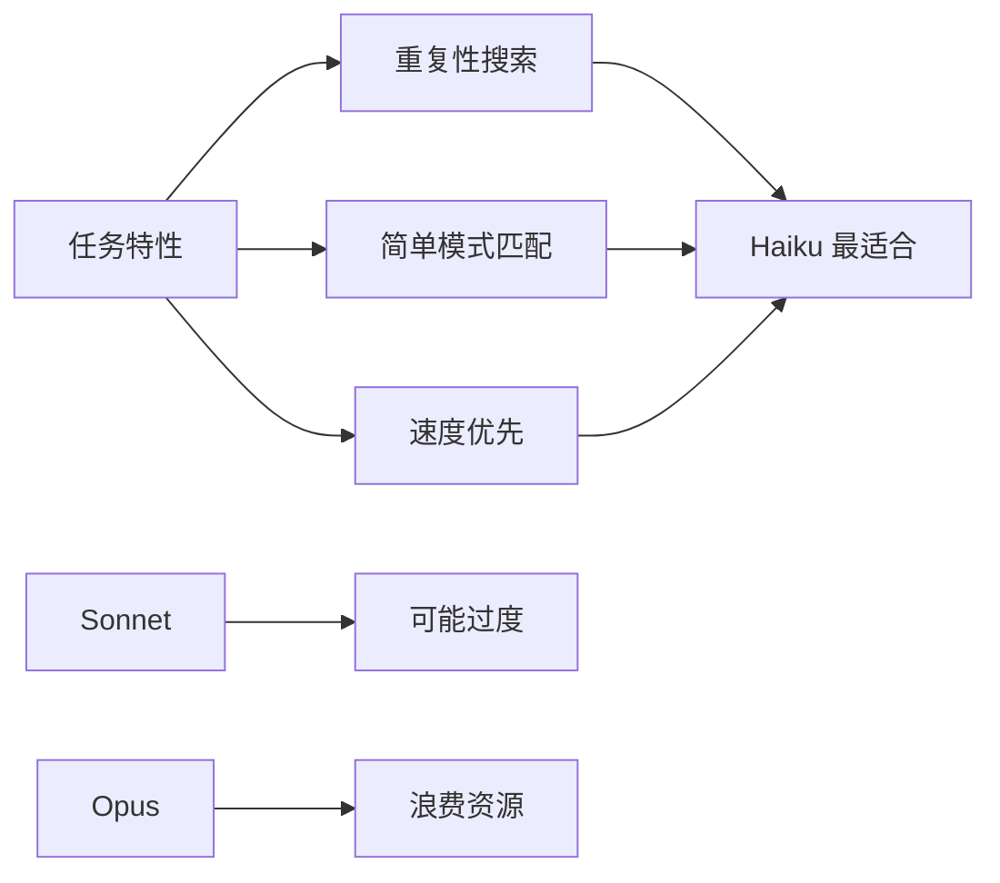

**选择理由**：
- 任务主要是**模式匹配和URL处理**
- 需要**快速响应**（可以多个并行）
- 不需要**深度推理或创造性**
- 成本**效率优先**

---

## 三、资源来源系统

### 3.1 资源来源优先级

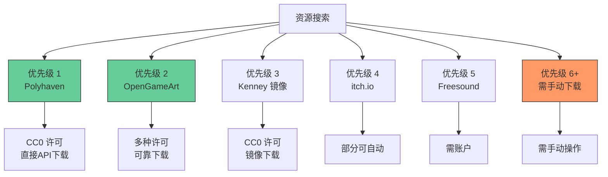

### 3.2 各来源详解

#### Polyhaven（最佳纹理/HDRI）

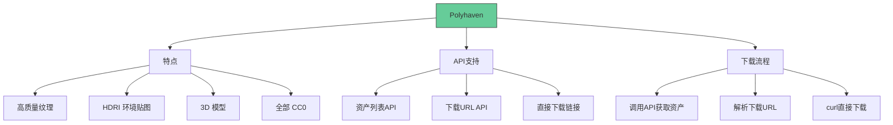

**API 使用示例**：

```bash
# 1. 获取资产列表
curl https://api.polyhaven.com/assets

# 2. 获取特定资产的下载链接
curl https://api.polyhaven.com/files/rock_ground_02

# 3. 直接下载（返回直接URL）
curl -L -o rock_ground_02.jpg "https://dl.polyhaven.org/file/ph-assets/Textures/jpg/1k/rock_ground_02/rock_ground_02_diff_1k.jpg"
```

**分辨率支持**：
- 1K (1024px)
- 2K (2048px)
- 4K (4096px)
- 8K (8192px)

#### OpenGameArt（可靠的 2D/3D/音频）

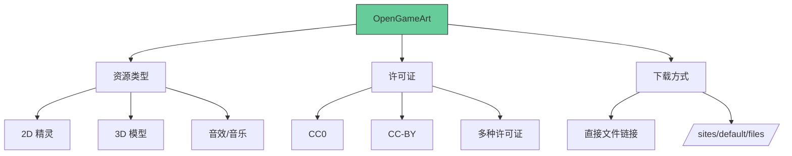

**直接下载模式**：

```bash
# 可靠的直接链接格式
https://opengameart.org/sites/default/files/asset_name.zip

# 示例
curl -L -o zombies.zip "https://opengameart.org/sites/default/files/zombies.zip"
```

#### Kenney 镜像（CC0 资源）

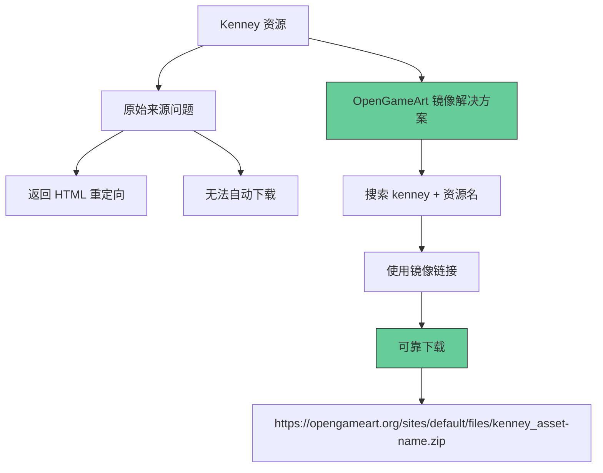

**重要模式**：
```
搜索: "kenney food-kit"
下载: https://opengameart.org/sites/default/files/kenney_food-kit.zip
```

**已知镜像资源**：
- food-kit
- platformer-kit
- nature-kit
- ui-pack
- 以及更多...

#### 其他来源（需手动）

| 来源 | 资源类型 | 自动下载 | 原因 |
|------|----------|----------|------|
| Freesound.org | 音效 | 需账户 | 需要登录 |
| Mixamo.com | 角色动画 | 需账户 | 需要 Adobe 账户 |
| Sketchfab | 3D 模型 | 需手动 | 大多数需要登录 |
| Unity Asset Store | 各类 | 通过 Package Manager | 必须使用 Unity |

---

## 四、下载流程详解

### 4.1 完整下载流程

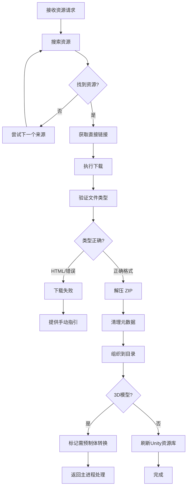

### 4.2 下载验证

**关键验证步骤**：

```bash
# 下载后必须验证文件类型
file /path/to/downloaded/file
```

**可能的输出**：

```
# 正确
asset.zip:         Zip archive data
sound.wav:         RIFF (little-endian) data, WAVE audio
model.fbx:         Autodesk FBX Binary

# 错误（下载失败）
asset.zip:         HTML document, ASCII text
```

### 4.3 ZIP 文件处理

```bash
# 创建目标目录
mkdir -p /path/to/project/Assets/Downloaded/ASSET_TYPE/

# 下载（使用 -L 跟随重定向）
cd /path/to/project/Assets/Downloaded/ASSET_TYPE/
curl -L -o asset.zip "DIRECT_URL"

# 验证是否真的是 ZIP
file asset.zip

# 如果有效，解压
unzip -o asset.zip
rm asset.zip

# 清理 Mac 元数据（如果存在）
rm -rf __MACOSX
```

---

## 五、目录结构规则

### 5.1 标准目录结构

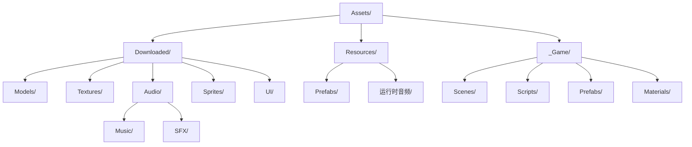

### 5.2 目录用途说明

| 目录 | 用途 | 运行时加载 |
|------|------|-----------|
| `Assets/Downloaded/Models/` | 下载的 3D 模型源文件 (FBX/OBJ) | 否 |
| `Assets/Downloaded/Textures/` | 下载的纹理图片 | 否 |
| `Assets/Downloaded/Audio/` | 下载的音频文件 | 部分 |
| `Assets/Downloaded/Sprites/` | 2D 精灵 | 否 |
| `Assets/Resources/Prefabs/` | 预制体 | 是 |
| `Assets/Resources/*/` | 需要运行时加载的音频 | 是 |

### 5.3 放置规则

```
下载资源 → Assets/Downloaded/[类型]/
  ├── Models/      → FBX/OBJ 源文件
  ├── Textures/    → PNG/JPG 纹理
  ├── Sprites/     → 2D 精灵图
  ├── Audio/
  │   ├── Music/   → 背景音乐
  │   └── SFX/     → 音效
  └── UI/          → UI 素材

运行时资源 → Assets/Resources/
  ├── Prefabs/     → 运行时生成的预制体
  └── [音频文件夹] → 需 Resources.Load 的音频
```

---

## 六、3D 模型特殊处理

### 6.1 FBX/OBJ 限制

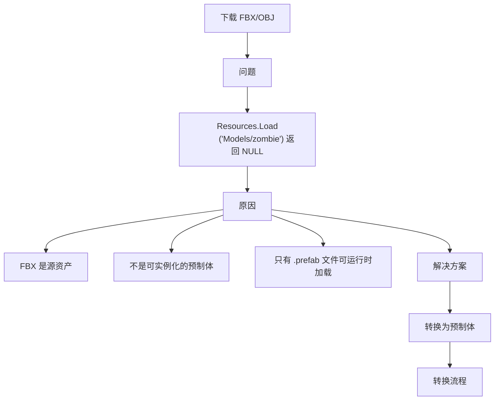

### 6.2 自动转换流程

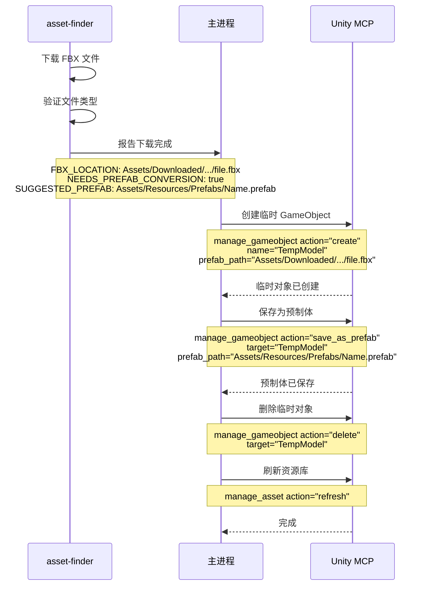

### 6.3 转换步骤

```bash
# 1. 下载 FBX 到 Downloaded/Models/
curl -L -o model.fbx "URL"

# 2. 返回主进程以下信息：
#    FBX_PATH: Assets/Downloaded/Models/model.fbx
#    NEEDS_PREFAB_CONVERSION: true
#    SUGGESTED_PREFAB_PATH: Assets/Resources/Prefabs/Model.prefab

# 3. 主进程执行：
manage_gameobject action="create" name="TempModel" prefab_path="Assets/Downloaded/Models/model.fbx"
manage_gameobject action="save_as_prefab" target="TempModel" prefab_path="Assets/Resources/Prefabs/Model.prefab"
manage_gameobject action="delete" target="TempModel"
manage_asset action="refresh"

# 4. 代码中使用：
Resources.Load<GameObject>("Prefabs/Model")
```

### 6.4 报告格式（3D 模型）

```
FOUND: Zombie Character
SOURCE: OpenGameArt.org
LICENSE: CC-BY 3.0
DOWNLOAD STATUS: Success
FBX LOCATION: Assets/Downloaded/Models/zombie.fbx
⚠️ NEEDS PREFAB CONVERSION: Yes
SUGGESTED PREFAB: Assets/Resources/Prefabs/Zombie.prefab
RUNTIME LOADING: Use Resources.Load<GameObject>("Prefabs/Zombie")
```

---

## 七、并行搜索架构

### 7.1 并行搜索模式

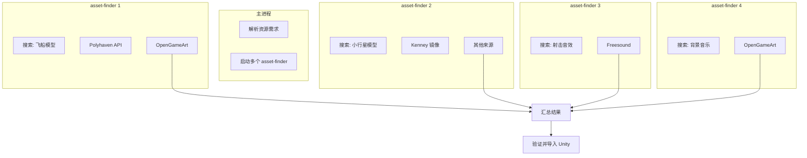

### 7.2 并行优势

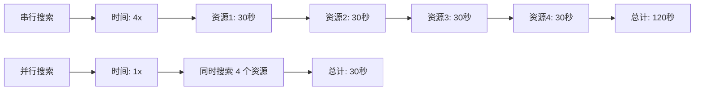

**加速比**：4 倍（取决于资源数量）

---

## 八、报告格式

### 8.1 成功报告

```
FOUND: Spaceship Player Model
SOURCE: Polyhaven
LICENSE: CC0 (No attribution required)
DOWNLOAD STATUS: Success
LOCATION: Assets/Downloaded/Models/spaceship.fbx
CONTENTS:
  - spaceship.fbx (main model)
  - texture_diffuse.png (1024x1024)
  - texture_normal.png (1024x1024)
FILE COUNT: 3 files imported
```

### 8.2 需要预制体转换报告

```
FOUND: Zombie Character
SOURCE: OpenGameArt.org
LICENSE: CC-BY 3.0 (Attribution required)
DOWNLOAD STATUS: Success
FBX LOCATION: Assets/Downloaded/Models/zombie.fbx
⚠️ NEEDS PREFAB CONVERSION: Yes
SUGGESTED PREFAB: Assets/Resources/Prefabs/Zombie.prefab
RUNTIME LOADING: Use Resources.Load<GameObject>("Prefabs/Zombie")
CONTENTS:
  - zombie.fbx (character model)
  - zombie_walk.fbx (walk animation)
  - zombie_attack.fbx (attack animation)
FILE COUNT: 3 files imported
```

### 8.3 下载失败报告

```
FOUND: Animated Character Pack
SOURCE: Mixamo.com
LICENSE: Free (requires Adobe account)
DOWNLOAD STATUS: Failed - Account required
SOURCE URL: https://www.mixamo.com/search?q=zombie

MANUAL DOWNLOAD INSTRUCTIONS:
1. Visit https://www.mixamo.com
2. Sign in with Adobe account (free)
3. Search for "zombie"
4. Download desired character (FBX format)
5. Place in: Assets/Downloaded/Models/
6. The main agent will convert to prefab
```

---

## 九、错误处理

### 9.1 错误类型

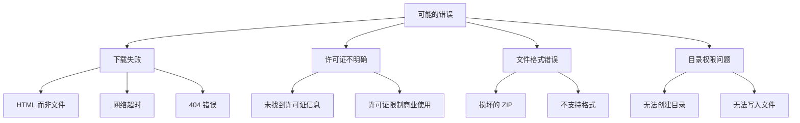

### 9.2 处理策略

| 错误类型 | 处理方式 |
|----------|----------|
| 下载返回 HTML | 提供手动下载指引 |
| 网络超时 | 重试一次，失败则提供指引 |
| 许可证不明确 | 标注"需验证许可证" |
| ZIP 损坏 | 报告错误，提供源链接 |
| 权限问题 | 报告错误，建议检查权限 |

---

## 十、重要规则

### 10.1 五条黄金规则

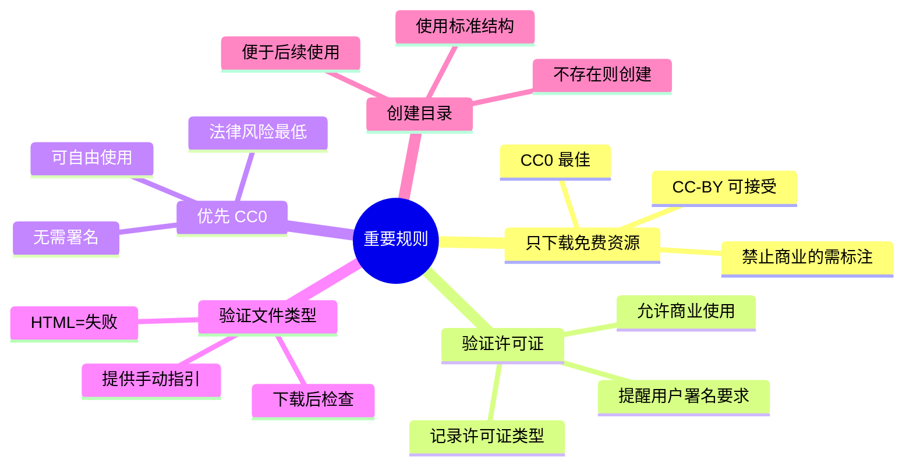

### 10.2 规则详解

#### 规则 1：只下载免费资源

**可接受的许可证**：
- CC0 (Creative Commons Zero) - 最佳
- CC-BY (需要署名)
- Free for commercial use
- Public Domain

**需要谨慎的许可证**：
- CC-BY-SA (需要署名，相同方式共享)
- CC-BY-NC (非商业使用)

#### 规则 2：验证许可证允许商业使用

```
许可证验证检查表：
□ 许可证类型已识别
□ 允许商业使用
□ 署名要求已记录
□ 特殊限制已标注
```

#### 规则 3：优先 CC0

**原因**：
- 无需署名（简化项目）
- 可自由使用和修改
- 无法律风险

#### 规则 4：验证文件类型

```bash
# 下载后立即验证
file downloaded_file

# 检查输出
# ✅ Zip archive data
# ❌ HTML document
```

#### 规则 5：创建目录

```bash
# 总是先创建目录
mkdir -p /path/to/Assets/Downloaded/TYPE/

# 然后下载到该目录
cd /path/to/Assets/Downloaded/TYPE/
curl -L -o asset.zip "URL"
```

---

## 十一、音频处理

### 11.1 音频分类

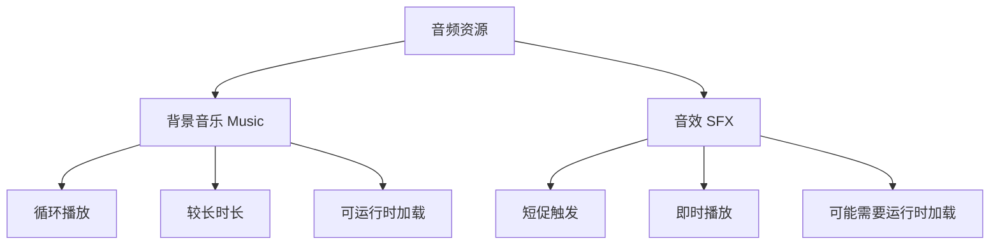

### 11.2 音频放置规则

```
背景音乐 → Assets/Resources/Audio/Music/
  - 需要 Resources.Load("Audio/Music/track_name")
  - 循环播放的较长音频

音效 → Assets/Resources/Audio/SFX/
  - 需要 Resources.Load("Audio/SFX/sound_name")
  - 运行时触发的短音频

其他音频 → Assets/Downloaded/Audio/
  - 不需要运行时加载
  - 编辑时使用
```

---

## 十二、完整工作流示例

### 12.1 搜索并下载飞船模型

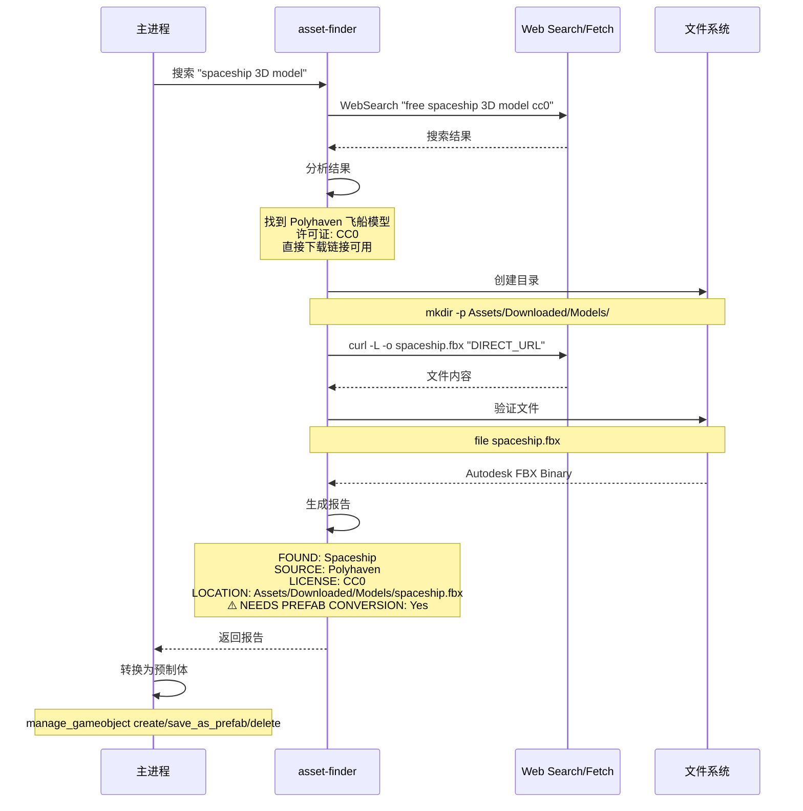

---

## 十三、与其他代理的协作

### 13.1 协作流程

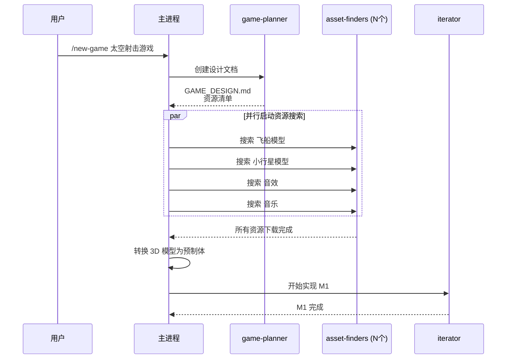

### 13.2 代理职责对比

| 代理 | 输入 | 输出 | 并行 |
|------|------|------|------|
| game-planner | 游戏描述 | GAME_DESIGN.md | 否 |
| asset-finder | 资源需求 | 已下载资源 | 是（多个） |
| iterator | 里程碑任务 | 已实现功能 | 否 |

---

## 十四、最佳实践

### 14.1 搜索建议

**好的搜索词**：
```
✅ "spaceship 3D model cc0"
✅ "zombie character fbx free"
✅ "explosion sound effect"
```

**不够清晰的搜索词**：
```
❌ "game assets"          太宽泛
❌ "cool stuff"           不明确
```

### 14.2 下载后检查

```
下载后检查清单：
□ 文件类型正确
□ 文件大小合理
□ ZIP 可解压
□ 许可证已记录
□ 放置在正确目录
□ Unity 资源库已刷新
□ 3D 模型标记转换需求
```

---

## 十五、类比总结

### 15.1 类比理解

**asset-finder 就像是"采购部门"**：

| 采购部门 | asset-finder |
|---------|--------------|
| 设计师开出材料清单 | game-planner 识别资源需求 |
| 联系多个供应商 | 搜索多个资源网站 |
| 比较价格和质量 | 检查许可证和质量 |
| 下订单并收货 | 下载并验证文件 |
| 分类入库 | 放到正确目录 |
| 特殊材料需加工 | 3D 模型需预制体转换 |

### 15.2 工作流程类比

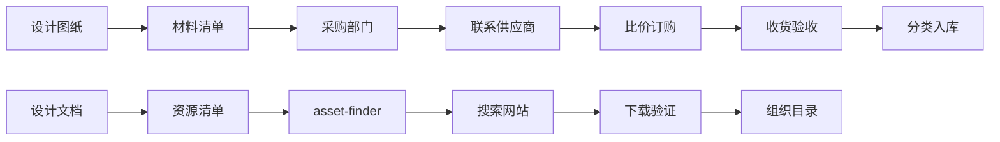

---

## 十六、总结

### 16.1 核心价值

asset-finder 代理是资源获取的"自动化采购员"：

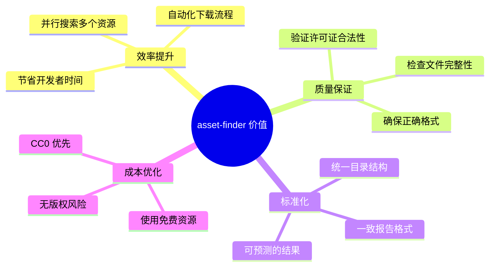

### 16.2 关键文件位置

| 文件 | 路径 | 说明 |
|------|------|------|
| 代理配置 | `template/.claude/agents/asset-finder.md` | 代理定义 |
| 资源目录 | `Assets/Downloaded/` | 下载的资源 |
| 预制体目录 | `Assets/Resources/Prefabs/` | 运行时预制体 |

### 16.3 参考资源

### 资源网站
- [Polyhaven - 免费 3D 资源](https://polyhaven.com)
- [OpenGameArt - 游戏艺术资源](https://opengameart.org)
- [Kenney Assets - 游戏素材](https://kenney.nl/assets)

### API 文档
- [Polyhaven API](https://polyhaven.com/api)

### 相关代理
- [game-planner 代理](../agents/game-planner.md) - 识别资源需求
- [iterator 代理](../agents/iterator.md) - 使用资源实现功能

---

**文档生成时间**：2026-02-02
**分析版本**：gamekit-cli v0.0.2
