# game-planner 代理实现详解

## 一、代理概述

### 1.1 基本信息

| 属性 | 值 |
|------|-----|
| **名称** | game-planner |
| **描述** | 创建详细的游戏设计文档，规划功能，将实现分解为里程碑 |
| **模型** | Sonnet（需要深度思考和结构化输出） |
| **触发场景** | 开始新游戏或规划主要功能时 |
| **输出文件** | `GAME_DESIGN.md`（项目根目录） |

### 1.2 核心职责

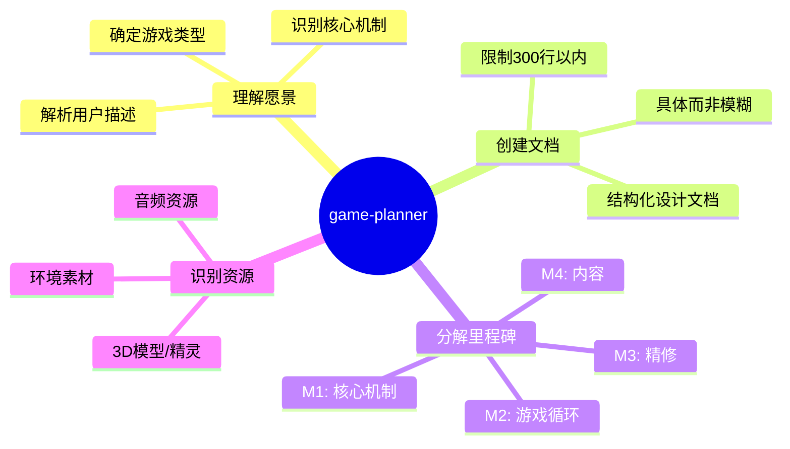

---

## 二、代理配置

### 2.1 YAML 配置结构

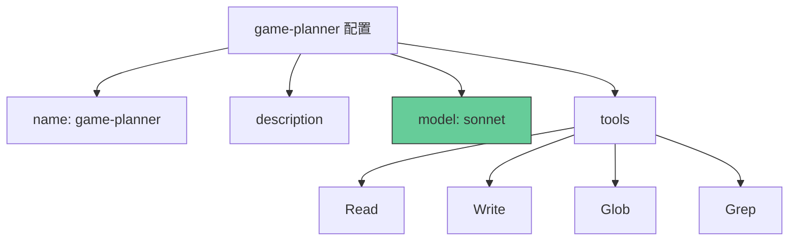

### 2.2 配置详解

```yaml
---
name: game-planner
description: Creates detailed game design documents, plans features, and breaks down implementation into milestones. Use when starting a new game or planning major features.
model: sonnet
tools:
  - Read      # 读取现有文件
  - Write     # 写入 GAME_DESIGN.md
  - Glob      # 查找项目文件
  - Grep      # 搜索特定内容
---
```

### 2.3 为什么选择 Sonnet 模型

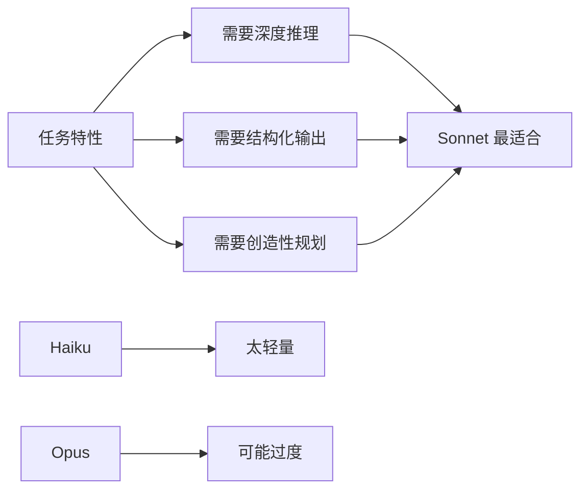

**选择理由**：
- 需要**理解用户的模糊描述**并做出合理推断
- 需要**创建结构化的长文档**（300行）
- 需要**规划可执行的里程碑**
- 需要**平衡创造性和实用性**

---

## 三、工作流程

### 3.1 整体流程

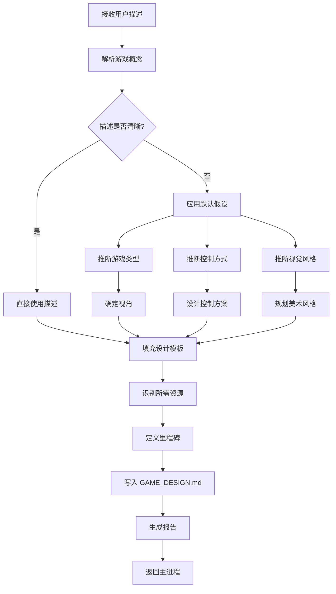

### 3.2 输入处理流程

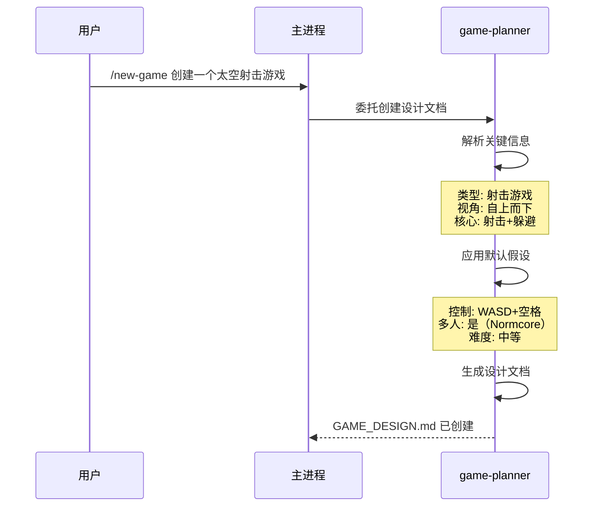

---

## 四、设计文档结构

### 4.1 完整文档模板

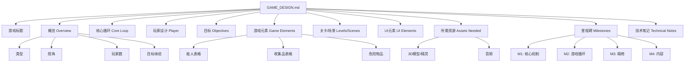

### 4.2 文档各部分详解

#### 概览 (Overview)

```markdown
## Overview
**Genre:** [类型 - 如 Platformer, Shooter, Puzzle]
**Perspective:** [视角 - Top-down, Side-view, First-person]
**Players:** Multiplayer (Normcore)
**Target Feel:** [目标体验 - 如 Fast-paced action, Relaxing exploration]
```

**设计要点**：
- **Genre**：确定游戏核心类型
- **Perspective**：决定相机和输入方式
- **Players**：默认多人（可后续改为单人）
- **Target Feel**：指导后续设计的整体基调

#### 核心循环 (Core Loop)

```markdown
## Core Loop
1. [主要动作 - 如 Navigate platforms]
2. [挑战 - 如 Avoid enemies and hazards]
3. [奖励 - 如 Collect coins, reach goal]
4. [进展 - 如 Unlock new levels]
```

**核心循环的重要性**：

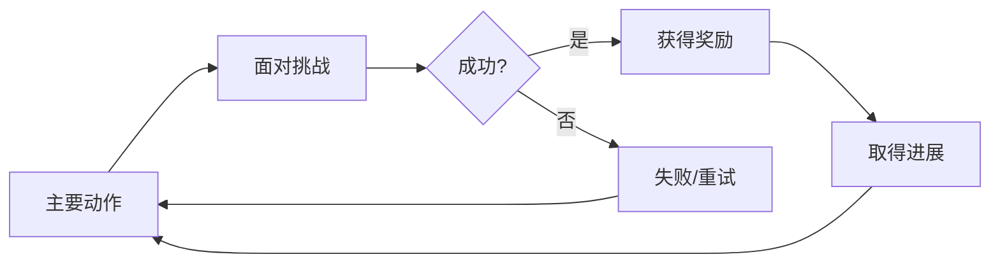

#### 玩家设计 (Player)

```markdown
## Player
- **Controls:** [控制方式 - WASD, Space to jump, etc.]
- **Abilities:** [能力 - Jump, Shoot, Dash, etc.]
- **Constraints:** [约束 - Health, lives, etc.]
```

#### 游戏元素 (Game Elements)

**敌人表格**：
| Type | Behavior | Threat |
|------|----------|--------|
| [敌人名称] | [行为模式] | [伤害类型] |

**收集品表格**：
| Item | Effect | Visual |
|------|--------|--------|
| [物品名称] | [效果] | [视觉描述] |

**危险物品表格**：
| Hazard | Effect |
|--------|--------|
| [危险名称] | [效果] |

---

## 五、里程碑系统

### 5.1 四阶段里程碑

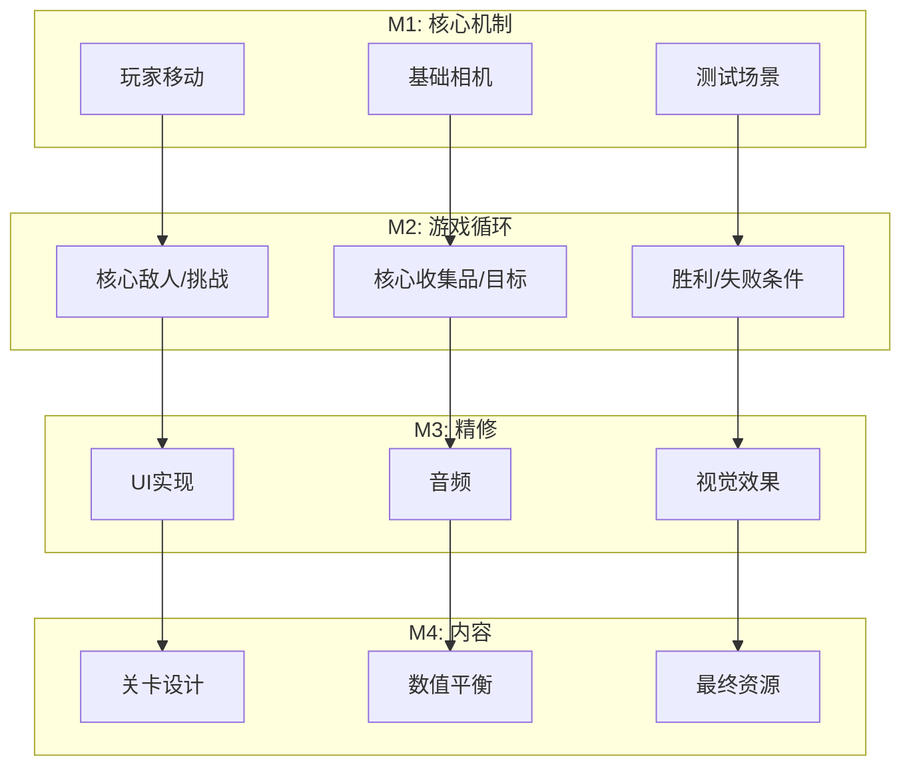

### 5.2 里程碑详细说明

#### M1: Core Mechanics（核心机制）

**目标**：创建可玩的基础框架

```
- [ ] Player movement        玩家能够移动
- [ ] Basic camera           相机正确跟随
- [ ] Test scene             有一个测试场景
```

**验收标准**：
- 玩家可以用输入控制角色
- 相机显示游戏区域
- 没有崩溃或错误

**预期时间**：首次迭代的基础

#### M2: Gameplay Loop（游戏循环）

**目标**：完整的游戏体验

```
- [ ] [Core enemy/challenge]    核心挑战机制
- [ ] [Core collectible/goal]   核心目标/奖励
- [ ] Win/lose conditions       胜利和失败条件
```

**验收标准**：
- 有明确的障碍需要克服
- 有明确的目标需要达成
- 玩家可以赢或输
- 游戏循环完整可玩

#### M3: Polish（精修）

**目标**：提升游戏质量

```
- [ ] UI implementation        用户界面
- [ ] Audio                    音效和音乐
- [ ] Visual effects           视觉效果
```

**验收标准**：
- UI 显示必要信息
- 音频反馈存在
- 视觉效果增强体验

#### M4: Content（内容）

**目标**：扩展游戏内容

```
- [ ] Level design             多个关卡/区域
- [ ] Balancing                数值平衡调整
- [ ] Final assets             最终美术资源
```

**验收标准**：
- 有可玩的内容量
- 难度曲线合理
- 美术风格统一

### 5.3 里程碑优先级原则

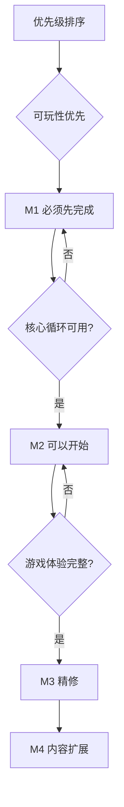

---

## 六、默认假设系统

### 6.1 模糊输入处理

当用户描述不够具体时，game-planner 会应用合理的默认假设：

```mermaid
flowchart TD
    A[接收用户输入] --> B{游戏类型明确?}
    B -->|否| C[从关键词推断]

    C --> D{包含 "shoot"?}
    D -->|是| E[类型 = 射击游戏]
    D -->|否| F{包含 "jump" 或 "platform"?}

    F -->|是| G[类型 = 平台跳跃]
    F -->|否| H[使用通用类型]

    A --> I{视角明确?}
    I -->|否| J[根据类型推断]

    J --> K{射击游戏?}
    K -->|是| L[视角 = 自上而下]
    K -->|否| M{平台游戏?}

    M -->|是| N[视角 = 侧视图]
    M -->|否| O[视角 = 第一/第三人称]

    A --> P{控制方式明确?}
    P -->|否| Q[默认 WASD]
```

### 6.2 默认假设规则表

| 假设维度 | 默认值 | 推理依据 |
|----------|--------|----------|
| **游戏视角** | 射击游戏→自上而下<br/>平台游戏→侧视图 | 行业标准 |
| **控制方式** | WASD + 空格 | PC 游戏标准 |
| **视觉风格** | 简单几何图形（除非指定） | 快速原型 |
| **多人模式** | 启用（Normcore） | gamekit 默认 |
| **难度设置** | 中等、公平 | 可体验可调整 |

### 6.3 推断示例

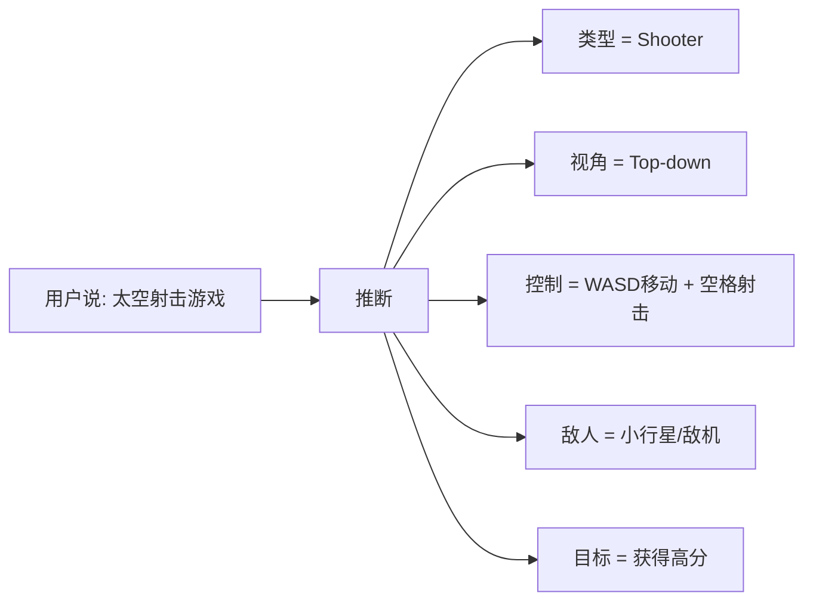

---

## 七、资源识别

### 7.1 资源分类

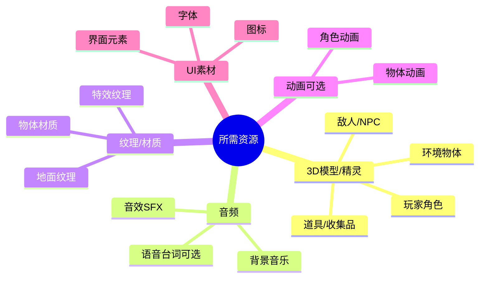

### 7.2 资源列表生成

game-planner 会为 asset-finder 生成清晰的资源需求清单：

```markdown
## Assets Needed

### 3D Models / Sprites
- [ ] Spaceship player model
- [ ] Asteroid models (3-5 variations)
- [ ] Laser projectile
- [ ] Explosion effect sprites
- [ ] Star background texture

### Audio
- [ ] Background music (space theme, loopable)
- [ ] Laser shooting sound
- [ ] Explosion sound effects
- [ ] Engine hum/thruster sound
- [ ] Power-up collection sound
```

### 7.3 资源优先级

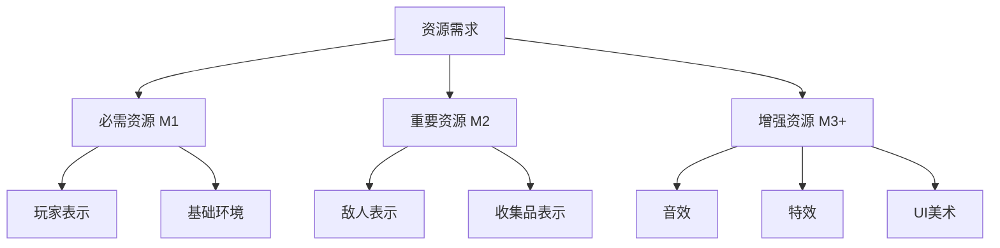

---

## 八、输出格式

### 8.1 报告模板

game-planner 完成后会生成以下报告：

```
CREATED: GAME_DESIGN.md
MILESTONES: 4 milestones identified
ASSETS NEEDED:
  - Spaceship model
  - Asteroid models (5 variations)
  - Laser and explosion effects
  - Space-themed music
  - SFX for shooting and explosions
READY TO BUILD:
  - Create main scene with space background
  - Build player spaceship with WASD movement
  - Add laser shooting with spacebar
  - Implement asteroid spawning system
  - Set up collision and scoring
```

### 8.2 与其他代理的协作

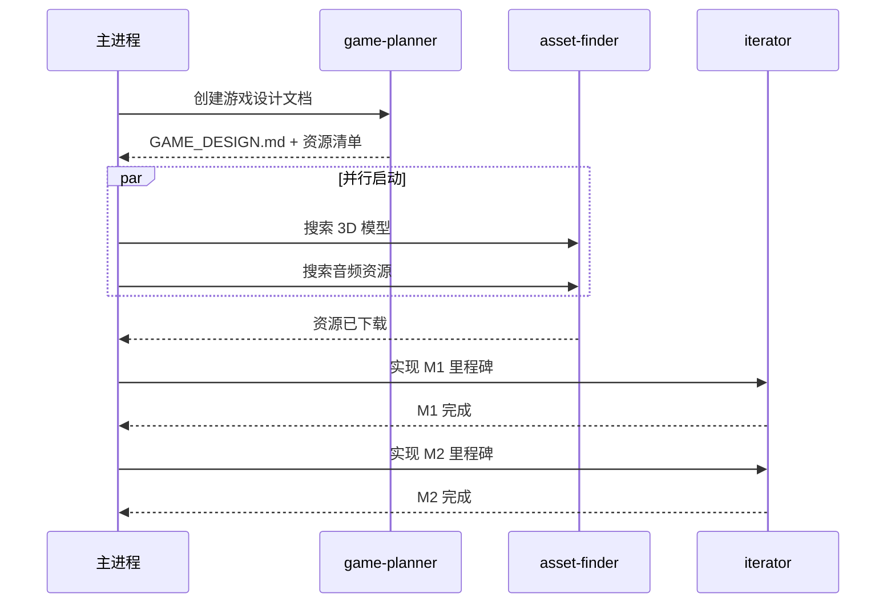

---

## 九、设计原则

### 9.1 五大核心原则

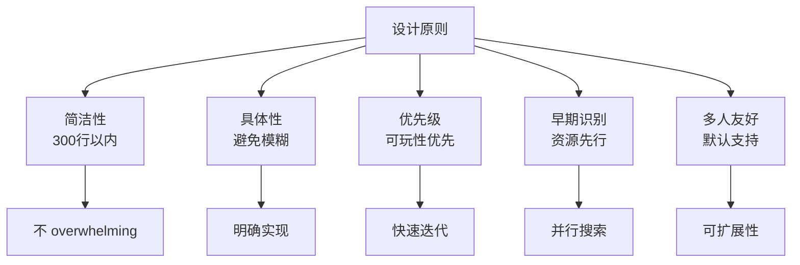

### 9.2 原则详解

#### 1. Keep it under 300 lines（简洁性）

**原因**：
- 太长难以阅读和执行
- 关键信息可能被淹没
- 快速原型不需要过度设计

**实现**：
- 使用表格代替长段落
- 使用要点列表
- 删除冗余描述

#### 2. Be specific（具体性）

**避免**：
```
"Add some enemies"  模糊
```

**推荐**：
```
"Red cube enemy that patrols back and forth,
damaging player on contact"  具体
```

#### 3. Prioritize milestones（优先级）

**原则**：
- M1 必须首先完成才能测试
- M2 完成后游戏可玩
- M3+ 是锦上添花

#### 4. Identify assets early（资源识别）

**原因**：
- asset-finder 可以并行工作
- 在实现前就知道需要什么
- 避免实现等待资源

#### 5. Assume multiplayer（多人友好）

**技术影响**：
- 预制体必须放在 Resources/
- 需要考虑所有权和同步
- 状态管理需要网络支持

---

## 十、技术笔记

### 10.1 技术规范

设计文档包含的技术规范部分：

```markdown
## Technical Notes
- Multiplayer: Normcore (assumed)
- Prefabs in Resources/ for networking
- [其他技术决策]
```

### 10.2 Normcore 多人规范

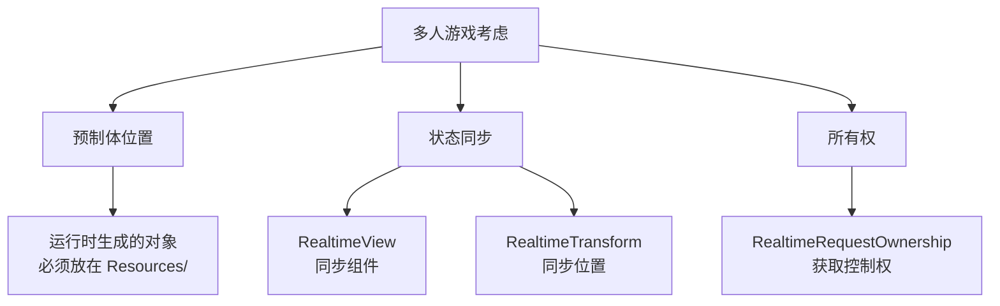

---

## 十一、完整示例

### 11.1 输入示例

**用户输入**：
```
/new-game 太空射击游戏，玩家控制飞船躲避小行星并射击得分
```

### 11.2 输出示例

```markdown
# Space Shooter Game

## Overview
**Genre:** Shooter
**Perspective:** Top-down
**Players:** Multiplayer (Normcore)
**Target Feel:** Fast-paced action with increasing difficulty

## Core Loop
1. Fly spaceship and dodge incoming asteroids
2. Shoot asteroids to destroy them
3. Earn points for each asteroid destroyed
4. Difficulty increases over time (faster asteroids, more frequent)

## Player
- **Controls:** WASD to move, Spacebar to shoot
- **Abilities:** Shoot laser projectiles
- **Constraints:** Limited ship health (3 hits = game over)

## Objectives
- **Win Condition:** Survival mode - achieve highest score
- **Lose Condition:** Health reaches zero
- **Scoring:** 10 points per asteroid destroyed

## Game Elements

### Enemies
| Type | Behavior | Threat |
|------|----------|--------|
| Asteroid | Drifts toward player, random rotation | Contact damage |
| Asteroid Large | Slower, splits into 2 medium asteroids | Contact damage |

### Collectibles
| Item | Effect | Visual |
|------|--------|--------|
| Health Pack | Restores 1 health | Green cross |

### Hazards
| Hazard | Effect |
|--------|--------|
| Asteroid Collision | -1 health on contact |

## Levels/Scenes
1. **Main Space Scene:** Infinite space with starfield background

## UI Elements
- [ ] Health display (3 hearts or bar)
- [ ] Score counter
- [ ] Game over screen with final score

## Assets Needed

### 3D Models / Sprites
- [ ] Spaceship player model
- [ ] Asteroid models (3-5 variations)
- [ ] Laser projectile sprite/beam
- [ ] Explosion particle effect
- [ ] Health pickup sprite
- [ ] Star background texture

### Audio
- [ ] Background music (upbeat space theme, loopable)
- [ ] Laser shooting sound
- [ ] Explosion sound effects
- [ ] Impact/damage sound
- [ ] Health pickup sound
- [ ] Game over sound

## Milestones

### M1: Core Mechanics
- [ ] Player spaceship with WASD movement
- [ ] Camera following player (top-down view)
- [ ] Basic space background scene
- [ ] Laser shooting with spacebar

### M2: Gameplay Loop
- [ ] Asteroid spawning system
- [ ] Collision detection (lasers destroy asteroids)
- [ ] Player health system
- [ ] Score tracking
- [ ] Game over state

### M3: Polish
- [ ] Health UI display
- [ ] Score UI counter
- [ ] Explosion visual effects
- [ ] Audio integration (music + SFX)
- [ ] Screen shake on damage

### M4: Content
- [ ] Difficulty progression (asteroids faster/more frequent)
- [ ] Health pickup spawning
- [ ] High score saving
- [ ] Final asset polish

## Technical Notes
- Multiplayer: Normcore (assumed)
- Prefabs in Resources/ for networking (asteroids, lasers, pickups)
- Asteroid spawning uses object pooling for performance
- Background music should loop seamlessly
```

---

## 十二、与其他代理的协作

### 12.1 代理协作图

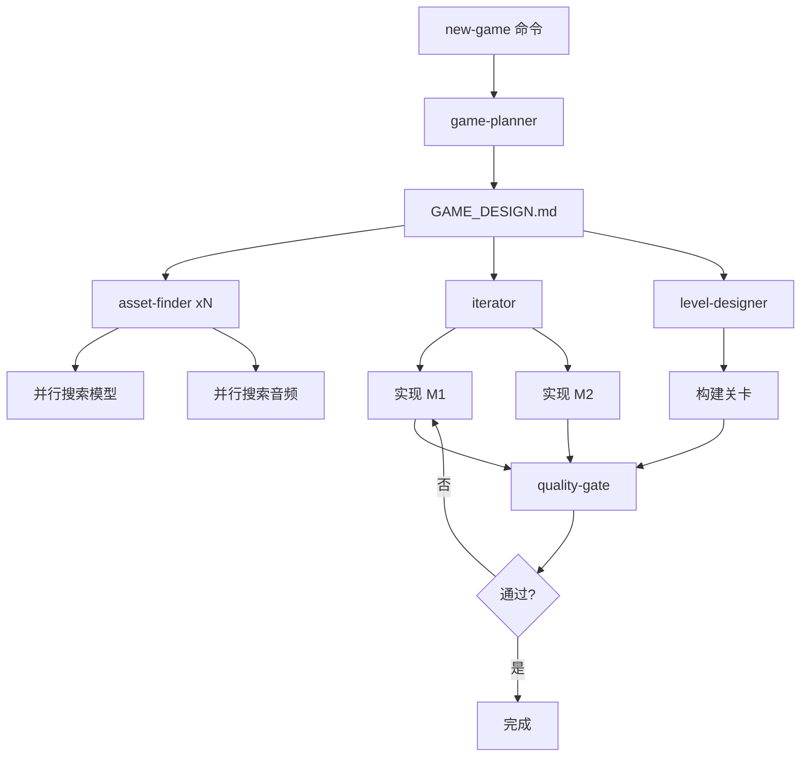

### 12.2 代理职责分工

| 代理 | 职责 | 调用时机 |
|------|------|----------|
| **game-planner** | 规划游戏，生成设计文档 | `/new-game` 开始 |
| **asset-finder** | 搜索和下载资源 | 规划完成后，并行启动 |
| **iterator** | 迭代实现里程碑 | 资源就位后 |
| **level-designer** | 设计和构建关卡 | M2+ 阶段 |
| **code-debugger** | 调试和修复 | 出现问题时 |
| **optimizer** | 性能优化 | M3+ 阶段 |

---

## 十三、最佳实践

### 13.1 输入建议

**好的输入**：
```
✅ "太空射击游戏，躲避小行星并射击"
✅ "平台跳跃游戏，收集金币到达终点"
```

**不够清晰的输入**：
```
❌ "做一个游戏"                    太模糊
❌ "好玩的游戏"                    缺少类型
```

### 13.2 文档审查清单

game-planner 应该自检：

```
文档完整性检查：
□ 游戏类型明确
□ 视角确定
□ 核心循环清晰
□ 玩家能力列出
□ 目标条件说明
□ 游戏元素表格完整
□ 资源清单具体
□ 里程碑可执行
□ 技术规范包含
□ 总行数 < 300
```

---

## 十四、类比总结

### 14.1 类比理解

**game-planner 就像是"建筑设计师"**：

| 建筑设计师 | game-planner |
|-----------|--------------|
| 客户说"我要一栋房子" | 用户说"我要一个射击游戏" |
| 询问需求、偏好 | 理解游戏概念 |
| 画出设计图纸 | 生成 GAME_DESIGN.md |
| 列出材料清单 | 识别所需资源 |
| 规划施工阶段 | 分解里程碑 |
| 考虑技术规范 | 标注技术笔记 |

### 14.2 工作流程类比

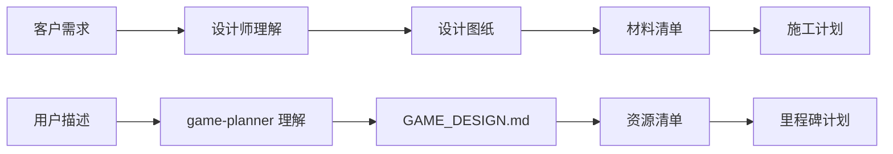

---

## 十五、总结

### 15.1 核心价值

game-planner 代理是整个游戏开发流程的"大脑"：

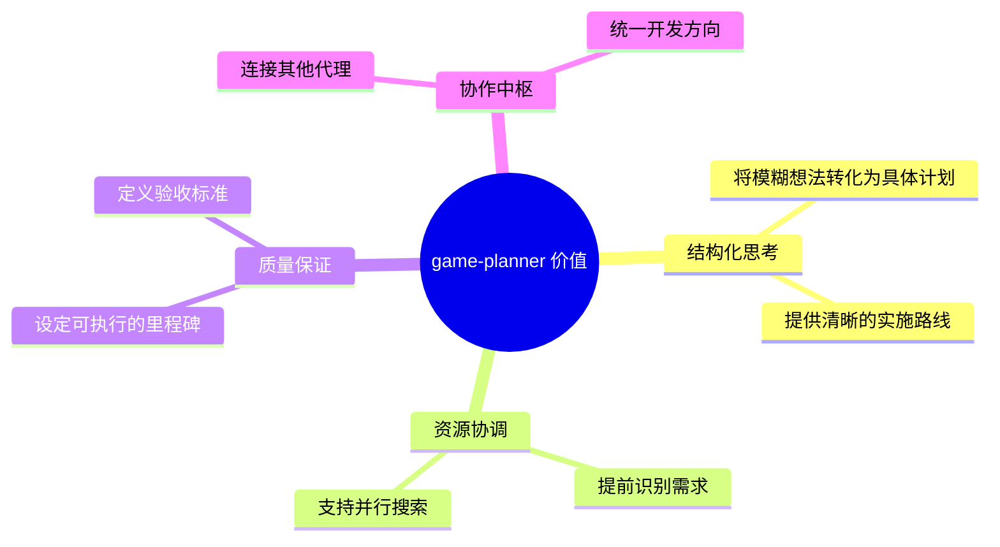

### 15.2 关键文件位置

| 文件 | 路径 | 说明 |
|------|------|------|
| 代理配置 | `template/.claude/agents/game-planner.md` | 代理定义 |
| 输出文档 | `GAME_DESIGN.md`（项目根目录） | 游戏设计文档 |
| 相关命令 | `template/.claude/commands/new-game.md` | 调用入口 |

### 15.3 参考资源

### 相关代理
- [asset-finder 代理](../agents/asset-finder.md) - 资源搜索
- [iterator 代理](../agents/iterator.md) - 迭代实现
- [level-designer 代理](../agents/level-designer.md) - 关卡设计
- [code-debugger 代理](../agents/code-debugger.md) - 调试修复

### 相关技能
- adding-player - 玩家创建
- adding-enemies - 敌人创建
- adding-collectibles - 收集品创建
- multiplayer-setup - 多人设置

---

**文档生成时间**：2026-02-02
**分析版本**：gamekit-cli v0.0.2
