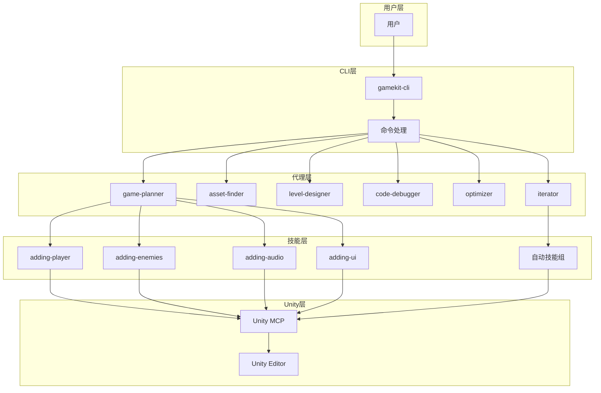
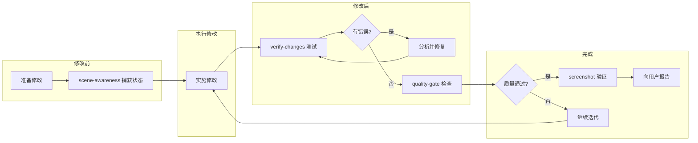

# gamekit-cli 项目完整分析文档

## 项目概述

gamekit-cli 是一个用于 Unity 游戏开发的 CLI 工具，它集成了 Claude AI 能力，提供了自动化游戏开发的工作流程。项目的核心目标是让用户只需描述游戏想法，Claude 就能自动完成 Unity 游戏的构建。

---

## 目录

1. [Agents 代理分析](#agents-代理分析)
2. [Skills 技能分析](#skills-技能分析)
3. [Commands 命令分析](#commands-命令分析)
4. [架构流程图](#架构流程图)
5. [类比如图理解](#类比如图理解)

---

## Agents 代理分析

代理是专门用于处理复杂任务的子代理，每个代理都有特定的职责和工具集。

### 代理总览

| 代理名称 | 模型 | 核心职责 | 触发场景 |
|---------|------|---------|---------|
| asset-finder | haiku | 搜索并下载免费游戏资源 | 需要模型、纹理、音效等资源 |
| code-debugger | sonnet | 系统性调试和修复 Unity 问题 | 出现问题且基础修复无效时 |
| game-planner | sonnet | 创建游戏设计文档和实现计划 | 开始新游戏或规划大功能 |
| iterator | sonnet | 编排构建-测试-修复循环 | 构建需要多轮优化的复杂功能 |
| level-designer | sonnet | 设计和构建游戏关卡 | 创建新关卡或修改现有关卡 |
| optimizer | sonnet | 分析性能并应用优化 | 游戏运行缓慢或需要性能优化 |

### 详细代理分析

#### 1. asset-finder (资源查找器)

```
职责流程:
用户请求资源 -> 搜索免费资源网站 -> 验证许可证 -> 下载资源 -> 组织到正确目录 -> 报告结果
```

**可用工具**: WebSearch, WebFetch, Bash, Write

**资源来源优先级**:
1. **Polyhaven** - 最佳纹理来源，直接 API 下载
2. **OpenGameArt.org** - 可靠的音效和 2D 资源
3. **Kenney.nl** - CC0 资源（通过 OpenGameArt 镜像下载）
4. **itch.io** - 独立游戏资源
5. **Freesound.org** - 音效资源
6. **Mixamo.com** - 动画角色（需手动下载）
7. **Sketchfab** - 3D 模型（需手动下载）
8. **Unity Asset Store** - Unity 官方资源商店

**关键特性**:
- 自动验证文件类型（防止下载 HTML 重定向）
- 3D 模型自动转换为 Prefab（FBX 不能运行时加载）
- 资源按类型组织到 `Assets/Downloaded/` 目录

#### 2. code-debugger (代码调试器)

```
调试流程:
收集问题信息 -> 检查控制台错误 -> 调查相关代码 -> 识别根因 -> 实施修复 -> 验证修复
```

**可用工具**: Read, Grep, Glob, manage_console, manage_gameobject, manage_script, manage_scene

**常见问题类型**:
- NullReferenceException（空引用异常）
- 碰撞不工作
- 触发器不触发
- 移动不工作
- 多人同步问题

**输出格式**:
```
PROBLEM: [问题描述]
ROOT CAUSE: [根本原因]
FIX APPLIED: [应用的修复]
VERIFICATION: [如何验证]
```

#### 3. game-planner (游戏规划器)

```
规划流程:
理解游戏愿景 -> 创建 GDD 文档 -> 分解里程碑 -> 识别所需资源 -> 保存到 GAME_DESIGN.md
```

**可用工具**: Read, Write, Glob, Grep

**GDD 文档结构**:
- 游戏概述（类型、视角、目标感受）
- 核心循环
- 玩家设定（控制、能力、约束）
- 游戏元素（敌人、收集品、危险）
- 关卡/场景设计
- UI 元素
- 资源需求
- 里程碑（M1-M4）

#### 4. iterator (迭代器)

```
迭代循环:
理解目标 -> 迭代 N -> 实现 -> 测试 -> 评估 -> 质量门检查 -> 通过/下一轮迭代
```

**可用工具**: Read, Write, Glob, Grep, Bash, manage_console, manage_gameobject, manage_script, manage_scene, manage_editor, manage_asset, manage_physics

**迭代阶段**:
1. **Iteration 1: 基础功能** - 核心机制可工作
2. **Iteration 2: 健壮性** - 修复 bug 和边缘情况
3. **Iteration 3: 手感** - 优化游戏感觉
4. **Iteration 4+: 打磨** - 精细化到高质量

**限制**: 最多 5 次迭代，超过后报告阻塞问题

#### 5. level-designer (关卡设计师)

```
关卡设计流程:
理解需求 -> 规划布局 -> 构建结构 -> 放置元素 -> 确保可玩性
```

**可用工具**: Read, Grep, Glob, manage_gameobject, manage_scene, manage_asset

**关卡设计原则**:
- **Flow（流程）**: 清晰的起点到目标路径
- **Pacing（节奏）**: 变化强度（动作 -> 休息 -> 动作）
- **Difficulty Curve（难度曲线）**: 由易到难
- **Space（空间）**: 足够的机动空间

**关卡类型**:
- 平台跳跃关卡
- 竞技场/战斗关卡
- 线性/冒险关卡
- 解谜关卡

#### 6. optimizer (优化器)

```
优化流程:
获取基线 -> 识别瓶颈 -> 应用修复 -> 重新分析验证
```

**可用工具**: Read, Grep, Glob, manage_profiler, manage_console, manage_gameobject, manage_script, manage_rendering, manage_physics

**优化领域**:
- **渲染**: Draw calls、阴影、批处理
- **脚本**: Update() 优化、缓存、GC 避免
- **物理**: 碰撞器类型、层碰撞矩阵
- **内存**: 纹理压缩、音频流式

---

## Skills 技能分析

技能是 Claude 在特定场景下自动应用的知识库，提供代码模式和最佳实践。

### 技能总览

| 技能名称 | 描述 | 触发词 |
|---------|------|--------|
| adding-audio | 添加音效、音乐和音频反馈 | sound, audio, music |
| adding-collectibles | 创建收集品、硬币、能量道具 | collect, pickup, coins |
| adding-enemies | 创建敌人、NPC 和 AI 角色 | enemy, NPC, AI, chase |
| adding-juice | 视觉打磨、游戏手感、粒子效果 | juice, polish, shake |
| adding-player | 创建玩家角色和移动控制 | player, character, move |
| adding-ui | 创建 UI 元素如血条、分数 | health bar, score, menu |
| creating-animations | 创建简单动画如旋转、浮动 | spin, rotate, bob, pulse |
| creating-materials | 创建材质、颜色、纹理 | color, texture, material |
| level-progression | 场景转换、关卡解锁、存档 | levels, save, checkpoint |
| multiplayer-setup | 设置 Normcore 多人同步 | multiplayer, network |
| quality-gate | 质量检查清单 | 自动应用（完成前） |
| quick-tweaks | 快速调整游戏数值 | faster, bigger, harder |
| scene-awareness | 场景状态捕获 | 自动应用（修改前后） |
| screenshot | 捕获游戏截图 | 自动应用（视觉验证） |
| setting-up-cameras | 设置相机视角和跟随 | camera, view, perspective |
| setting-up-physics | 设置物理、碰撞、刚体 | fall, collide, physics |
| setting-up-triggers | 创建触发区域 | zone, trigger, checkpoint |
| using-3d-models | 处理 3D 模型转换 | 自动应用（FBX 下载后） |
| verify-changes | 自动测试修复循环 | 自动应用（修改后） |

### 技能分类

#### A. 游戏元素创建类

```
adding-player     -> 玩家角色创建
adding-enemies    -> 敌人和 AI 创建
adding-collectibles -> 收集品创建
adding-ui         -> UI 元素创建
adding-audio      -> 音频系统创建
```

#### B. 视觉和打磨类

```
creating-materials   -> 材质和颜色
creating-animations  -> 简单动画
adding-juice         -> 游戏手感打磨
```

#### C. 系统设置类

```
setting-up-cameras   -> 相机设置
setting-up-physics   -> 物理设置
setting-up-triggers  -> 触发器设置
multiplayer-setup    -> 多人游戏设置
level-progression    -> 关卡进程系统
using-3d-models      -> 3D 模型处理
```

#### D. 自动化质量保证类

```
scene-awareness  -> 场景状态跟踪（自动）
verify-changes   -> 修改验证（自动）
quality-gate     -> 质量门检查（自动）
screenshot       -> 视觉验证（自动）
quick-tweaks     -> 快速调整
```

### 自动行为技能详解

这些技能会在特定条件下**自动触发**，无需用户请求：

#### 1. scene-awareness（场景感知）

```
触发时机:
- 修改 3 个以上 GameObject
- 创建或修改脚本
- 更改物理配置
- 修改 UI 元素

自动执行:
BEFORE: 捕获场景层次结构、组件状态
AFTER:  验证控制台无错误、比较前后状态
```

#### 2. verify-changes（修改验证）

```
触发时机:
- 任何脚本创建或修改
- 添加新的行为 GameObject
- 更改物理配置
- 创建新游戏机制

验证循环:
修改 -> 5 秒测试 -> 检查错误 -> [通过/修复后重试]
```

#### 3. quality-gate（质量门）

```
触发时机:
- 说 "done", "finished", "complete"
- 向用户展示新功能
- 推荐用户测试前

检查级别:
Gate 1: 功能性（必须通过）
Gate 2: 可玩性（应该通过）
Gate 3: 视觉质量（应该检查）
Gate 4: 打磨（锦上添花）
```

#### 4. using-3d-models（3D 模型处理）

```
触发时机:
- asset-finder 下载 FBX/OBJ 文件
- 用户提到 "3D model", "FBX"
- 需要运行时生成模型

自动转换:
FBX -> 创建临时实例 -> 保存为 Prefab -> 删除临时对象
```

---

## Commands 命令分析

命令是用户可以显式调用的操作，通过 `/command-name` 语法触发。

### 命令总览

| 命令 | 描述 | 示例用法 |
|-----|------|---------|
| /new-game | 从零开始创建新游戏 | /new-game space shooter |
| /playtest | 进入播放模式监控问题 | /playtest for 30 seconds |
| /auto-test | 自动化测试无需人工干预 | /auto-test 30 seconds |
| /build | 构建游戏到指定平台 | /build windows |
| /find-asset | 查找并导入免费资源 | /find-asset zombie |
| /preview-assets | 预览资源选项再下载 | /preview-assets spaceship |
| /explain | 解释 Unity/Normcore 概念 | /explain what is a prefab |
| /fix | 诊断并修复特定问题 | /fix player clips through walls |
| /screenshot | 捕获游戏截图 | /screenshot game |
| /snapshot | 捕获完整场景状态 | /snapshot player |
| /rollback | 撤销 Claude 的最近修改 | /rollback last 3 |
| /convert-models | 转换 FBX 到运行时 Prefab | /convert-models zombie.fbx |
| /add-multiplayer | 添加 Normcore 多人支持 | /add-multiplayer |
| /provide-feedback | 生成体验报告 | /provide-feedback |

### 命令分类

#### A. 游戏创建和构建类

```
/new-game     -> 完整游戏创建流程
/build        -> 构建到各平台
```

#### B. 测试和调试类

```
/playtest     -> 手动测试监控
/auto-test    -> 自动化测试
/fix          -> 问题诊断修复
```

#### C. 资源管理类

```
/find-asset     -> 直接下载资源
/preview-assets -> 预览后选择下载
/convert-models -> 模型格式转换
```

#### D. 状态管理类

```
/snapshot     -> 捕获当前状态
/rollback     -> 恢复之前状态
/screenshot   -> 视觉验证
```

#### E. 系统配置类

```
/add-multiplayer -> 添加多人支持
```

#### F. 学习和反馈类

```
/explain          -> 概念解释
/provide-feedback -> 体验报告
```

### 关键命令详解

#### /new-game（创建新游戏）

```
执行流程:
1. 委托 game-planner 代理创建设计文档
2. 并行启动多个 asset-finder 代理搜索资源
3. 创建项目目录结构
4. 开始构建第一个里程碑

目录结构:
Assets/
├── _Game/
│   ├── Scenes/
│   ├── Scripts/
│   ├── Prefabs/
│   └── Materials/
├── Resources/  (多人游戏 Prefab)
└── Downloaded/ (导入的资源)
```

#### /build（构建游戏）

```
平台映射:
windows, pc, win -> StandaloneWindows64
mac, macos, osx  -> StandaloneOSX
linux            -> StandaloneLinux64
webgl, browser   -> WebGL
android          -> Android
ios, iphone      -> iOS

构建位置:
Builds/Windows/MyGame.exe
Builds/Mac/MyGame.app
Builds/WebGL/index.html
```

#### /snapshot（场景快照）

```
快照内容:
- 场景层次结构
- 关键对象组件
- 物理配置
- 相机设置
- UI 状态
- 渲染信息

聚焦选项:
/snapshot player   -> 玩家相关
/snapshot physics  -> 物理设置
/snapshot ui       -> UI 元素
/snapshot enemies  -> 敌人状态
```

---

## 架构流程图

### 整体架构



### 自动质量保证流程



### 新游戏创建流程

```mermaid
graph TD
    A[/new-game 命令] --> B[game-planner 代理]
    B --> C[创建 GAME_DESIGN.md]

    C --> D[并行资源搜索]
    D --> E1[asset-finder: 角色]
    D --> E2[asset-finder: 环境]
    D --> E3[asset-finder: 音效]

    E1 --> F[创建项目结构]
    E2 --> F
    E3 --> F

    F --> G[构建里程碑 1]
    G --> H[添加玩家]
    H --> I[设置相机]
    I --> J[基础游戏循环]

    J --> K[verify-changes]
    K --> L[quality-gate]
    L --> M[游戏就绪]
```

---

## 类比如图理解

### 项目类比：游戏开发自动化工厂

```
gamekit-cli 就像一个自动化游戏开发工厂:

┌─────────────────────────────────────────────────────────────┐
│                     gamekit-cli 工厂                         │
├─────────────────────────────────────────────────────────────┤
│                                                             │
│  [用户] 发送订单: "我要一个太空射击游戏"                      │
│                         ↓                                   │
│  ┌─────────────────────────────────────────────────────┐   │
│  │           /new-game 命令 (订单接收器)                │   │
│  └─────────────────────────────────────────────────────┘   │
│                         ↓                                   │
│  ┌─────────────────────────────────────────────────────┐   │
│  │        game-planner 代理 (设计师办公室)              │   │
│  │  - 绘制蓝图 (GAME_DESIGN.md)                        │   │
│  │  - 分解工作阶段                                      │   │
│  │  - 列出材料需求                                      │   │
│  └─────────────────────────────────────────────────────┘   │
│                         ↓                                   │
│  ┌─────────────────────────────────────────────────────┐   │
│  │        asset-finder 代理 (采购部门)                  │   │
│  │  - 搜索免费资源市场                                  │   │
│  │  - 下载并验证资源                                    │   │
│  │  - 分类存放材料                                      │   │
│  └─────────────────────────────────────────────────────┘   │
│                         ↓                                   │
│  ┌─────────────────────────────────────────────────────┐   │
│  │           技能组 (专业工人团队)                       │   │
│  │                                                      │   │
│  │  [玩家技工] [敌人技工] [UI技工] [音效技工]            │   │
│  │  [相机技工] [物理技工] [触发技工] [打磨技工]          │   │
│  │                                                      │   │
│  │  每个技工带着自己的工具箱（代码模板）                  │   │
│  └─────────────────────────────────────────────────────┘   │
│                         ↓                                   │
│  ┌─────────────────────────────────────────────────────┐   │
│  │         质量保证系统 (自动检测线)                     │   │
│  │                                                      │   │
│  │  [scene-awareness] ← 记录每步状态                    │   │
│  │  [verify-changes]   ← 测试每步修改                   │   │
│  │  [quality-gate]     ← 最终质量检查                   │   │
│  │  [screenshot]       ← 视觉检验                       │   │
│  │                                                      │   │
│  └─────────────────────────────────────────────────────┘   │
│                         ↓                                   │
│  ┌─────────────────────────────────────────────────────┐   │
│  │        iterator 代理 (迭代优化工程师)                │   │
│  │  - 不满意? 再来一轮                                  │   │
│  │  - 修复问题                                          │   │
│  │  - 打磨细节                                          │   │
│  │  - 直到质量达标                                      │   │
│  └─────────────────────────────────────────────────────┘   │
│                         ↓                                   │
│              [成品游戏] 交付给用户                           │
│                                                             │
└─────────────────────────────────────────────────────────────┘
```

### 技能类比：专业技能工具箱

```
每个技能就像一个专业工具箱:

┌──────────────────────────────────────────────────────────┐
│                adding-player 工具箱                       │
├──────────────────────────────────────────────────────────┤
│                                                          │
│  触发词: player, character, move, WASD                   │
│                                                          │
│  工具:                                                   │
│  ┌─────────────┐ ┌─────────────┐ ┌─────────────┐       │
│  │ 俯视移动模板 │ │ 平台移动模板 │ │ 飞行移动模板 │       │
│  └─────────────┘ └─────────────┘ └─────────────┘       │
│                                                          │
│  ┌─────────────┐ ┌─────────────┐ ┌─────────────┐       │
│  │ 多人同步代码 │ │ 物理配置参数 │ │ 相机跟随脚本 │       │
│  └─────────────┘ └─────────────┘ └─────────────┘       │
│                                                          │
│  输出:                                                   │
│  "我创建了你的玩家角色，用 WASD 移动，Space 跳跃"         │
│                                                          │
└──────────────────────────────────────────────────────────┘

┌──────────────────────────────────────────────────────────┐
│               quality-gate 检查清单                       │
├──────────────────────────────────────────────────────────┤
│                                                          │
│  Gate 1: 功能性 [必须通过]                               │
│  □ 游戏运行无错误                                        │
│  □ 无编译错误                                            │
│  □ 核心循环工作                                          │
│  □ 30 秒测试通过                                         │
│                                                          │
│  Gate 2: 可玩性 [应该通过]                               │
│  □ 控制响应                                              │
│  □ 碰撞正确                                              │
│  □ 目标清晰                                              │
│  □ 难度合理                                              │
│                                                          │
│  Gate 3: 视觉 [应该检查]                                 │
│  □ 场景不空旷                                            │
│  □ 颜色有意                                              │
│  □ UI 可读                                               │
│                                                          │
│  Gate 4: 打磨 [锦上添花]                                 │
│  □ 音频反馈                                              │
│  □ 视觉反馈                                              │
│  □ 游戏手感                                              │
│                                                          │
└──────────────────────────────────────────────────────────┘
```

### 命令类比：工厂订单系统

```
命令就像工厂的不同订单类型:

/new-game     = 完整产品订单
                "我要一台完整的电脑"
                -> 需要规划、采购、组装、测试

/playtest     = 产品试用请求
                "让我试试这个产品"
                -> 启动产品，监控问题

/build        = 包装发货请求
                "把产品打包发给我"
                -> 构建可执行文件

/snapshot     = 状态报告请求
                "告诉我现在的进度"
                -> 详细状态快照

/rollback     = 撤销请求
                "我不喜欢这个改动，回到之前"
                -> 恢复之前状态
```

---

## 总结

### 核心设计理念

1. **自动化优先**: 场景感知、修改验证、质量门都是自动触发的
2. **专业化分工**: 每个代理和技能都有明确的职责范围
3. **质量保证**: 多层质量检查确保输出高质量
4. **用户友好**: 用户只需描述想法，技术细节由系统处理

### 交互模式

```
用户描述 -> Claude 理解 -> 选择代理/技能 -> 执行 -> 自动验证 -> 交付
                ↑                                    ↓
                └────────── 迭代优化 ←───────────────┘
```

### 适用场景

- 快速原型开发
- 独立游戏开发
- 游戏开发学习
- 多人游戏原型

---

## 引用说明

本文档基于以下项目文件分析生成:

- `template/.claude/agents/` - 代理定义文件
- `template/.claude/skills/` - 技能定义文件
- `template/.claude/commands/` - 命令定义文件
- `template/.claude/CLAUDE.md` - 主配置文件

---

## 问题修复记录

### 2026-03-02: 添加必要的 Unity 包依赖

**问题描述**: `/new-game` 命令创建项目时没有添加 Unity UI (UGUI) 包，导致后续开发 UI 逻辑时报错。

**影响范围**:
- 无法使用 Canvas、Text、Button、Slider 等 UI 组件
- UI 相关脚本编译失败

**解决方案**: 修改 `src/utils/manifest.ts`，在初始化项目时自动添加以下必要包:

| 包名 | 版本 | 用途 |
|-----|------|-----|
| `com.unity.ugui` | 1.0.0 | Unity UI 系统 |
| `com.unity.textmeshpro` | 3.0.6 | 现代文本渲染系统 |
| `com.unity.inputsystem` | 1.7.0 | 新输入系统 |
| `com.unity.ide.rider` | 3.0.39 | Rider IDE 支持（智能提示、调试） |

**修改文件**:
- `src/utils/manifest.ts` - 添加 `addEssentialPackages` 函数
- `src/__tests__/utils/manifest.test.ts` - 添加相应测试用例

**注意事项**:
- 如果项目已存在这些包，不会覆盖现有版本
- 这些包只在新项目创建或现有项目初始化时添加

