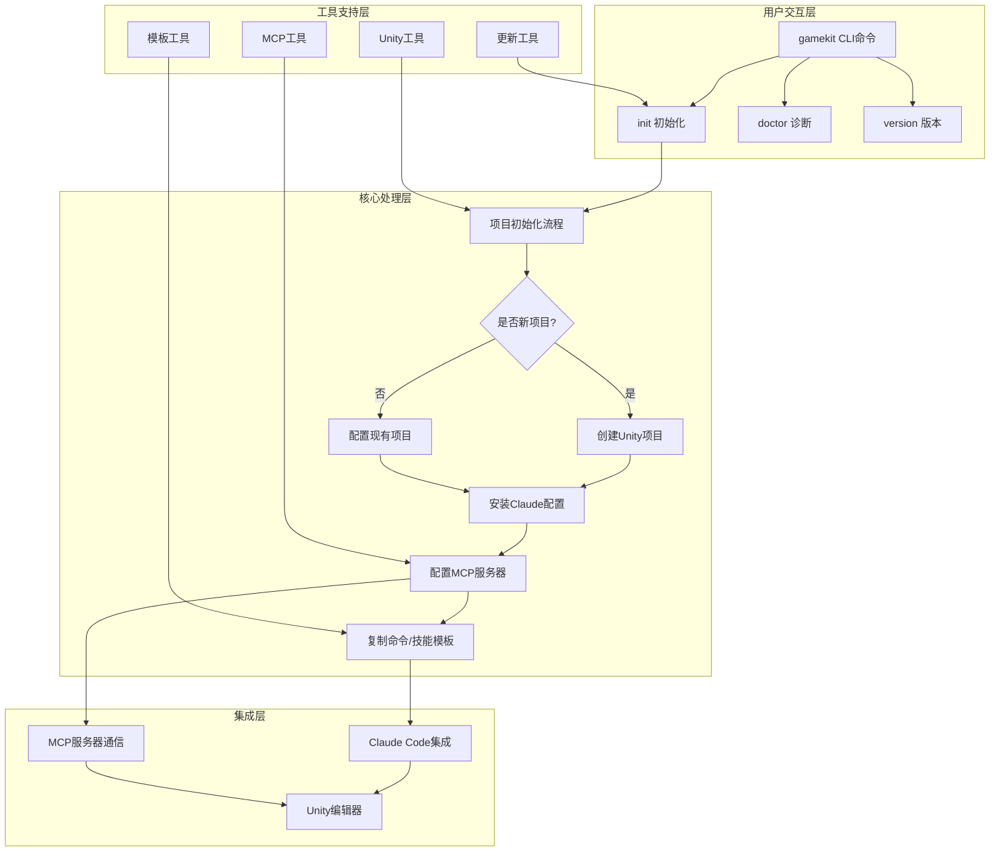
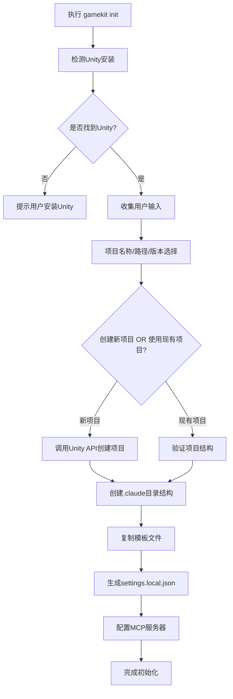
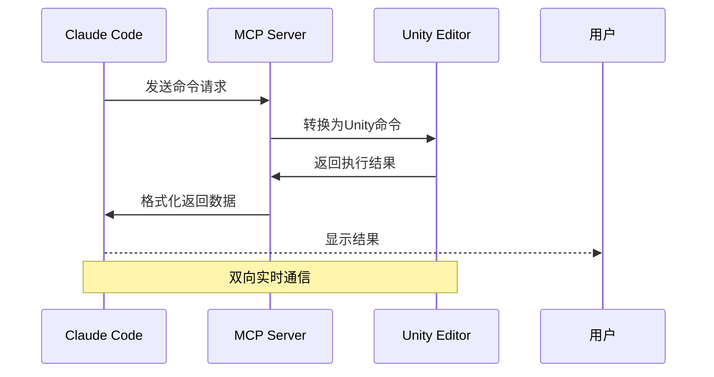
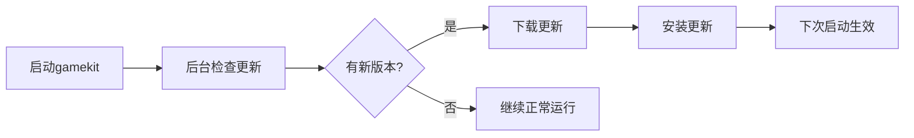
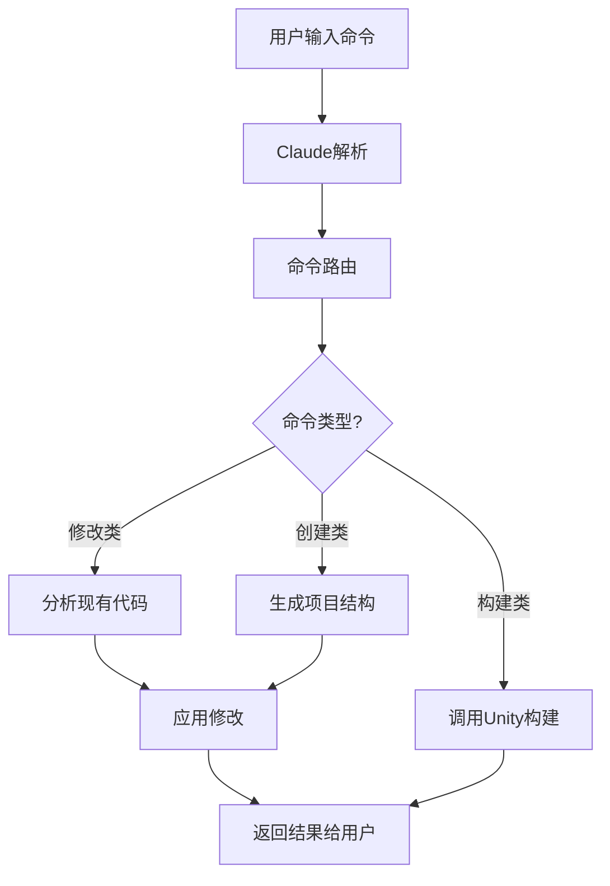
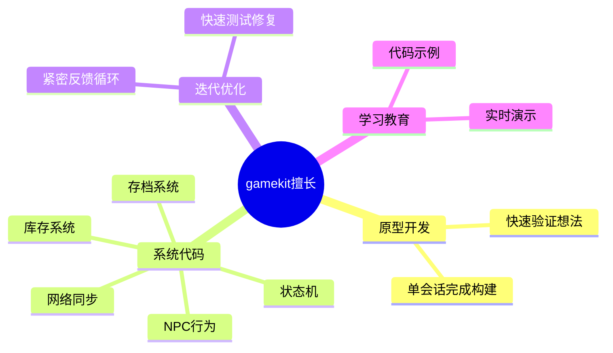
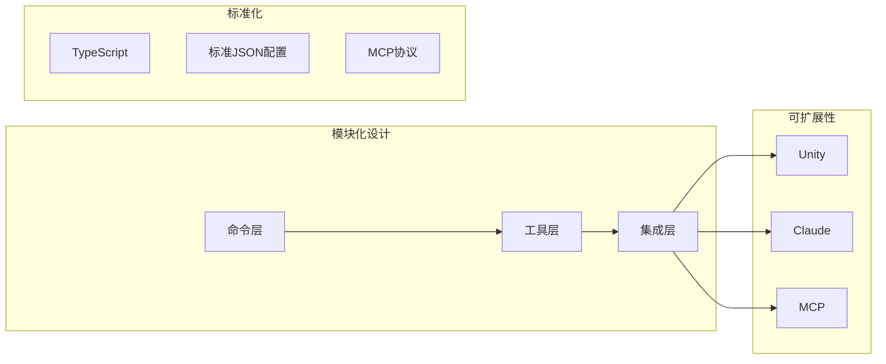
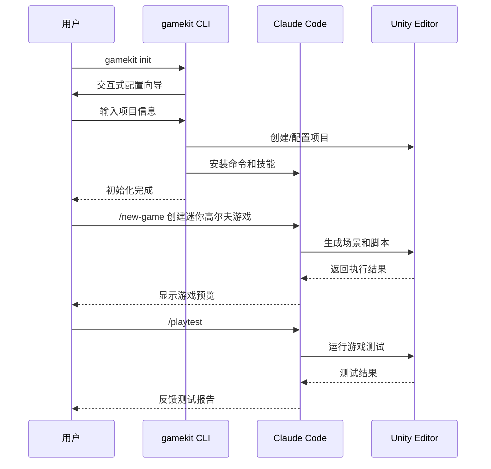

# gamekit-cli 项目分析文档

## 一、项目概述

### 1.1 项目简介

**gamekit-cli** 是一个开源的命令行工具，专为使用 Claude Code 进行 Unity 游戏开发而设计。该项目由 Normal 团队创建，采用 MIT 许可证发布。

**项目定位**：AI 驱动的 Unity 游戏开发 CLI 工具

**核心价值**：通过集成 Claude AI 和 MCP（Model Context Protocol）协议，为开发者提供智能化的 Unity 游戏开发辅助工具。

### 1.2 技术栈

| 类别 | 技术选型 |
|------|----------|
| 开发语言 | TypeScript |
| 运行环境 | Node.js >= 18.0.0 |
| 构建工具 | Bun |
| 测试框架 | Vitest |
| CLI 框架 | Commander |
| 终端美化 | Chalk |
| 交互式输入 | Inquirer |
| 加载动画 | Ora |

---

## 二、项目架构

### 2.1 整体架构流程



### 2.2 目录结构详解

```
gamekit-cli/
├── src/                          # 源代码目录
│   ├── commands/                 # CLI命令实现
│   │   ├── init.ts              # 初始化命令 (13.5KB - 核心文件)
│   │   └── doctor.ts            # 诊断命令
│   ├── utils/                   # 工具模块
│   │   ├── assets.ts            # 资源管理
│   │   ├── commands.ts          # 命令工具
│   │   ├── manifest.ts          # 清单文件处理
│   │   ├── mcp.ts               # MCP服务器集成 (4.9KB)
│   │   ├── platform.ts          # 平台检测
│   │   ├── template.ts          # 模板处理 (10.5KB)
│   │   ├── unity.ts             # Unity集成 (6.2KB)
│   │   └── updater.ts           # 更新检查 (11.2KB)
│   ├── index.ts                 # 主程序入口
│   └── version.ts              # 版本信息
│
├── template/                     # Unity项目模板
│   └── .claude/                 # Claude配置目录
│       ├── CLAUDE.md            # Claude配置文件
│       ├── LEARNINGS.md         # 学习记录
│       ├── settings.local.json  # 本地设置
│       ├── commands/            # Claude命令库 (14个命令)
│       ├── agents/              # Claude代理
│       └── skills/              # Claude技能库
│
├── scripts/                      # 构建脚本
├── docs/                        # 文档目录
├── dist/                        # 编译输出目录
└── 配置文件
    ├── package.json
    ├── tsconfig.json
    ├── vitest.config.ts
    └── bunfig.toml
```

---

## 三、核心功能模块详解

### 3.1 初始化流程 (init.ts)

**功能说明**：这是 gamekit-cli 最核心的模块，负责完整的 Unity 项目初始化流程。



**类比理解**：
- init.ts 就像是装修公司的"项目启动部"
- 它先检查你的"毛坯房"（Unity环境）是否准备好
- 然后问你想要"精装修"（新项目）还是"局部改造"（现有项目）
- 最后把所有"家具"（Claude命令、技能、MCP配置）都摆放好

### 3.2 MCP 集成模块 (mcp.ts)

**功能说明**：负责配置 Claude Code 的 MCP（Model Context Protocol）服务器，实现 Claude 与 Unity 的双向通信。



**配置结构**：
```json
{
  "mcpServers": {
    "advanced-unity-mcp": {
      "command": "node",
      "args": ["path/to/mcp-server.js"],
      "env": {
        "UNITY_PROJECT_PATH": "项目路径"
      }
    }
  }
}
```

**类比理解**：
- MCP 就像是"翻译官"
- Claude 说中文（AI指令），Unity 说英文（C#脚本）
- MCP 负责双向翻译，确保双方能理解对方的指令

### 3.3 Unity 集成模块 (unity.ts)

**功能说明**：处理与 Unity 编辑器相关的所有操作。

**核心能力**：
| 功能 | 描述 |
|------|------|
| 版本检测 | 自动检测系统中安装的 Unity 版本 |
| 项目创建 | 通过 Unity 命令行 API 创建新项目 |
| 包管理 | 集成 Unity Package Manager |
| 模板生成 | 生成符合规范的脚本模板 |

### 3.4 模板处理模块 (template.ts)

**功能说明**：管理 Claude 配置模板和项目初始化模板。

**模板包含内容**：
1. **Claude 命令集**（14个核心命令）
2. **Claude 技能库**（Unity开发专用技能）
3. **Claude 代理**（自动化任务代理）
4. **配置文件**（settings.local.json）

### 3.5 更新系统 (updater.ts)

**功能说明**：后台自动检测和安装更新，确保用户始终使用最新版本。



---

## 四、Claude 命令集详解

gamekit-cli 预置了 14 个专用于 Unity 游戏开发的 Claude 命令：

### 4.1 命令列表

| 命令 | 功能描述 |
|------|----------|
| `/new-game` | 创建新游戏项目 |
| `/add-multiplayer` | 添加多人游戏功能 |
| `/build` | 构建项目 |
| `/playtest` | 游戏测试 |
| `/fix` | 修复问题 |
| `/explain` | 解释代码 |
| `/screenshot` | 截图功能 |
| `/snapshot` | 项目快照 |
| `/rollback` | 回滚更改 |
| `/auto-test` | 自动测试 |
| `/find-asset` | 查找资源 |
| `/preview-assets` | 预览资源 |
| `/convert-models` | 模型转换 |
| `/provide-feedback` | 提供反馈 |

### 4.2 命令执行流程



---

## 五、适用场景分析

### 5.1 目标用户群体

**1. Unity 新手开发者**
- 快速从想法到可玩原型
- 通过观察 Claude 构建代码来学习
- 交互式学习体验

**2. 经验丰富的开发团队**
- 加速系统代码开发（NPC、库存、状态机、网络）
- 保留现有工作流，在合适的地方添加 AI 辅助
- 提高开发效率

**3. 多人游戏开发者**
- Claude 擅长编写多人游戏代码
- 自动生成测试套件验证生产环境正确性
- 简化网络同步逻辑

### 5.2 项目擅长领域



### 5.3 当前限制

1. **资源创建**：Claude 只能编写代码，不能创建艺术/音频/3D模型
2. **MCP 性能**：基于截图的迭代存在延迟
3. **Unity 版本**：需要 Unity 6 或 2022.x 以上版本

---

## 六、技术特点总结

### 6.1 设计亮点

1. **CLI 优先**：符合开发者工作习惯
2. **跨平台支持**：macOS、Windows、Linux 全覆盖
3. **模板化配置**：一键完成环境搭建
4. **AI 深度集成**：充分利用 Claude 的代码生成能力
5. **MCP 协议标准化**：使用标准协议实现工具集成

### 6.2 架构优势



---

## 七、使用示例

### 7.1 快速开始流程



### 7.2 典型工作流

```mermaid
flowchart TD
    A[构思游戏想法] --> B[gamekit init 初始化]
    B --> C[/new-game 创建基础框架]
    C --> D[迭代开发]
    D --> E[/screenshot 查看当前状态]
    E --> F{需要修改?}
    F -->|是| G[/fix 修复问题]
    F -->|否| H[/playtest 测试游戏]
    G --> D
    H --> I{满意?}
    I -->|否| D
    I -->|是| J[/build 构建最终版本]
```

---

## 八、开发路线图

根据项目文档，团队正在以下方向持续改进：

1. **性能优化**：开发更快的 Unity 通信方式，替代基于截图的方案
2. **资源发现**：增强 `/find-asset` 命令，帮助开发者找到合适的美术资源
3. **更多命令**：扩展 Claude 命令集，覆盖更多开发场景
4. **社区贡献**：开放技能库，允许社区贡献自定义命令

---

## 九、总结

### 9.1 核心价值

gamekit-cli 是一个创新的 Unity 游戏开发工具，它将：
- **AI 能力**（Claude 代码生成）
- **专业工具**（Unity 游戏引擎）
- **标准化协议**（MCP）
- **开发体验**（CLI 工作流）

完美结合，为游戏开发者提供了全新的开发范式。

### 9.2 类比总结

如果把 Unity 游戏开发比作"建造房子"：
- **Unity** 是"建筑工地和原材料"
- **Claude** 是"智能建筑师助手"
- **gamekit-cli** 是"项目管家"，负责协调各方，确保项目顺利启动

### 9.3 技术贡献

该项目展示了：
1. MCP 协议在实际 AI 工具集成中的应用
2. CLI 工具如何提升 AI 辅助开发的效率
3. 游戏开发自动化的最佳实践

---

## 十、参考资源

### 官方资源
- [GitHub 仓库](https://github.com/gamekit-agent/gamekit-cli)
- [Claude Code 官方文档](https://docs.anthropic.com/en/docs/claude-code)
- [Normal 团队官网](https://normcore.io/)
- [Discord 社区](https://discord.gg/jmJNmJbwxYc)

### 技术文档
- [MCP 协议规范](https://modelcontextprotocol.io/)
- [Unity 命令行文档](https://docs.unity3d.com/Manual/CommandLineArguments.html)
- [Commander.js 文档](https://github.com/tj/commander.js)
- [Vitest 测试框架](https://vitest.dev/)

### 相关项目
- [Normcore - Unity 多人游戏网络中间件](https://normcore.io/)
- [Claude AI](https://www.anthropic.com/claude)

---

**文档生成时间**：2026-02-02
**项目版本**：v0.0.2
**分析工具**：Claude Code
