# new-game 命令执行流程分析文档

## 一、命令概述

### 1.1 命令定义

`/new-game` 是 gamekit-cli 中用于创建新游戏项目的核心命令，它是一个完整的游戏开发启动流程，从概念到可玩原型的全流程自动化。

**命令格式**：`/new-game [游戏描述]`

**示例**：
- `/new-game space shooter where you dodge asteroids`
- `/new-game 3D platformer with coins and enemies`
- `/new-game Create a mini golf game with 3 holes`

### 1.2 核心能力

| 能力 | 描述 |
|------|------|
| 游戏设计 | 自动生成结构化的游戏设计文档 |
| 资源获取 | 并行搜索并下载免费游戏资源 |
| 项目构建 | 创建标准化的 Unity 项目结构 |
| 代码实现 | 使用专用技能自动实现游戏功能 |
| 质量保证 | 自动测试和质量检查 |

---

## 二、执行流程总览

### 2.1 整体流程图

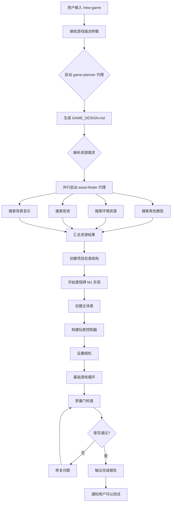

### 2.2 时间线流程

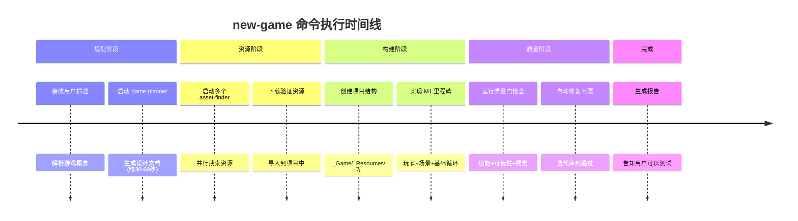

---

## 三、阶段一：游戏规划（game-planner）

### 3.1 game-planner 代理配置

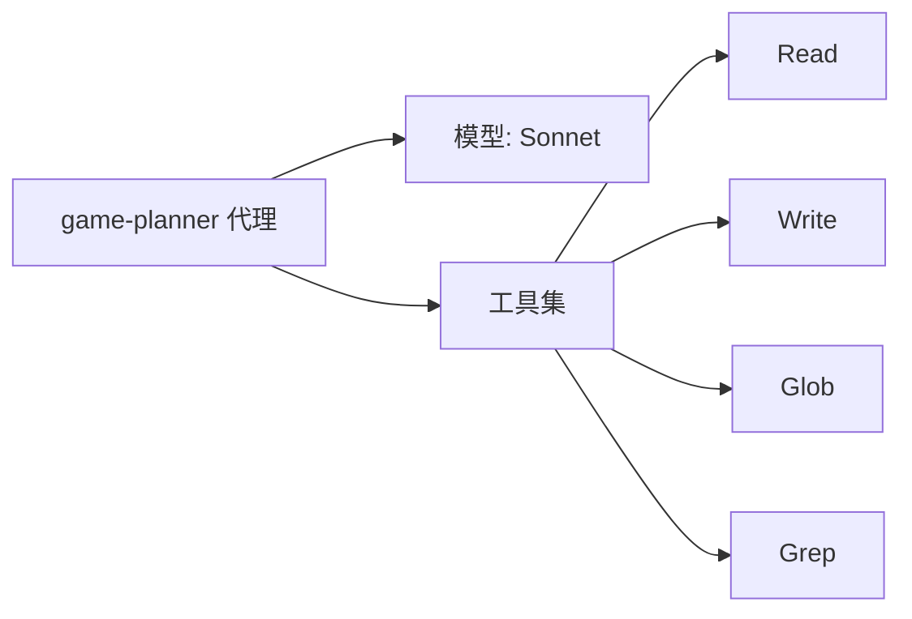

### 3.2 设计文档结构

game-planner 生成的设计文档（GAME_DESIGN.md）包含以下内容：

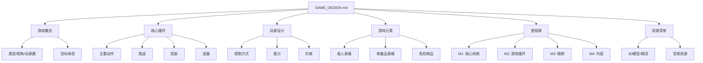

### 3.3 设计文档模板

```markdown
# [游戏标题]

## Overview
**Genre:** [类型]
**Perspective:** [视角]
**Players:** Multiplayer (Normcore)
**Target Feel:** [目标体验]

## Core Loop
1. [主要动作]
2. [挑战]
3. [奖励]
4. [进展]

## Player
- **Controls:** [控制方式]
- **Abilities:** [能力]
- **Constraints:** [约束]

## Game Elements

### Enemies
| Type | Behavior | Threat |
|------|----------|--------|
| [敌人1] | [行为模式] | [伤害类型] |

### Collectibles
| Item | Effect | Visual |
|------|--------|--------|
| [物品1] | [效果] | [视觉效果] |

## Milestones

### M1: Core Mechanics
- [ ] Player movement
- [ ] Basic camera
- [ ] Test scene

### M2: Gameplay Loop
- [ ] Core enemy/challenge
- [ ] Core collectible/goal
- [ ] Win/lose conditions

## Assets Needed
[资源清单]
```

### 3.4 类比理解

**game-planner 就像是"建筑设计师"**：
- 用户说"我想建一个游泳池的房子"
- 设计师画出完整的建筑图纸
- 包括房间布局、材料清单、施工步骤
- 后续工人（Claude）按图纸施工

---

## 四、阶段二：资源获取（asset-finder）

### 4.1 并行搜索架构

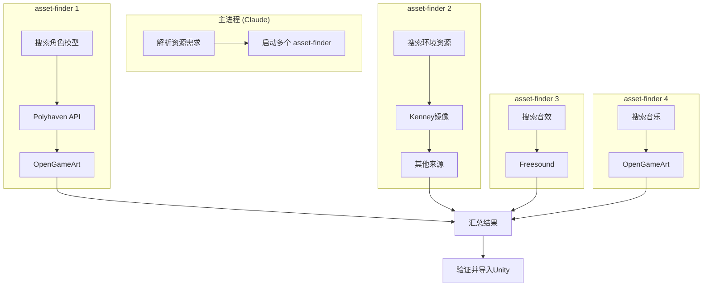

### 4.2 资源来源优先级

| 优先级 | 来源 | 资源类型 | 许可证 | 自动下载 |
|--------|------|----------|--------|----------|
| 1 | Polyhaven | 纹理/HDRI/3D模型 | CC0 | 是 |
| 2 | OpenGameArt | 2D/3D/音频 | 多种 | 是 |
| 3 | Kenney镜像 | 3D/2D/UI/音频 | CC0 | 是 |
| 4 | itch.io | 各类 | 多种 | 部分可 |
| 5 | Freesound | 音效 | 多种 | 需账户 |
| 6 | Mixamo | 角色动画 | 免费 | 需账户 |

### 4.3 资源下载流程

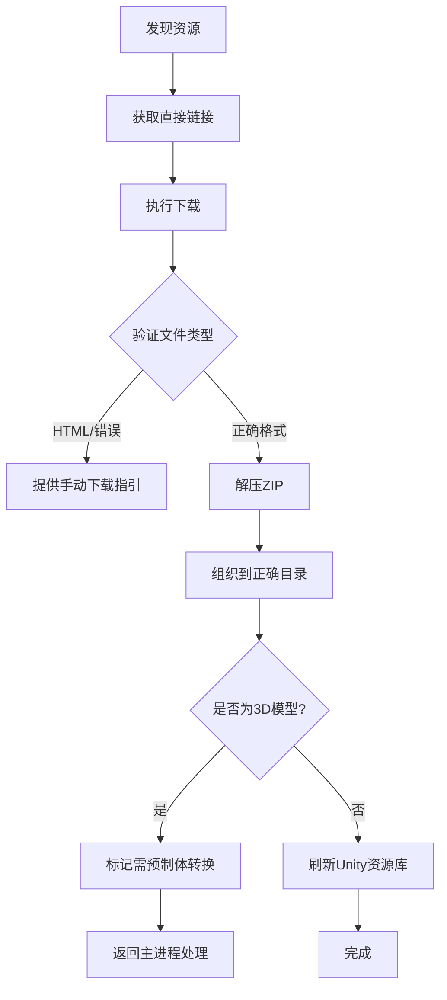

### 4.4 目录结构规则

```
Assets/
├── Downloaded/              # 下载的外部资源
│   ├── Models/             # 3D模型 (FBX/OBJ)
│   ├── Textures/           # 纹理图片
│   ├── Sprites/            # 2D精灵
│   ├── Audio/              # 音频文件
│   │   ├── Music/          # 背景音乐
│   │   └── SFX/            # 音效
│   └── UI/                 # UI素材
│
├── Resources/              # 运行时加载资源
│   ├── Prefabs/            # 预制体 (运行时生成)
│   └── [AudioFolders]/     # 需运行时加载的音频
│
└── _Game/                  # 游戏核心文件
    ├── Scenes/
    ├── Scripts/
    └── Prefabs/
```

### 4.5 3D模型特殊处理

**重要**：FBX/OBJ 文件不能直接通过 `Resources.Load()` 在运行时加载！


### 4.6 asset-finder 代理配置

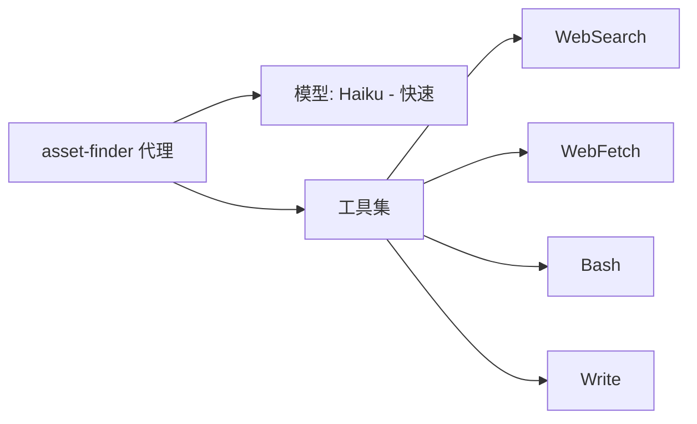

### 4.7 类比理解

**asset-finder 就像是"采购部门"**：
- 设计师开出材料清单
- 采购部门同时联系多个供应商
- 货到后验收质量
- 把材料分类放到仓库指定位置
- 特殊材料（3D模型）需要二次加工

---

## 五、阶段三：项目结构创建

### 5.1 目录创建流程

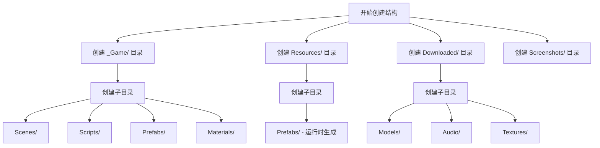

### 5.2 完整项目结构

```
Assets/
├── _Game/                      # 游戏核心文件
│   ├── Scenes/                 # 场景文件
│   │   ├── Main.unity         # 主场景
│   │   └── [其他场景]
│   ├── Scripts/                # C# 脚本
│   │   ├── Player/            # 玩家相关脚本
│   │   ├── Enemies/           # 敌人脚本
│   │   ├── Collectibles/      # 收集品脚本
│   │   ├── UI/                # UI脚本
│   │   └── Managers/          # 管理器脚本
│   ├── Prefabs/               # 编辑时预制体
│   ├── Materials/             # 材质
│   └── Animations/            # 动画控制器
│
├── Resources/                  # 运行时加载资源
│   ├── Prefabs/               # 运行时生成的预制体
│   └── [运行时音频文件夹]
│
├── Downloaded/                 # 导入的外部资源
│   ├── Models/
│   ├── Textures/
│   ├── Audio/
│   │   ├── Music/
│   │   └── SFX/
│   └── Sprites/
│
├── Screenshots/                # 截图验证
├── Normal/                     # Normcore SDK
└── [第三方包]
```

### 5.3 类比理解

**项目结构就像是"房屋施工图纸"**：
- _Game/ 是"主居住区"（核心功能）
- Resources/ 是"应急储藏室"（随时取用）
- Downloaded/ 是"材料仓库"（外部采购）
- Screenshots/ 是"施工照片"（质量检查记录）

---

## 六、阶段四：里程碑M1实现

### 6.1 M1核心任务

根据设计文档，M1（里程碑1）通常包含：

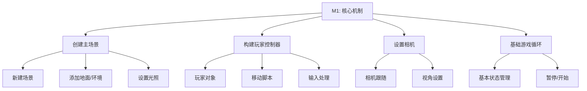

### 6.2 自动使用的技能

在实现过程中，Claude 会自动调用以下技能：

| 技能 | 功能 | 触发时机 |
|------|------|----------|
| adding-player | 添加玩家角色 | 创建玩家对象时 |
| setting-up-cameras | 设置相机 | 需要相机跟随时 |
| setting-up-physics | 设置物理 | 需要碰撞/重力时 |
| adding-ui | 添加UI元素 | 需要显示信息时 |
| multiplayer-setup | 多人设置 | 默认启用Normcore |

### 6.3 技能调用流程

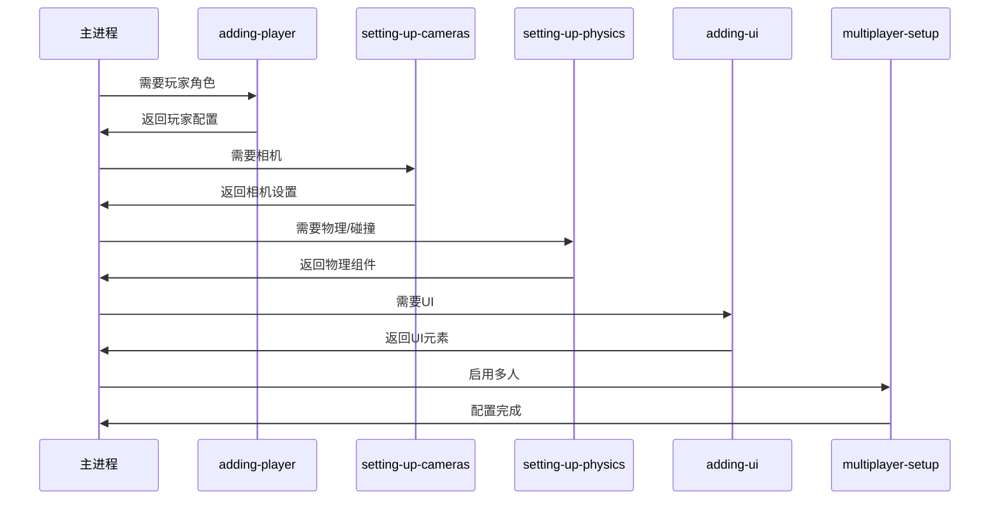

### 6.4 类比理解

**M1实现就像是"房屋主体结构施工"**：
- 主场景 = 地基和框架
- 玩家控制器 = 门和窗户（用户交互）
- 相机 = 照明系统（用户视角）
- 基础循环 = 水电系统（维持运转）

---

## 七、阶段五：质量保证

### 7.1 质量门检查流程

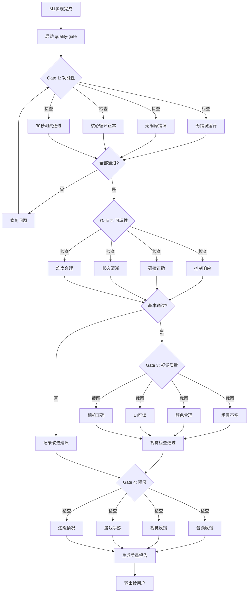

### 7.2 质量门四道关卡

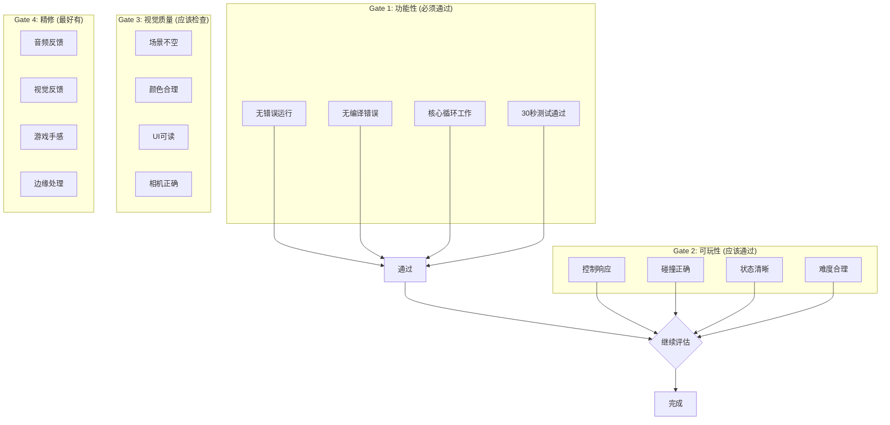

### 7.3 质量报告格式

```
## Quality Gate: [PASS/PASS WITH NOTES/NEEDS WORK]

### Functional (Gate 1): [状态]
- 无错误在30秒测试中
- 核心循环已验证
- 性能稳定

### Playability (Gate 2): [状态]
- 控制响应
- 碰撞工作正常
- 目标清晰

### Visual (Gate 3): [状态]
- 场景看起来不错
- UI可读
- 注意: [改进建议]

### Polish (Gate 4): [状态]
- 音效: [状态]
- 粒子: [状态]
- 可添加: [建议]

### Ready for User: [YES/NO]
```

### 7.4 类比理解

**质量门就像是"房屋验收标准"**：
- Gate 1 = 结构安全（不能倒塌）
- Gate 2 = 功能可用（门能开关、水能流）
- Gate 3 = 美观度（装修协调、采光良好）
- Gate 4 = 舒适度（隔音、恒温、细节）

---

## 八、完整执行时序图

### 8.1 详细交互流程

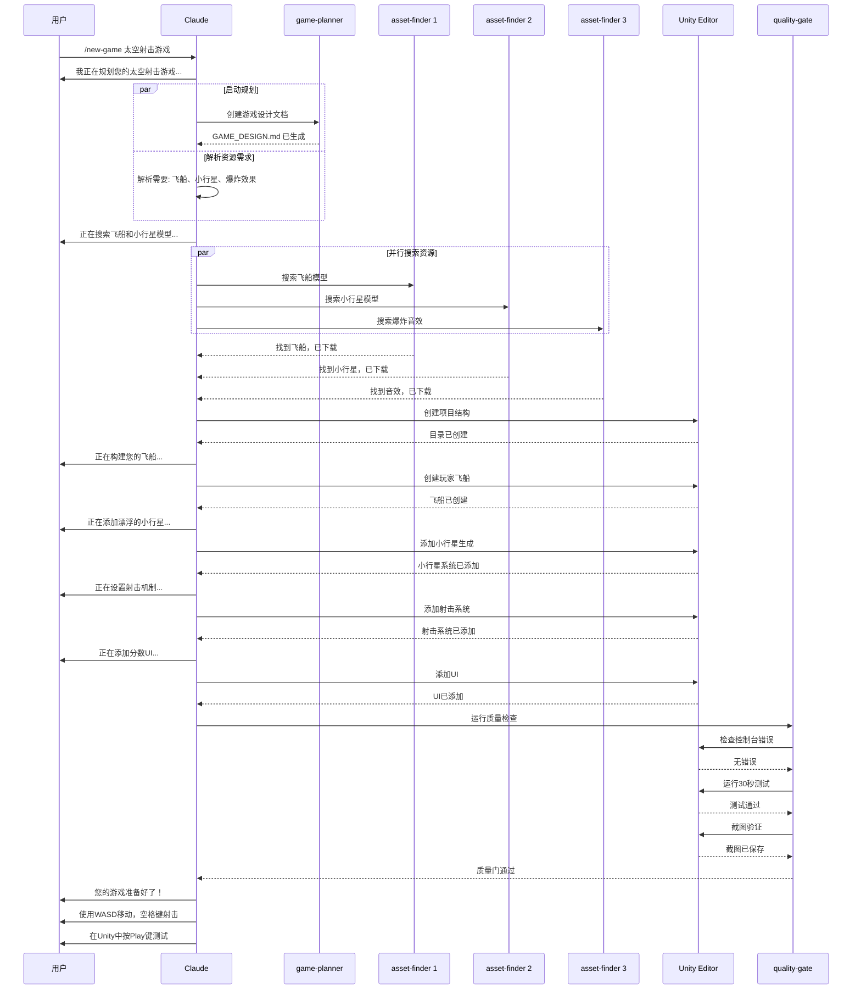

### 8.2 状态转换图

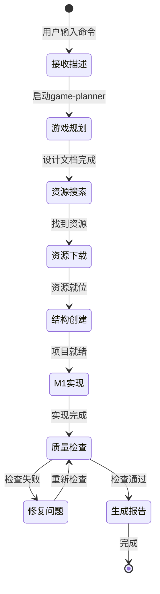

---

## 九、关键技术要点

### 9.1 代理模型选择

| 代理 | 模型 | 原因 |
|------|------|------|
| game-planner | Sonnet | 需要深度思考和结构化输出 |
| asset-finder | Haiku | 简单搜索任务，追求速度 |
| 主进程 | Opus/Sonnet | 复杂协调和代码生成 |

### 9.2 并行处理策略

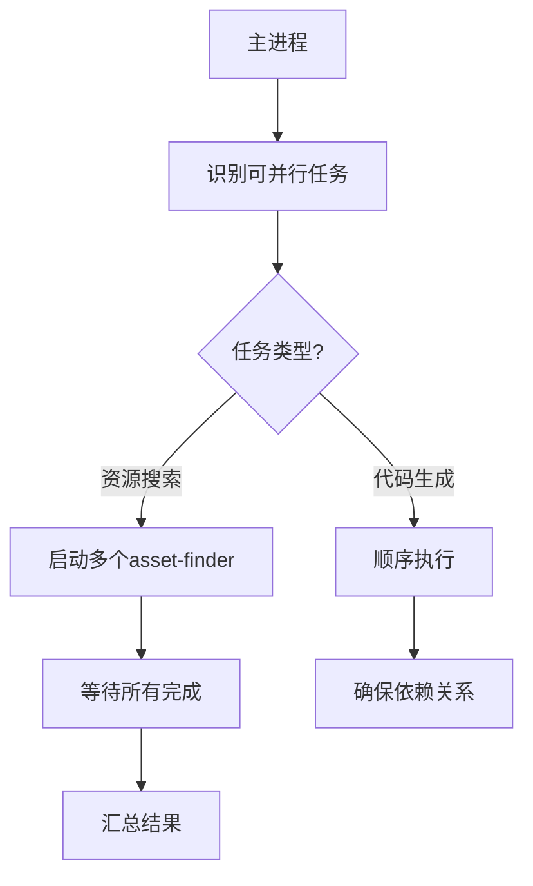

### 9.3 错误处理策略

| 错误类型 | 处理方式 |
|----------|----------|
| 资源下载失败 | 提供手动下载指引 |
| Unity API 错误 | 重试或替代方案 |
| 质量门失败 | 自动修复直到通过 |
| 代理超时 | 使用更简单方案 |

---

## 十、输出示例

### 10.1 成功输出

```
您的太空射击游戏准备好了！

我为您完成了：
- 创建了自上而下的太空场景
- 飞船使用 WASD 移动，空格键射击
- 小行星从顶部随机生成并下落
- 击中小行星得分
- 添加了分数UI和基本的爆炸效果

控制方式：
- W/A/S/D - 移动飞船
- 空格键 - 发射激光
- 击毁小行星获得分数

质量检查结果：
- 功能测试通过（30秒无错误）
- 控制响应灵敏
- 视觉效果良好

在Unity中按Play键即可开始测试！
```

### 10.2 带改进建议的输出

```
您的太空射击游戏基本完成！

质量检查结果：
- 功能测试通过
- 控制正常工作
- 视觉: 使用基本几何图形，可稍后添加模型

改进建议：
- 小行星可以更快以增加挑战
- 可以添加不同类型的小行星
- 可以添加背景音乐和音效

您现在可以测试，或告诉我想要改进的地方！
```

---

## 十一、类比总结

如果将 **new-game 命令**比作**"房屋建造项目"**：

| 阶段 | 房屋建造 | new-game 命令 |
|------|----------|---------------|
| 规划 | 建筑设计师画图纸 | game-planner 生成设计文档 |
| 采购 | 采购部门买材料 | asset-finder 搜索下载资源 |
| 施工 | 施工队按图纸建造 | Claude 使用技能实现功能 |
| 验收 | 质检部门检查 | quality-gate 质量检查 |
| 交付 | 钥匙交给业主 | 输出报告给用户 |

---

## 十二、参考资源

### 相关文档
- [game-planner 代理配置](../template/.claude/agents/game-planner.md)
- [asset-finder 代理配置](../template/.claude/agents/asset-finder.md)
- [quality-gate 技能](../template/.claude/skills/quality-gate/SKILL.md)
- [CLAUDE.md 配置](../template/.claude/CLAUDE.md)

### 相关技能
- adding-player - 玩家角色创建
- setting-up-cameras - 相机设置
- setting-up-physics - 物理系统
- adding-ui - UI元素
- multiplayer-setup - 多人设置

### 外部资源
- [Polyhaven - 免费3D资源](https://polyhaven.com)
- [OpenGameArt - 游戏艺术资源](https://opengameart.org)
- [Kenney Assets - 游戏素材](https://kenney.nl/assets)

---

**文档生成时间**：2026-02-02
**分析版本**：gamekit-cli v0.0.2
