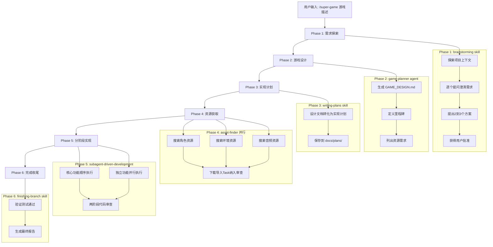
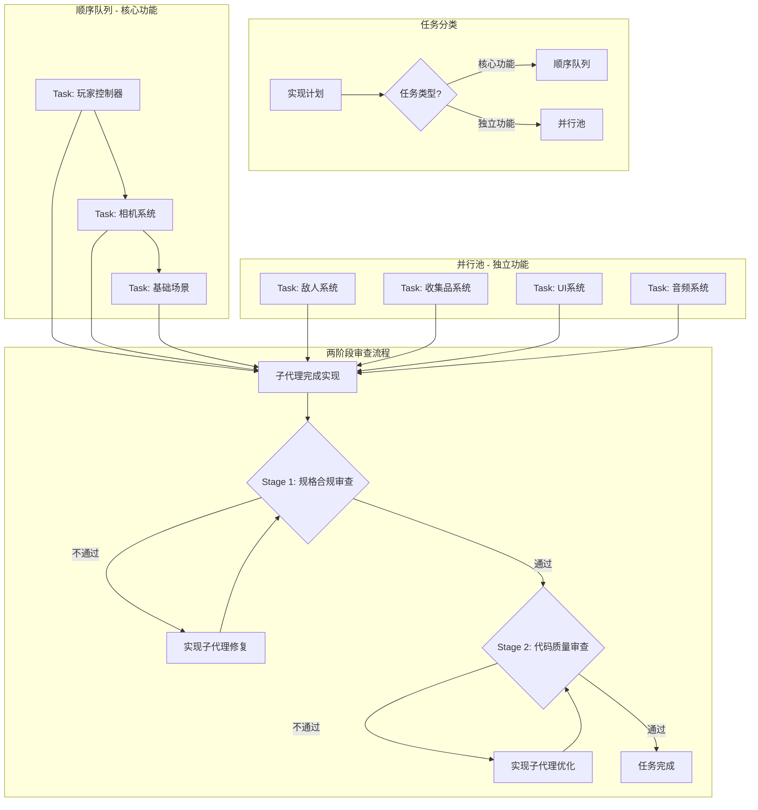
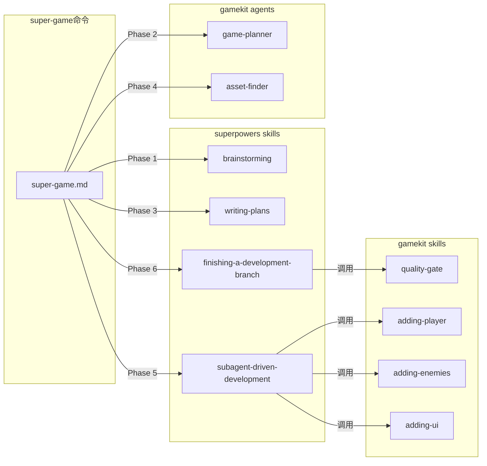

# super-game 命令设计文档

> **For Claude:** REQUIRED SUB-SKILL: Use superpowers:writing-plans to create the implementation plan.

**Goal:** 创建一个新的 `/super-game` 命令，整合 superpowers 工作流到游戏创建过程中

**Design Date:** 2026-03-03

**Decision Summary:**
- 完整整合 superpowers 工作流
- 混合模式：brainstorming → game-planner
- 混合派发：核心功能顺序，独立功能并行
- 完整两阶段审查：规格合规 + 代码质量
- 资源搜索保持并行，下载导入纳入审查流程

---

## 一、整体流程架构



### 核心流程说明

| Phase | 调用组件 | 输入 | 输出 |
|-------|----------|------|------|
| 1 | brainstorming skill | 用户游戏描述 | 澄清后的需求 |
| 2 | game-planner agent | 需求文档 | GAME_DESIGN.md |
| 3 | writing-plans skill | GAME_DESIGN.md | 实现计划 |
| 4 | asset-finder agents | 资源需求列表 | 下载的资源 |
| 5 | subagent-driven-development | 实现计划 | 游戏代码 |
| 6 | finishing-a-development-branch | 项目状态 | 可玩游戏 |

---

## 二、Phase 5 详细设计（混合派发+两阶段审查）

### 任务分类规则



### 任务分类表

| 类型 | 任务示例 | 执行方式 | 原因 |
|------|----------|----------|------|
| **核心功能** | 玩家控制器、相机、基础场景、物理系统 | 顺序执行 | 有强依赖关系，后续功能基于此构建 |
| **独立功能** | 敌人AI、收集品、UI、音频、特效 | 并行执行 | 相互独立，可同时开发 |

### 两阶段审查详情

| 阶段 | 审查内容 | 审查者 | 通过标准 |
|------|----------|--------|----------|
| **Stage 1** | 规格合规 | spec-reviewer 子代理 | 完全符合设计文档，无遗漏无多余 |
| **Stage 2** | 代码质量 | code-quality-reviewer 子代理 | 代码规范、无坏味道、可维护 |

### 执行顺序

1. 先执行顺序队列中的核心功能（每个任务都经过两阶段审查）
2. 核心功能全部完成后，并行执行独立功能池
3. 所有任务完成后，进行整体集成审查

---

## 三、命令文件结构

super-game 命令文件将创建在 `template/.claude/commands/super-game.md`：

```markdown
---
description: Start a new game with full superpowers workflow integration
---

# /super-game

Create a new game using the complete superpowers development workflow.

**User's game idea:** $ARGUMENTS

## Workflow Overview

This command integrates superpowers skills for a rigorous development process:

1. **brainstorming** - Interactive requirements exploration
2. **game-planner** - Professional game design document
3. **writing-plans** - Convert design to implementation plan
4. **asset-finder** - Parallel resource search
5. **subagent-driven-development** - Task execution with two-stage review
6. **finishing-a-development-branch** - Final verification and delivery

## Process

### Phase 1: Requirements Exploration

Invoke **superpowers:brainstorming** skill:
- Explore project context
- Ask clarifying questions one at a time
- Propose 2-3 approaches with recommendation
- Get user approval on design direction

**Output:** Clear understanding of game vision

### Phase 2: Game Design

Invoke **game-planner** agent:
- Create `GAME_DESIGN.md` with:
  - Core mechanics and loop
  - Player abilities and controls
  - Enemies, collectibles, hazards
  - Implementation milestones (M1, M2, M3...)
  - Asset requirements

**Output:** `Assets/_Game/Docs/GAME_DESIGN.md`

### Phase 3: Implementation Plan

Invoke **superpowers:writing-plans** skill:
- Convert game design to bite-sized tasks (2-5 min each)
- Classify tasks as Core (sequential) or Independent (parallel)
- Save plan to `docs/plans/YYYY-MM-DD-<game-name>.md`

**Output:** Detailed implementation plan with task classification

### Phase 4: Asset Acquisition

Spawn multiple **asset-finder** agents in parallel:
- Search for models/sprites
- Search for audio files
- Search for textures

After search completes, create a Task for download/import with review.

**Output:** Assets in `Assets/Downloaded/` and converted prefabs

### Phase 5: Implementation

Invoke **superpowers:subagent-driven-development** skill:

**Sequential Tasks (Core):**
1. Player controller
2. Camera system
3. Base scene setup

**Parallel Tasks (Independent):**
- Enemy system
- Collectible system
- UI system
- Audio system

**Each task goes through two-stage review:**
1. Spec compliance review
2. Code quality review

### Phase 6: Completion

Invoke **superpowers:finishing-a-development-branch** skill:
- Verify all tests pass
- Run quality gate
- Generate final report

**Output:** Ready-to-play game

## Output to User

Keep user informed at each phase:
- "I'm exploring your game idea..."
- "Creating the game design..."
- "Searching for assets..."
- "Building the core mechanics..."
- "Your game is ready!"
```

---

## 四、与现有组件的交互

### 组件交互图



### 交互规则表

| 调用方 | 被调用方 | 调用时机 | 传递内容 |
|--------|----------|----------|----------|
| super-game | brainstorming | Phase 1 开始 | 用户游戏描述 |
| brainstorming | game-planner | Phase 1 结束 | 澄清后的需求 |
| super-game | writing-plans | Phase 2 结束 | GAME_DESIGN.md 路径 |
| super-game | asset-finder | Phase 3 结束 | 资源需求列表 |
| super-game | subagent-driven | Phase 4 结束 | 实现计划路径 |
| subagent-driven | adding-* skills | 任务执行时 | 任务详情 |
| super-game | finishing-branch | Phase 5 结束 | 项目状态 |

### 数据流向

```
用户描述
    ↓
brainstorming 问答 → 需求文档
    ↓
game-planner → GAME_DESIGN.md
    ↓
writing-plans → docs/plans/YYYY-MM-DD-game.md
    ↓
asset-finder → Assets/Downloaded/
    ↓
subagent-driven → Assets/_Game/Scripts/, Prefabs/, Scenes/
    ↓
finishing-branch → 最终可玩游戏
```

### 错误处理

| 场景 | 处理方式 |
|------|----------|
| brainstorming 无共识 | 继续提问直到用户批准 |
| game-planner 失败 | 重试或使用简化设计 |
| asset-finder 无结果 | 使用占位符，继续实现 |
| 子代理任务失败 | 派发修复子代理，重新审查 |
| 审查不通过 | 实现子代理修复后重新审查 |

---

## 五、文件清单

### 需要创建/修改的文件

| 文件路径 | 操作 | 说明 |
|----------|------|------|
| `template/.claude/commands/super-game.md` | **新建** | 主命令文件 |
| `template/.claude/CLAUDE.md` | **修改** | 添加 super-game 命令说明 |
| `.claude/commands/super-game.md` | **新建** | 项目根目录的命令文件（与 template 同步）|

### 不需要修改的文件

以下现有组件直接复用，无需修改：

| 组件 | 路径 | 复用方式 |
|------|------|----------|
| brainstorming skill | `.claude/skills/brainstorming/` | Skill tool 调用 |
| writing-plans skill | `.claude/skills/writing-plans/` | Skill tool 调用 |
| subagent-driven-development skill | `.claude/skills/subagent-driven-development/` | Skill tool 调用 |
| finishing-a-development-branch skill | `.claude/skills/finishing-a-development-branch/` | Skill tool 调用 |
| game-planner agent | `template/.claude/agents/game-planner.md` | Task tool 调用 |
| asset-finder agent | `template/.claude/agents/asset-finder.md` | Task tool 调用 |
| gamekit skills | `template/.claude/skills/adding-*/` | 子代理内部调用 |

---

## 六、预期效果

### 用户输入示例

```
/super-game 太空射击游戏，躲避小行星
```

### 系统执行示例

```
[Phase 1] 使用 brainstorming skill 探索需求...
          Q: 游戏视角是什么？
          A: 俯视角
          Q: 单人还是多人？
          A: 多人
          ...获得用户批准

[Phase 2] 调用 game-planner 生成设计文档...
          → GAME_DESIGN.md 已创建

[Phase 3] 使用 writing-plans 生成实现计划...
          → docs/plans/2026-03-03-space-shooter.md

[Phase 4] 并行搜索资源...
          → 飞船模型、小行星模型、爆炸音效已下载

[Phase 5] 执行实现计划...
          [顺序] Task: 玩家控制器 → 审查通过
          [顺序] Task: 相机系统 → 审查通过
          [并行] Task: 敌人系统 → 审查通过
          [并行] Task: UI系统 → 审查通过
          ...

[Phase 6] 完成收尾...
          → 质量门通过，游戏可玩！

您的太空射击游戏已准备就绪！
```

---

## 七、设计决策记录

| 决策点 | 选项 | 选择 | 原因 |
|--------|------|------|------|
| 整合深度 | A/B/C | A: 命令层整合 | 复用现有 skills，维护成本低 |
| game-planner 处理 | 1/2/3 | 3: 混合模式 | 保留游戏设计专业知识 |
| 实现派发方式 | 1/2/3 | 3: 混合派发 | 平衡效率与依赖管理 |
| 代码审查流程 | 1/2/3 | 1: 完整两阶段 | 确保质量和规格一致性 |
| 资源获取处理 | 1/2/3 | 3: 后置处理 | 搜索并行高效，导入需审查 |

---

## 八、参考资源

### 相关文件
- [new-game 命令分析](../new-game命令执行流程分析.md)
- [brainstorming skill](../../.claude/skills/brainstorming/SKILL.md)
- [writing-plans skill](../../.claude/skills/writing-plans/SKILL.md)
- [subagent-driven-development skill](../../.claude/skills/subagent-driven-development/SKILL.md)
- [finishing-a-development-branch skill](../../.claude/skills/finishing-a-development-branch/SKILL.md)
- [game-planner agent](../../template/.claude/agents/game-planner.md)
- [asset-finder agent](../../template/.claude/agents/asset-finder.md)
