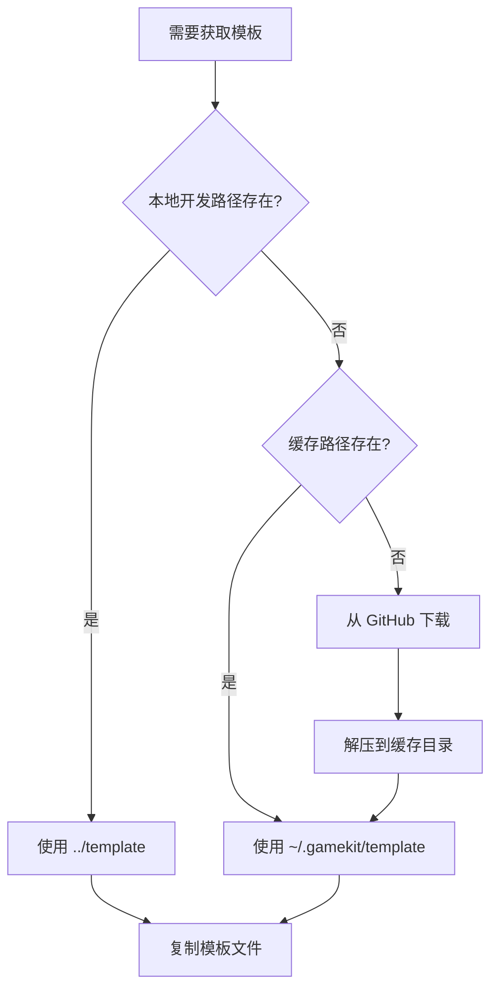
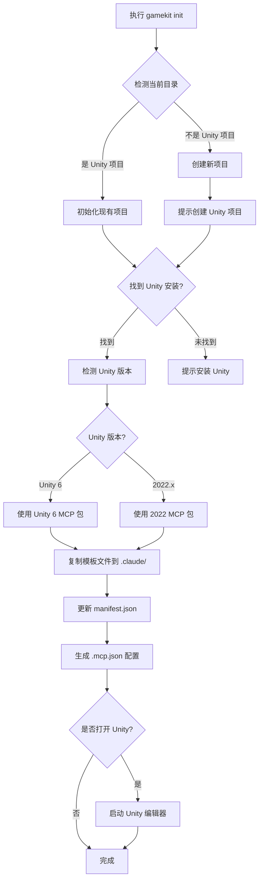
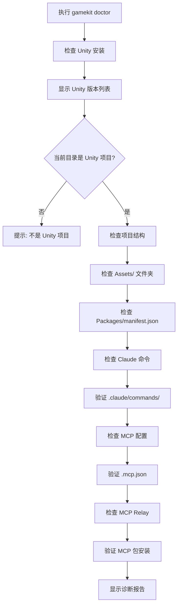
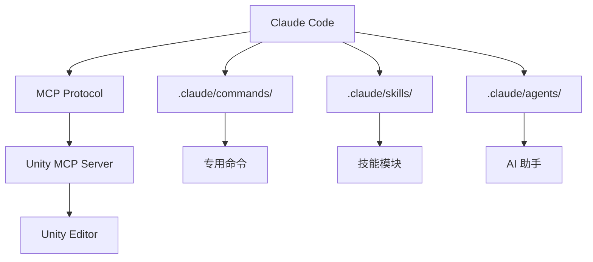

# GameKit CLI 项目说明文档

## 项目简介

GameKit CLI 是一个基于 TypeScript 开发的 Unity 游戏开发命令行工具，旨在帮助开发者快速创建和设置支持 Claude Code 的 Unity 项目。

> **类比理解**：如果把 Unity 游戏开发比作建造房子，GameKit CLI 就像一个"精装修团队"，在你拿到毛坯房（新建 Unity 项目）时，能快速帮你铺设好所有必要的水电线路（MCP 集成）、安装好智能家居系统（Claude 命令）、准备好装修手册（技能模板），让你可以直接开始专注于房子的设计和装饰（游戏玩法开发）。

## 项目结构

```
gamekit-cli/
├── src/                    # 源代码目录
│   ├── commands/          # CLI 命令实现
│   │   ├── init.ts        # 初始化命令
│   │   ├── doctor.ts      # 诊断命令
│   │   └── index.ts       # 命令入口
│   ├── utils/             # 工具函数模块
│   │   ├── template.ts    # 模板管理核心
│   │   ├── unity.ts       # Unity 相关操作
│   │   ├── manifest.ts    # manifest.json 处理
│   │   ├── mcp.ts         # MCP 配置管理
│   │   └── ...
│   └── __tests__/         # 测试文件
├── template/              # 项目模板目录
├── scripts/               # 构建和安装脚本
├── docs/                  # 文档
├── package.json          # 项目配置
└── readme.md             # 项目说明
```

## 核心功能

### 1. 快速创建游戏模板

模板系统是整个项目的核心功能，主要在 `src/utils/template.ts` 中实现。

#### 模板获取策略流程



#### 模板管理核心功能

1. **多层获取策略**
   - 优先使用本地开发路径：`../template`（开发时）
   - 其次使用缓存路径：`~/.gamekit/template`（已安装）
   - 最后从 GitHub 下载最新模板（首次使用）

2. **自动下载机制**
   - 从 GitHub 仓库 `gamekit-agent/gamekit-cli` 下载
   - 使用 tar.gz 格式传输
   - 解压并缓存到用户主目录
   - 支持断点续传（通过缓存）

3. **版本控制**
   - 记录安装时的 CLI 版本
   - 生成文件哈希用于变更追踪
   - 支持检测模板是否过时

#### 模板内容结构

模板目录包含了完整的 Claude Code + Unity 开发环境配置：

```
template/.claude/
├── CLAUDE.md              # Claude 角色和行为指南
├── agents/               # AI 代理技能
│   ├── asset-finder.md   # 资源查找助手
│   ├── code-debugger.md  # 代码调试助手
│   ├── game-planner.md   # 游戏规划助手
│   ├── iterator.md       # 迭代开发助手
│   ├── level-designer.md # 关卡设计助手
│   └── optimizer.md      # 性能优化助手
├── commands/             # Claude 专用命令（14+）
│   ├── new-game.md       # 创建新游戏
│   ├── add-multiplayer.md # 添加多人游戏
│   ├── auto-test.md      # 自动测试
│   ├── build.md          # 构建游戏
│   ├── convert-models.md # 转换模型
│   ├── explain.md        # 代码解释
│   ├── fix.md            # 修复问题
│   └── ...
└── skills/               # 游戏开发技能模块
    ├── adding-audio/     # 添加音效
    ├── adding-collectibles/ # 添加收集品
    ├── adding-enemies/   # 添加敌人
    ├── adding-player/    # 添加玩家
    ├── adding-ui/        # 添加UI
    ├── creating-animations/ # 创建动画
    ├── creating-materials/  # 创建材质
    ├── juice/            # 游戏手感增强
    ├── level-progression/   # 关卡进度
    ├── multiplayer-setup/   # 多人设置
    └── ...
```

### 2. 项目初始化流程 (init 命令)



#### init 命令详细步骤

1. **环境检测**
   - 检查当前目录是否为 Unity 项目（存在 Assets/ 文件夹）
   - 查找已安装的 Unity 版本

2. **Unity 版本识别**
   - Unity 6：使用 `com.unity.mcp-auth` 和 `com.unity.modelkcp`
   - Unity 2022.x：使用 legacy MCP 包

3. **模板文件复制**
   - 将 template/ 目录复制到项目的 `.claude/` 文件夹
   - 保留版本信息和文件哈希

4. **MCP 包集成**
   - 在 `Packages/manifest.json` 中添加 MCP 依赖
   - 保持现有依赖不变

5. **配置文件生成**
   - 创建 `.mcp.json` 配置文件
   - 配置 MCP Server 连接

6. **完成初始化**
   - 可选：自动打开 Unity 编辑器

### 3. 问题诊断功能 (doctor 命令)



#### doctor 命令检查项

| 检查项 | 说明 | 问题处理 |
|--------|------|----------|
| Unity 安装 | 查找所有已安装的 Unity 版本 | 提示安装 Unity Hub |
| 项目结构 | 验证 Assets/ 和 Packages/ 文件夹 | 提示运行 init |
| Claude 命令 | 检查 .claude/commands/ 目录 | 提示运行 init |
| MCP 配置 | 验证 .mcp.json 文件 | 提示运行 init |
| MCP Relay | 检查 MCP 包是否正确安装 | 提示在 Unity 中重新导入 |

## 技术架构

### 依赖项

```json
{
  "commander": "^12.1.0",    // CLI 命令框架
  "chalk": "^5.3.0",         // 终端颜色输出
  "inquirer": "^9.3.2",      // 交互式命令行提示
  "ora": "^8.1.0",           // 加载动画
  "tar": "^7.4.3",           // tar.gz 解压缩
  "node-fetch": "^3.3.2"     // HTTP 请求
}
```

### 核心模块说明

#### 1. template.ts - 模板管理器

```typescript
// 主要函数
- getTemplatePath()           // 获取模板路径（多层策略）
- downloadTemplateAsync()     // 从 GitHub 下载模板
- copyTemplateAsync()         // 异步复制模板
- getTemplateVersion()        // 获取模板版本信息
- hashDirectory()             // 计算目录哈希
```

> **类比理解**：template.ts 就像一个"智能仓库管理员"，知道在哪里找到模板（本地、缓存或在线），能够自动补货（下载），还能记录每次出货的版本（哈希追踪）。

#### 2. unity.ts - Unity 操作工具

```typescript
// 主要函数
- findUnityInstallations()    // 查找已安装的 Unity 版本
- parseUnityVersion()         // 解析 Unity 版本号
- getMcpPackageUrl()          // 获取 MCP 包 URL
```

> **类比理解**：unity.ts 就像一个"Unity 翻译官"，能够理解不同 Unity 版本的"方言"（Unity 6 vs 2022），为每个版本找到合适的 MCP 工具包。

#### 3. manifest.ts - Manifest 处理器

```typescript
// 主要函数
- addMcpDependency()          // 添加 MCP 依赖到 manifest.json
```

#### 4. mcp.ts - MCP 配置管理

```typescript
// 主要函数
- generateMcpConfig()         // 生成 .mcp.json 配置
- checkMcpRelay()            // 检查 MCP Relay
- waitForMcpInstall()        // 等待 MCP 安装完成
```

### CLI 命令框架

使用 [Commander.js](https://commander.js/) 框架实现命令行接口：

```typescript
// src/index.ts
import { Command } from 'commander';

const program = new Command();

program
  .name('gamekit')
  .description('AI-powered Unity game development with Claude')
  .version('0.0.2');

program.command('init')
  .description('Initialize a new Unity project')
  .action(init);

program.command('doctor')
  .description('Diagnose Unity project issues')
  .action(doctor);

// 无参数时默认运行 init
if (process.argv.length === 2) {
  program.action(init);
}

program.parse();
```

## 使用方法

### 安装

```bash
# 全局安装
npm install -g gamekit-cli

# 或使用 npx 直接运行（无需安装）
npx gamekit-cli
```

### 基本命令

```bash
# 初始化新项目
gamekit init

# 或直接运行（init 是默认命令）
gamekit

# 诊断项目问题
gamekit doctor

# 查看版本
gamekit --version
```

### 典型工作流程

1. **创建新 Unity 项目**
   ```bash
   # 在 Unity Hub 中创建新项目
   # 然后在项目目录运行
   gamekit init
   ```

2. **使用 Claude Code 开发**
   ```bash
   # 在 VS Code 中打开项目
   code .

   # Claude Code 会自动识别 .claude/ 配置
   # 可以使用 /new-game 等命令快速开发
   ```

3. **诊断问题**
   ```bash
   # 如果遇到问题，运行诊断
   gamekit doctor
   ```

## 与 Claude Code 的集成

GameKit CLI 通过 MCP (Model Context Protocol) 与 Claude Code 深度集成：

### 集成层次



### 集成组件

1. **MCP Server**
   - 提供 Unity API 访问能力
   - 支持实时场景操作
   - 资源导入和管理

2. **Claude 命令**（14+ 专用命令）
   - `/new-game` - 创建新游戏
   - `/add-multiplayer` - 添加多人游戏
   - `/build` - 构建游戏
   - `/fix` - 修复问题
   - 等等...

3. **技能系统**（模块化游戏开发技能）
   - 添加玩家、敌人、收集品
   - 创建动画、材质
   - 关卡设计和进度管理
   - 游戏手感增强

4. **代理系统**
   - 资源查找助手
   - 代码调试助手
   - 游戏规划助手
   - 等等...

> **类比理解**：这就像给 Claude Code 配备了一套"Unity 开发工具箱"，里面有各种专业工具（命令）、操作手册（技能）和专业顾问（代理），让 AI 能够真正理解和操作 Unity 项目。

## 开发指南

### 本地开发

```bash
# 克隆仓库
git clone https://github.com/gamekit-agent/gamekit-cli.git
cd gamekit-cli

# 安装依赖
npm install

# 构建项目
npm run build

# 链接到全局（用于测试）
npm link

# 运行测试
npm test
```

### 模板开发

模板文件位于 `template/` 目录，修改后会自动被 CLI 使用：

```bash
# 开发时使用本地模板
# CLI 会优先使用 ../template 路径

# 修改模板后测试
gamekit init
```

### 发布新版本

```bash
# 更新版本号
npm version patch  # 或 minor, major

# 构建和发布
npm run build
npm publish
```

## 技术亮点

1. **智能模板管理**
   - 多层获取策略（本地 → 缓存 → 在线）
   - 自动下载和缓存机制
   - 版本跟踪和变更检测

2. **跨平台支持**
   - Windows, macOS, Linux
   - 路径自动适配
   - Unity Hub 路径检测

3. **用户体验优化**
   - 友好的 CLI 界面
   - 加载动画（ora）
   - 彩色输出（chalk）
   - 交互式提示（inquirer）

4. **错误处理**
   - 完善的错误提示
   - 修复建议
   - 诊断工具

5. **版本兼容性**
   - 支持 Unity 6
   - 支持 Unity 2022.x
   - 自动检测版本并选择正确的 MCP 包

## 类比总结

把整个 GameKit CLI 系统比作一个"精装修服务"：

| 组件 | 类比 | 功能 |
|------|------|------|
| CLI 工具 | 装修队入口 | 一键启动整个服务 |
| 模板系统 | 精装套餐 | 预先设计好的完整配置 |
| MCP 集成 | 智能布线 | 让 AI 能控制 Unity |
| Claude 命令 | 快捷操作面板 | 一句话完成复杂任务 |
| 技能模块 | 装修手册 | 分步骤的专业指导 |
| 代理系统 | 专业顾问 | 各领域的专家助手 |
| doctor 命令 | 验房师 | 检查配置是否正确 |

这个工具让开发者从"从零开始搭建开发环境"转变为"一键启动专业开发环境"，极大地提高了开发效率。

## 引用说明

- [Commander.js - CLI 命令框架](https://commander.js/)
- [Inquirer.js - 交互式命令行界面](https://github.com/SBoudrias/Inquirer.js)
- [Ora - 终端加载动画](https://github.com/sindresorhus/ora)
- [Chalk - 终端颜色输出](https://github.com/chalk/chalk)
- [Unity MCP 官方文档](https://github.com/Unity-Technologies/com.unity.mcp-auth)
- [Claude Code 官方文档](https://docs.anthropic.com/claude-code)
- [Model Context Protocol (MCP)](https://modelcontextprotocol.io/)
