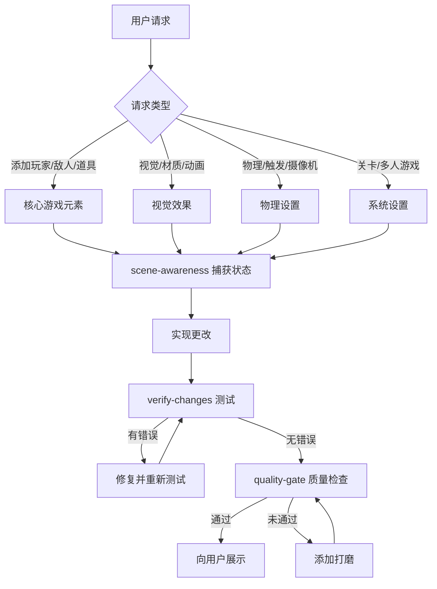

# Unity 游戏开发技能整理文档

> 文档生成时间：2026-01-26
> 技能总数：19个
> 分类：6大类

---

## 目录

1. [核心游戏元素添加类](#1-核心游戏元素添加类)
2. [视觉效果与表现类](#2-视觉效果与表现类)
3. [音频与多媒体类](#3-音频与多媒体类)
4. [物理与机制设置类](#4-物理与机制设置类)
5. [关卡进程与系统类](#5-关卡进程与系统类)
6. [质量保障与自动化类](#6-质量保障与自动化类)

---

## 1. 核心游戏元素添加类

### 1.1 添加玩家角色 (adding-player)

**功能描述：** 创建可控制的玩家角色，支持多种移动模式

**触发短语：**
- "player", "character", "avatar"
- "move around", "control", "walk", "run", "fly"
- "WASD", "arrow keys", "controller"

**实现步骤：**
```
1. 创建玩家 GameObject
   └── 添加视觉表示（基础体形或导入的模型）

2. 添加移动脚本
   ├── 俯视视角：X/Z 平面移动
   ├── 平台跳跃：X 轴移动 + 跳跃
   ├── 飞行模式：全 3D 移动
   └── 太空模式：推力为基础的移动

3. 添加物理组件（如需要）
   ├── Rigidbody - 物理移动
   ├── CharacterController - 精确控制
   └── Colliders - 碰撞检测

4. 多人游戏设置（Normcore）
   ├── 添加 RealtimeView 组件
   ├── 添加 RealtimeTransform 组件
   ├── 所有权检查包装输入代码
   └── 保存预制体到 Resources/ 文件夹

5. 摄像机设置
   └── 考虑摄像机是否跟随玩家
```

**代码示例 - 俯视视角移动：**
```csharp
float h = Input.GetAxis("Horizontal");
float v = Input.GetAxis("Vertical");
Vector3 move = new Vector3(h, 0, v).normalized * speed * Time.deltaTime;
transform.Translate(move, Space.World);
```

---

### 1.2 添加敌人/NPC (adding-enemies)

**功能描述：** 创建具有AI行为的敌人和NPC角色

**触发短语：**
- "enemy", "enemies", "bad guy", "monster"
- "NPC", "character that moves on its own"
- "AI", "chase", "patrol", "attack"

**实现步骤：**
```
1. 创建敌人 GameObject
   ├── 视觉表现（通常用红色表示敌人）
   ├── 合适的碰撞体
   └── 标记为 "Enemy"

2. 添加 AI 行为
   ├── 追逐模式：向玩家移动
   ├── 巡逻模式：在路点间移动
   ├── 固定模式：炮塔式，不移动
   └── 游荡模式：随机移动

3. 添加战斗系统（如适用）
   ├── 生命值系统
   ├── 伤害输出（触发碰撞体）
   └── 死亡行为

4. 多人游戏设置
   ├── 添加 RealtimeView
   ├── 添加 RealtimeTransform
   └── 所有权：服务器权威或先击中者拥有

5. 生成设置
   └── 在 Resources/ 中创建预制体
```

**AI模式示例：**
```csharp
// 简单追逐
void Update()
{
    if (target == null) target = GameObject.FindWithTag("Player")?.transform;
    if (target != null)
    {
        Vector3 dir = (target.position - transform.position).normalized;
        transform.position += dir * speed * Time.deltaTime;
        transform.LookAt(target);
    }
}

// 巡逻模式
void Update()
{
    Transform wp = waypoints[currentWaypoint];
    transform.position = Vector3.MoveTowards(transform.position, wp.position, speed * Time.deltaTime);
    if (Vector3.Distance(transform.position, wp.position) < 0.5f)
        currentWaypoint = (currentWaypoint + 1) % waypoints.Length;
}
```

---

### 1.3 添加收集品/道具 (adding-collectibles)

**功能描述：** 创建可拾取的收集品、金币、能量道具等

**触发短语：**
- "collect", "pickup", "pick up"
- "coins", "gems", "stars", "points"
- "power-up", "health pack", "ammo"

**实现步骤：**
```
1. 创建收集品 GameObject
   ├── 视觉效果（金币、宝石等）
   ├── 碰撞体设为 TRIGGER
   ├── Rigidbody（isKinematic = true）
   └── 适当标记（"Coin", "PowerUp" 等）

2. 添加收集脚本
   ├── OnTriggerEnter 检测玩家
   ├── 收集效果（加分、回血等）
   ├── 反馈（声音、粒子）
   └── 收集后销毁或禁用

3. 视觉效果
   ├── 旋转动画
   ├── 上下浮动
   ├── 发光或粒子效果
   └── 独特颜色

4. 多人游戏设置
   ├── 添加 RealtimeView
   └── 同步收集状态

5. 计分/背包系统
   ├── 创建或更新分数管理器
   └── UI 显示计数/分数
```

**代码示例：**
```csharp
public class Collectible : MonoBehaviour
{
    public int value = 1;
    public CollectibleType type = CollectibleType.Coin;

    void OnTriggerEnter(Collider other)
    {
        if (other.CompareTag("Player"))
        {
            Collect(other.gameObject);
        }
    }

    void Collect(GameObject player)
    {
        switch (type)
        {
            case CollectibleType.Coin:
                ScoreManager.Instance.AddScore(value);
                break;
            case CollectibleType.Health:
                player.GetComponent<Health>()?.Heal(value);
                break;
        }
        Destroy(gameObject);
    }
}
```

**视觉效果代码：**
```csharp
// 旋转 + 浮动组合
void Update()
{
    transform.Rotate(0, 90 * Time.deltaTime, 0);
    transform.position = startPos + Vector3.up * Mathf.Sin(Time.time * 2) * 0.2f;
}
```

---

### 1.4 添加UI元素 (adding-ui)

**功能描述：** 创建用户界面元素，如血条、分数显示、菜单等

**触发短语：**
- "health bar", "HP", "lives"
- "score", "points", "counter"
- "menu", "pause", "game over"
- "UI", "HUD", "display"

**实现步骤：**
```
1. 创建 Canvas（如不存在）
   ├── Screen Space - Overlay（HUD）
   ├── Screen Space - Camera（世界锚定UI）
   └── World Space（游戏内UI，如头顶血条）

2. 添加 UI 元素
   ├── 使用 Unity UI 组件
   ├── 适当锚点设置
   └── 非交互元素设为 raycastTarget = false

3. 创建 UI 管理脚本
   ├── UI 元素引用
   ├── 公共更新方法
   └── 监听游戏事件

4. 多人游戏考虑
   ├── 本地 UI 不需要同步
   └── 共享 UI（排行榜）需要 RealtimeModel
```

**常见UI模式：**

```csharp
// 血条（基于滑块）
public class HealthUI : MonoBehaviour
{
    public Slider healthSlider;
    public Image fillImage;

    public void UpdateHealth(int current, int max)
    {
        healthSlider.value = (float)current / max;

        // 根据血量改变颜色
        if (healthSlider.value > 0.5f)
            fillImage.color = Color.green;
        else if (healthSlider.value > 0.25f)
            fillImage.color = Color.yellow;
        else
            fillImage.color = Color.red;
    }
}

// 分数显示
public class ScoreUI : MonoBehaviour
{
    public TextMeshProUGUI scoreText;

    void Start()
    {
        ScoreManager.Instance.OnScoreChanged += UpdateScore;
    }

    void UpdateScore(int score)
    {
        scoreText.text = $"Score: {score}";
    }
}

// 暂停菜单
public class PauseMenu : MonoBehaviour
{
    public GameObject pausePanel;

    public void TogglePause()
    {
        bool isPaused = !pausePanel.activeSelf;
        pausePanel.SetActive(isPaused);
        Time.timeScale = isPaused ? 0 : 1;
    }
}
```

---

## 2. 视觉效果与表现类

### 2.1 创建材质 (creating-materials)

**功能描述：** 为对象创建颜色、纹理和材质属性

**触发短语：**
- "color", "colored", "red", "blue"
- "shiny", "metallic", "glossy"
- "transparent", "glass"
- "glowing", "emissive"

**实现步骤：**
```
1. 通过 MCP 创建材质
   └── manage_asset action="create" asset_type="Material"

2. 应用到对象
   └── manage_gameobject action="set_component_property"

3. 设置材质属性
   ├── 颜色（RGBA）
   ├── 金属度
   └── 光滑度
```

**颜色预设：**
| 颜色 | RGB值 | 用途 |
|------|-------|------|
| 红色 | [1, 0.2, 0.2, 1] | 敌人、伤害 |
| 绿色 | [0.2, 1, 0.2, 1] | 生命值、目标 |
| 蓝色 | [0.2, 0.5, 1, 1] | 玩家、水 |
| 金色 | [1, 0.85, 0, 1] | 金币、奖励 |

**材质类型：**
```csharp
// 哑光
color: [R, G, B, 1]
metallic: 0
smoothness: 0.2

// 发光
color: [R, G, B, 1]
emission: [R*2, G*2, B*2, 1]

// 透明
color: [R, G, B, 0.3]
renderingMode: Transparent
```

---

### 2.2 创建动画 (creating-animations)

**功能描述：** 为对象添加旋转、浮动、脉冲等简单动画

**触发短语：**
- "spin", "rotate", "spinning"
- "bob", "float", "hover"
- "pulse", "grow", "shrink"
- "animate", "moving"

**实现步骤：**
```
自动添加动画时机：
├── 收集品（金币旋转、宝石浮动）
├── 能量道具（脉冲/发光）
├── 装饰物（旗帜飘动、风扇旋转）
├── 反馈（伤害晃动、收集跳动）
└── 空闲对象（呼吸、轻微移动）
```

**动画脚本示例：**

```csharp
// 旋转/自转
public class Spinner : MonoBehaviour
{
    public Vector3 rotationSpeed = new Vector3(0, 90, 0);

    void Update()
    {
        transform.Rotate(rotationSpeed * Time.deltaTime);
    }
}

// 浮动
public class Bobber : MonoBehaviour
{
    public float amplitude = 0.3f;
    public float frequency = 1f;

    void Update()
    {
        Vector3 pos = transform.localPosition;
        pos.y += Mathf.Sin(Time.time * frequency * Mathf.PI * 2) * amplitude;
        transform.localPosition = pos;
    }
}

// 脉冲/缩放
public class Pulser : MonoBehaviour
{
    public float minScale = 0.9f;
    public float maxScale = 1.1f;

    void Update()
    {
        float t = (Mathf.Sin(Time.time * 2) + 1) / 2;
        float scale = Mathf.Lerp(minScale, maxScale, t);
        transform.localScale = originalScale * scale;
    }
}

// 旋转 + 浮动组合（收集品常用）
public class CollectibleAnimation : MonoBehaviour
{
    void Update()
    {
        transform.Rotate(0, 90 * Time.deltaTime, 0);
        transform.position = startPos + Vector3.up * Mathf.Sin(Time.time * 2) * 0.2f;
    }
}
```

---

### 2.3 添加视觉表现/游戏手感 (adding-juice)

**功能描述：** 为游戏添加视觉反馈效果，提升游戏手感

**触发短语：**
- "make it feel better", "add polish", "add juice"
- "screen shake", "camera shake"
- "particles", "effects", "sparkles"
- "flash", "hit effect", "feedback"

**实现步骤：**
```
视觉表现工具箱：
├── 1. 屏幕震动
│   ├── 轻击：duration=0.05s, intensity=0.05
│   ├── 中击：duration=0.1s, intensity=0.1
│   ├── 重击：duration=0.15s, intensity=0.2
│   └── 爆炸：duration=0.3s, intensity=0.3
│
├── 2. 受击闪烁
│   └── 白色闪烁表示"我被击中"
│
├── 3. 缩放冲击（挤压和拉伸）
│   ├── 收集时的冲击
│   └── 着陆时的挤压
│
├── 4. 粒子效果
│   ├── 爆炸/爆发
│   ├── 金币/拾取闪光
│   └── 拖尾效果
│
├── 5. 时间效果
│   ├── 受击暂停（定格帧）
│   └── 慢动作
│
└── 6. UI 视觉效果
    ├── 分数弹出
    └── 伤害数字弹出
```

**核心代码示例：**

```csharp
// 屏幕震动
public class CameraShake : MonoBehaviour
{
    public static CameraShake Instance;

    public void Shake(float duration = 0.1f, float intensity = 0.1f)
    {
        StartCoroutine(DoShake(duration, intensity));
    }

    IEnumerator DoShake(float duration, float intensity)
    {
        float elapsed = 0;
        while (elapsed < duration)
        {
            transform.localPosition = originalPosition + Random.insideUnitSphere * intensity;
            elapsed += Time.deltaTime;
            yield return null;
        }
        transform.localPosition = originalPosition;
    }
}

// 受击闪烁
public class HitFlash : MonoBehaviour
{
    public void Flash()
    {
        StartCoroutine(DoFlash());
    }

    IEnumerator DoFlash()
    {
        rend.material.color = flashColor;
        yield return new WaitForSeconds(flashDuration);
        rend.material.color = originalColor;
    }
}

// 缩放冲击
public class ScalePunch : MonoBehaviour
{
    public void Punch(float amount = 0.2f, float duration = 0.1f)
    {
        StartCoroutine(DoPunch(amount, duration));
    }
}

// 爆炸粒子
public static void CreateExplosion(Vector3 position, Color color)
{
    GameObject particleObj = new GameObject("Explosion");
    var ps = particleObj.AddComponent<ParticleSystem>();
    // 配置粒子系统...
    ps.Play();
    Destroy(particleObj, 1f);
}

// 时间效果
public class TimeManager : MonoBehaviour
{
    public void HitPause(float duration = 0.05f)
    {
        StartCoroutine(DoHitPause(duration));
    }

    public void SlowMotion(float duration = 1f, float scale = 0.3f)
    {
        StartCoroutine(DoSlowMo(duration, scale));
    }
}
```

**应用时机表：**
| 事件 | 添加的效果 |
|------|-----------|
| 玩家受击 | 闪白、轻微屏幕震动、受击暂停 |
| 敌人受击 | 闪白、缩放冲击、粒子 |
| 敌人死亡 | 爆炸粒子、屏幕震动、慢动作 |
| 收集金币 | 缩放冲击、闪光爆发、声音 |
| 跳跃/着陆 | 着陆挤压、灰尘粒子 |
| 射击 | 枪口闪光、后坐力、子弹拖尾 |

---

### 2.4 截图功能 (screenshot)

**功能描述：** 捕获游戏视图截图用于视觉验证

**实现步骤：**
```
1. 确保处于播放模式
   └── manage_editor action="play"

2. 等待世界渲染完成
   └── sleep 2-3 秒

3. 执行截图菜单项
   └── manage_menu_item menu_path="Tools/Capture Screenshot"

4. 等待文件写入
   └── sleep 1-2 秒

5. 查找最新截图
   └── ls -lt Assets/Screenshots/*.png | head -1

6. 读取并分析图像
   └── Read file_path="Assets/Screenshots/screenshot_YYYYMMDD_HHMMSS.png"
```

**使用时机：**
- 视觉变更后（材质、UI、位置）
- 地形调整期间
- 声明完成前（视觉质量检查）
- 调试时（"看起来对吗？"）
- 迭代设计时（向用户展示当前状态）

---

## 3. 音频与多媒体类

### 3.1 添加音频 (adding-audio)

**功能描述：** 添加音效、背景音乐和音频反馈

**触发短语：**
- "sound", "audio", "music"
- "sound effect", "SFX"
- "background music", "BGM"
- "when X happens, play sound"

**实现步骤：**
```
自动添加音频时机：
├── 玩家收集物品（满足的叮声）
├── 玩家受伤（痛苦/击中声）
├── 玩家射击（噗噗声）
├── 敌人死亡（爆炸/失败声）
├── 完成关卡（胜利号角）
└── 背景氛围（始终存在）

1. 音频源设置
   ├── AudioSource 组件
   ├── playOnAwake: false
   ├── loop: true（音乐）/ false（音效）
   └── spatialBlend: 0（2D）/ 1（3D）

2. 播放声音
   ├── PlayOneShot() - 不打断当前声音
   └── Play() - 替换当前声音

3. 音频管理器模式（单例）
   ├── 音乐源
   ├── 音效源
   └── 各种音频片段引用
```

**AudioManager 示例：**
```csharp
public class AudioManager : MonoBehaviour
{
    public static AudioManager Instance;

    [Header("Music")]
    public AudioSource musicSource;
    public AudioClip[] musicTracks;

    [Header("SFX")]
    public AudioSource sfxSource;
    public AudioClip collectSound;
    public AudioClip hitSound;
    public AudioClip shootSound;
    public AudioClip deathSound;
    public AudioClip victorySound;

    public void PlaySFX(AudioClip clip)
    {
        if (clip != null)
            sfxSource.PlayOneShot(clip);
    }

    public void PlayCollect() => PlaySFX(collectSound);
    public void PlayHit() => PlaySFX(hitSound);
    public void PlayShoot() => PlaySFX(shootSound);

    public void PlayMusic(int trackIndex)
    {
        if (trackIndex < musicTracks.Length)
        {
            musicSource.clip = musicTracks[trackIndex];
            musicSource.Play();
        }
    }
}
```

**音频设置建议：**
| 类型 | 音量 | 循环 | 空间混合 |
|------|------|------|----------|
| 音乐 | 0.3-0.5 | true | 0 (2D) |
| UI音效 | 0.7 | false | 0 (2D) |
| 游戏音效 | 0.8-1.0 | false | 0 或 1 |
| 环境音 | 0.3-0.5 | true | 1 (3D) |

---

## 4. 物理与机制设置类

### 4.1 设置物理系统 (setting-up-physics)

**功能描述：** 设置物理、碰撞、刚体和物理交互

**触发短语：**
- "fall", "gravity", "drop"
- "bounce", "bouncy"
- "collide", "collision", "hit"
- "push", "physics"

**实现步骤：**
```
应用物理时机：
├── 对象需要下落（重力）
├── 对象需要互相碰撞
├── 对象需要触发检测（OnTriggerEnter）
├── 对象需要被推或受力影响
└── 对象需要真实移动

1. 添加 Rigidbody
   ├── useGravity: true/false
   ├── isKinematic: true/false
   ├── mass: 影响推/拉行为
   └── drag: 随时间减速

2. 添加 Colliders
   ├── 基本碰撞体（Box, Sphere, Capsule）- 性能优先
   ├── Mesh Collider - 仅在需要时
   └── isTrigger: 检测无物理碰撞

3. 物理材质（可选）
   ├── Bounciness: 0-1
   └── Friction: 0-1+

4. 层碰撞矩阵
   └── 配置哪些层与哪些层碰撞
```

**常见设置：**

```csharp
// 下落对象（箱子、球）
Rigidbody:
  - useGravity: true
  - isKinematic: false
  - mass: 1-10

// 触发区域（拾取、伤害区）
Rigidbody:
  - useGravity: false
  - isKinematic: true
Collider:
  - isTrigger: true

// 抛射物（子弹、激光）
Rigidbody:
  - useGravity: false
  - isKinematic: true
  - collisionDetectionMode: Continuous
Collider:
  - isTrigger: true

// 玩家角色
Option A - CharacterController（更精确，少物理）
Option B - Rigidbody with constraints（物理游戏）
```

**物理材质示例：**
```
// 弹跳球
bounciness: 0.8
friction: 0.2

// 冰面/光滑
bounciness: 0
friction: 0.05

// 粘滞/高摩擦
bounciness: 0
friction: 1
```

---

### 4.2 设置触发器 (setting-up-triggers)

**功能描述：** 创建检测区域，用于伤害区、检查点、目标等

**触发短语：**
- "when player enters", "when touched"
- "detection", "detect"
- "zone", "area"
- "checkpoint", "goal", "finish"

**实现步骤：**
```
应用触发器时机：
├── 收集物品（玩家触碰金币）
├── 受到伤害（玩家进入危险区）
├── 到达目标（玩家到达结束区）
├── 传送（玩家进入传送门）
├── 触发事件（玩家进入房间→敌人生成）
└── 检查点（保存进度）

1. 创建触发区域
   ├── Collider (isTrigger = true)
   ├── Rigidbody (isKinematic = true)
   └── 适当大小/形状

2. 添加触发脚本
   ├── OnTriggerEnter - 首次接触
   ├── OnTriggerStay - 持续检测
   └── OnTriggerExit - 离开

3. 按标签过滤
   └── 检查特定标签（Player, Enemy, Projectile）

4. 视觉反馈（可选）
   ├── 半透明材质
   ├── 编辑器 Gizmos
   └── 触发时的粒子或效果
```

**常见触发器类型：**

```csharp
// 收集触发器（金币、物品）
void OnTriggerEnter(Collider other)
{
    if (other.CompareTag("Player"))
    {
        ScoreManager.Instance.AddScore(10);
        Destroy(gameObject);
    }
}

// 伤害区域（危险、尖刺）
public int damagePerSecond = 10;

void OnTriggerStay(Collider other)
{
    if (other.CompareTag("Player"))
    {
        var health = other.GetComponent<Health>();
        health?.TakeDamage(Mathf.RoundToInt(damagePerSecond * Time.deltaTime));
    }
}

// 检查点
void OnTriggerEnter(Collider other)
{
    if (other.CompareTag("Player"))
    {
        GameManager.Instance.SetCheckpoint(transform.position);
        GetComponent<Renderer>().material.color = Color.green;
    }
}

// 目标/获胜区
void OnTriggerEnter(Collider other)
{
    if (other.CompareTag("Player"))
    {
        GameManager.Instance.LevelComplete();
    }
}

// 传送门
public Transform destination;

void OnTriggerEnter(Collider other)
{
    if (other.CompareTag("Player"))
    {
        other.transform.position = destination.position;
    }
}

// 敌人生成触发器（一次性）
public GameObject[] enemiesToSpawn;
private bool triggered = false;

void OnTriggerEnter(Collider other)
{
    if (!triggered && other.CompareTag("Player"))
    {
        triggered = true;
        // 生成敌人...
    }
}
```

---

### 4.3 设置摄像机 (setting-up-cameras)

**功能描述：** 配置玩家观看游戏世界的方式

**触发短语：**
- "camera", "view", "perspective"
- "top-down", "side view", "first person"
- "follow", "track"
- "zoom", "field of view"

**摄像机类型：**

```
俯视视角（射击、RPG、策略）
├── 位置：玩家上方，向下看
├── 旋转：(90, 0, 0)
├── Orthographic: true（可选）
└── OrthographicSize: 10-15

横版卷轴（平台跳跃）
├── 位置：游戏区域侧面
├── Orthographic: true（经典2D外观）
└── 摄像机跟随玩家 X，固定 Y

第三人称（动作、冒险）
├── 位置：玩家后方和上方
├── 偏移：(0, 5, -10) 典型值
└── 平滑跟随

第一人称（FPS、恐怖）
├── 位置：玩家眼睛高度
├── 玩家对象的子对象
└── 旋转由鼠标控制
```

**摄像机跟随脚本：**

```csharp
// 简单跟随
public class CameraFollow : MonoBehaviour
{
    public Transform target;
    public Vector3 offset = new Vector3(0, 10, -5);
    public float smoothSpeed = 5f;

    void LateUpdate()
    {
        if (target == null) return;

        Vector3 desiredPosition = target.position + offset;
        transform.position = Vector3.Lerp(transform.position, desiredPosition, smoothSpeed * Time.deltaTime);
        transform.LookAt(target);
    }
}

// 俯视跟随（无旋转）
public class TopDownCamera : MonoBehaviour
{
    public Transform target;
    public float height = 15f;

    void LateUpdate()
    {
        if (target == null) return;

        Vector3 desiredPosition = new Vector3(target.position.x, height, target.position.z);
        transform.position = Vector3.Lerp(transform.position, desiredPosition, 5f * Time.deltaTime);
    }
}

// 横版卷轴跟随
public class SideScrollCamera : MonoBehaviour
{
    public Transform target;
    public float xOffset = 3f;
    public float fixedY = 5f;

    void LateUpdate()
    {
        if (target == null) return;

        Vector3 pos = transform.position;
        pos.x = Mathf.Lerp(pos.x, target.position.x + xOffset, 5f * Time.deltaTime);
        pos.y = fixedY;
        transform.position = pos;
    }
}

// 多人游戏摄像机
public class PlayerCamera : MonoBehaviour
{
    public Camera playerCamera;
    private RealtimeView realtimeView;

    void Start()
    {
        realtimeView = GetComponent<RealtimeView>();

        // 只为本地玩家启用摄像机
        if (playerCamera != null)
        {
            playerCamera.enabled = realtimeView.isOwnedLocallyInHierarchy;
            playerCamera.GetComponent<AudioListener>().enabled = realtimeView.isOwnedLocallyInHierarchy;
        }
    }
}
```

---

### 4.4 使用3D模型 (using-3d-models)

**功能描述：** 处理3D模型（FBX、OBJ）的导入、转换为预制体和运行时加载

**触发条件：**
- Asset-finder 下载 .fbx、.obj 或 .blend 文件
- 用户提到"3D model"
- 编写需要生成/实例化模型的代码

**自动转换步骤：**
```
FBX 文件不是预制体！无法通过 Resources.Load<GameObject>() 加载

❌ Resources.Load<GameObject>("Models/character")  // FBX返回NULL
✅ Resources.Load<GameObject>("Prefabs/Character") // 预制体正常工作

1. 创建临时实例
   manage_gameobject action="create" prefab_path="Assets/Downloaded/Models/model.fbx"

2. 保存为预制体
   manage_gameobject action="save_as_prefab" prefab_path="Assets/Resources/Prefabs/Model.prefab"

3. 删除临时对象
   manage_gameobject action="delete"

4. 刷新资源
   manage_asset action="refresh"

5. 在代码中使用预制体路径，永远不要用FBX路径
```

**运行时加载模式：**

```csharp
// 错误 - FBX文件返回null
GameObject enemy = Resources.Load<GameObject>("Models/Zombie");
Instantiate(enemy); // NullReferenceException!

// 正确 - 加载转换后的预制体
GameObject enemyPrefab = Resources.Load<GameObject>("Prefabs/Zombie");
Instantiate(enemyPrefab); // 正常工作！

// 动态创建组件
public class MiniGame : MonoBehaviour
{
    private GameObject model;

    void Awake()
    {
        model = Resources.Load<GameObject>("Prefabs/MyModel");
    }
}
```

**文件夹结构：**
```
Assets/
├── Downloaded/
│   └── Models/           # 原始 FBX/OBJ 文件（源文件）
├── Resources/
│   └── Prefabs/          # 转换后的预制体（运行时可用）
└── _Game/
    └── Prefabs/          # 游戏特定预制体（可能不需要运行时加载）
```

**检查清单：**
1. ✅ 下载 FBX/OBJ 到 Assets/Downloaded/Models/
2. ✅ 刷新 Unity 资源
3. ✅ 转换为预制体到 Assets/Resources/Prefabs/
4. ✅ 添加所需组件
5. ✅ 向用户报告预制体路径，而不是 FBX 路径

---

## 5. 关卡进程与系统类

### 5.1 关卡进度系统 (level-progression)

**功能描述：** 场景转换、关卡解锁、保存/加载和游戏进度系统

**触发短语：**
- "multiple levels", "next level", "level 2"
- "save", "load", "progress", "checkpoint"
- "unlock", "locked level"
- "scene transition", "main menu"

**核心组件：**

```csharp
// 1. GameManager（持久化单例）
public class GameManager : MonoBehaviour
{
    public static GameManager Instance;

    // 进度数据
    public int currentLevel = 1;
    public int highestUnlockedLevel = 1;
    public int totalScore = 0;

    void Awake()
    {
        if (Instance == null)
        {
            Instance = this;
            DontDestroyOnLoad(gameObject);
            LoadProgress();
        }
        else
        {
            Destroy(gameObject);
        }
    }

    // 场景管理
    public void LoadLevel(int levelNumber)
    {
        SceneManager.LoadScene("Level" + levelNumber);
    }

    public void NextLevel()
    {
        currentLevel++;
        if (currentLevel > highestUnlockedLevel)
        {
            highestUnlockedLevel = currentLevel;
            SaveProgress();
        }
        LoadLevel(currentLevel);
    }

    // 保存/加载
    public void SaveProgress()
    {
        PlayerPrefs.SetInt("HighestLevel", highestUnlockedLevel);
        PlayerPrefs.Save();
    }

    public void LoadProgress()
    {
        highestUnlockedLevel = PlayerPrefs.GetInt("HighestLevel", 1);
    }
}

// 2. 关卡完成触发器
public class LevelGoal : MonoBehaviour
{
    void OnTriggerEnter(Collider other)
    {
        if (other.CompareTag("Player"))
        {
            GameManager.Instance.NextLevel();
        }
    }
}

// 3. 检查点系统
public class Checkpoint : MonoBehaviour
{
    public int checkpointID;
    private static int lastCheckpoint = 0;

    void OnTriggerEnter(Collider other)
    {
        if (other.CompareTag("Player") && checkpointID > lastCheckpoint)
        {
            lastCheckpoint = checkpointID;
            SaveCheckpoint();
        }
    }

    public static Vector3 GetRespawnPosition()
    {
        if (lastCheckpoint > 0)
            return lastCheckpointPosition;
        return Vector3.zero;
    }
}
```

**场景设置要求：**

```
Build Settings 必须包含所有场景：
├── 0 - MainMenu
├── 1 - Level1
├── 2 - Level2
└── 3 - Level3

MainMenu 场景：
├── 开始游戏按钮
├── 关卡选择按钮
└── 退出按钮

LevelSelect 场景：
├── 关卡按钮网格
├── 返回菜单按钮
└── 锁定/解锁状态

游戏场景：
├── 玩家出生点
├── 关卡目标触发器
├── 可选：检查点
└── 暂停菜单（ESC）
```

---

### 5.2 多人游戏设置 (multiplayer-setup)

**功能描述：** 使用 Normcore 设置多人游戏同步

**核心概念：**
```
1. Realtime - 连接管理器，存在于场景中
2. RealtimeView - 同步对象的身份标识
3. RealtimeTransform - 同步位置/旋转
4. Ownership - 谁控制对象
5. Resources/ - 运行时生成的预制体必须在这里
```

**玩家生成器：**
```csharp
using Normal.Realtime;

public class PlayerSpawner : MonoBehaviour
{
    public string playerPrefabName = "Player"; // 必须在 Resources/ 中

    private Realtime _realtime;

    void Awake()
    {
        _realtime = GetComponent<Realtime>();
        _realtime.didConnectToRoom += DidConnectToRoom;
    }

    void DidConnectToRoom(Realtime realtime)
    {
        var options = new Realtime.InstantiateOptions
        {
            ownedByClient = true,
            preventOwnershipTakeover = true,
            useInstance = realtime
        };

        Realtime.Instantiate(playerPrefabName, Vector3.zero, Quaternion.identity, options);
    }
}
```

**脚本中的所有权检查：**
```csharp
public class PlayerController : MonoBehaviour
{
    private RealtimeView _realtimeView;

    void Update()
    {
        // 关键：只为本地玩家处理输入
        if (!_realtimeView.isOwnedLocallyInHierarchy)
            return;

        // 正常移动代码
        float h = Input.GetAxis("Horizontal");
        float v = Input.GetAxis("Vertical");
        // ...
    }
}
```

**常见模式：**

```csharp
// 收集品（先接触获胜）
public class NetworkedCollectible : MonoBehaviour
{
    void OnTriggerEnter(Collider other)
    {
        if (!other.CompareTag("Player")) return;

        // 请求所有权以收集
        _view.RequestOwnership();

        if (_view.isOwnedLocally)
        {
            Realtime.Destroy(gameObject);
        }
    }
}

// 敌人（服务器/首个玩家权威）
// 首个连接的玩家拥有敌人
// 或者：无人拥有，被击中时获取所有权
```

**预制体要求：**
运行时生成的对象必须在 `Assets/Resources/` 中：
```
Assets/Resources/
├── Player.prefab
├── Projectile.prefab
└── NetworkedPickup.prefab
```

---

## 6. 质量保障与自动化类

### 6.1 场景状态感知 (scene-awareness)

**功能描述：** 在更改前后自动捕获场景状态，支持回滚和验证

**自动行为：**
```
在进行重大更改之前，捕获当前状态。
更改后，验证结果。

触发条件：
├── 修改 3+ 个 GameObject
├── 创建或修改脚本
├── 更改物理配置
├── 修改 UI 元素
└── 添加/移除多个对象上的组件
```

**更改前捕获流程：**
```
快速捕获（默认）
├── 1. manage_scene action="get_hierarchy"
│   └── 存储对象名称、父子关系
├── 2. manage_gameobject action="get_components"
│   └── 存储组件列表和关键属性值
└── 3. 在工作记忆中记录捕获

完整捕获（重大更改）
├── 1. get_hierarchy
├── 2. get errors
├── 3. get layer names
├── 4. 获取所有修改对象的完整组件状态
└── 5. 如预期视觉更改则截图
```

**更改后验证流程：**
```
快速验证（默认）
├── 1. 检查控制台是否有新错误
├── 2. 如果发现错误：
│   ├── 分析错误
│   ├── 尝试自动修复
│   └── 如果无法修复，报告并提供回滚
└── 3. 如果无错误，确认更改成功

完整验证（重大更改后）
├── 1. 获取所有类型的控制台日志
├── 2. 获取层级结构并与更改前对比
├── 3. 验证预期对象存在
├── 4. 验证预期组件已附加
├── 5. 截图进行视觉验证
└── 6. 运行快速自动测试（5秒）
```

---

### 6.2 变更验证 (verify-changes)

**功能描述：** 更改后自动测试和修复，直到正常工作

**自动行为：**
```
自动测试时机：
├── 脚本创建或修改后
├── 添加具有行为的新 GameObject 后
├── 更改物理配置后
├── 添加/修改玩家控制后
├── 添加/修改敌人 AI 后
├── 创建新游戏机制后
└── 任何可能破坏现有功能的更改后

验证循环：
┌─────────────────────────────────────────────┐
│  进行更改                                    │
└──────────────────┬──────────────────────────┘
                   ▼
┌─────────────────────────────────────────────┐
│  快速测试（5秒播放模式）                     │
│  - 进入播放模式                              │
│  - 等待 5 秒                                 │
│  - 检查控制台错误                            │
└──────────────────┬──────────────────────────┘
                   ▼
            ┌──────┴──────┐
            │ 有错误？     │
            └──────┬──────┘
       否 ◄────────┴────────► 是
        │                      │
        ▼                      ▼
┌─────────────────┐  ┌─────────────────────────┐
│ 已验证 ✓        │  │ 分析并修复              │
│ 继续下一个任务   │  │ - 读取错误信息          │
│                 │  │ - 确定根本原因          │
└─────────────────┘  │ - 应用修复              │
                     └───────────┬─────────────┘
                                   │
                                   ▼
                       ┌───────────────────────┐
                       │ 循环回测试             │
                       │（最多 3 次尝试）       │
                       └───────────────────────┘
```

**错误分析模式：**

```csharp
// NullReferenceException
错误：PlayerMovement.cs:25 的 NullReferenceException
分析：
1. 读取 PlayerMovement.cs 第 25 行
2. 识别哪个变量为 null
3. 常见原因：
   - GetComponent 失败（组件未附加）
   - Inspector 引用未设置
   - 对象被销毁
   - 在其他对象 Awake 之前访问

// MissingComponentException
错误："Player" 上缺少组件
分析：
1. 检查预期什么组件
2. 验证是否已添加

修复：
- 通过 MCP 添加缺失的组件

// 编译错误
错误：CS1002: 第 45 行应有 ;
分析：
1. 读取脚本
2. 找到语法错误

修复：
- 编辑脚本以更正语法
```

---

### 6.3 质量检查 (quality-gate)

**功能描述：** 在向用户展示工作之前运行的质量检查清单

**自动行为：**
```
在声明功能或游戏"完成"之前，运行质量检查清单

触发条件：
├── 说 "done"、"finished"、"complete"、"ready"
├── 向用户展示新功能
├── 用户测试某物之前
├── 回答"is it ready?"
├── 完成游戏设计里程碑后
└── 在推荐用户进行测试之前
```

**质量检查清单：**

```
关卡 1：功能性（必须通过）
├── □ 游戏运行无错误
│   └── manage_console action="get"
│   └── 必须返回空或仅可忽略的警告
│
├── □ 无编译错误
│   └── manage_console 显示无 CS#### 错误
│
├── □ 核心循环正常工作
│   ├── 玩家可以执行主要操作
│   ├── 胜利/失败条件正常工作
│   └── 游戏过程中不会崩溃
│
└── □ 30 秒游戏测试通过
    ├── manage_editor action="play"
    ├── 等待 30 秒
    ├── 检查控制台清洁
    └── manage_editor action="stop"

如果关卡 1 失败：在继续之前修复问题。不要向用户展示。

关卡 2：可玩性（应该通过）
├── □ 控制响应灵敏
│   └── 输入处理无明显延迟
│
├── □ 碰撞正确工作
│   ├── 玩家不会穿过地面
│   ├── 触发器适当触发
│   └── 物理行为符合预期
│
├── □ 游戏状态清晰
│   ├── 玩家知道要做什么
│   ├── 目标明显
│   └── 进度可见
│
└── □ 难度合理
    ├── 不太可能
    ├── 不太简单
    └── 挑战感觉公平

关卡 3：视觉质量（应该检查）
├── □ 场景不空/裸露
├── □ 颜色有意设计
├── □ UI 可读
└── □ 摄像机显示动作

关卡 4：打磨（最好具备）
├── □ 音频反馈存在
├── □ 视觉反馈存在
├── □ 游戏手感良好
└── □ 边缘情况已处理
```

**质量级别：**

```
最低可行（仅关卡 1）
├── 运行无错误
├── 核心循环工作
└── 用户可以玩
└── 用于：早期原型、快速测试

良好质量（关卡 1-2）
├── 所有功能要求
├── 可玩且公平
├── 目标清晰
└── 用于：功能演示、里程碑审查

高质量（关卡 1-3）
├── 完全功能
├── 优秀可玩性
├── 视觉打磨
└── 用于：用户展示、"完成"状态

发布质量（所有关卡）
├── 以上所有
├── 音频和效果
├── 完整打磨
└── 用于：最终构建、发布
```

---

### 6.4 快速调整 (quick-tweaks)

**功能描述：** 对现有游戏元素进行简单调整，用于迭代而非创建

**触发短语：**
```
速度调整：
├── "make it faster", "slow down", "speed up"
├── "too fast", "too slow"
└── "increase speed", "decrease speed"

大小调整：
├── "make it bigger", "make it smaller"
├── "too big", "too small"
└── "scale up", "scale down"

颜色更改：
├── "change color to...", "make it red/blue/green"
└── "darker", "lighter", "brighter"

难度：
├── "make it harder", "make it easier"
└── "too easy", "too hard"

数量：
├── "more enemies", "fewer enemies"
└── "spawn faster", "spawn slower"
```

**常见调整参考：**

```
速度调整：
├── 玩家移动 → Player script 中的 speed
├── 敌人移动 → Enemy AI script 中的 speed
├── 抛射物速度 → Projectile script 中的 speed
├── 生成率 → Spawner script 中的 spawnInterval
└── 动画速度 → Animator 中的 speed 乘数

典型乘数：
├── "a bit faster" = 1.25x
├── "faster" = 1.5x
├── "much faster" = 2x
├── "a bit slower" = 0.8x
└── "slower" = 0.5x

难度调整：
├── "make it harder"：
│   ├── 增加敌人速度 1.25x
│   ├── 减少玩家生命值
│   ├── 增加敌人伤害
│   ├── 更快的生成率
│   └── 每波更多敌人
│
└── "make it easier"：
    ├── 减少敌人速度 0.8x
    ├── 增加玩家生命值
    ├── 减少敌人伤害
    ├── 更慢的生成率
    └── 每波更少敌人

颜色预设：
├── 红色：[1, 0, 0, 1]
├── 绿色：[0, 1, 0, 1]
├── 蓝色：[0, 0, 1, 1]
├── 金色：[1, 0.84, 0, 1]
└── 青色：[0, 1, 1, 1]
```

**实现模式：**
```
1. 识别要更改的内容
2. 获取当前值
3. 计算新值
4. 应用更改
5. 向用户确认
```

---

## 技能分类总结

| 类别 | 技能数量 | 技能列表 |
|------|----------|----------|
| 核心游戏元素添加类 | 4 | adding-player, adding-enemies, adding-collectibles, adding-ui |
| 视觉效果与表现类 | 4 | creating-materials, creating-animations, adding-juice, screenshot |
| 音频与多媒体类 | 1 | adding-audio |
| 物理与机制设置类 | 4 | setting-up-physics, setting-up-triggers, setting-up-cameras, using-3d-models |
| 关卡进程与系统类 | 2 | level-progression, multiplayer-setup |
| 质量保障与自动化类 | 4 | scene-awareness, verify-changes, quality-gate, quick-tweaks |

---

## 自动行为技能

以下技能是**自动触发**的，无需用户明确请求：

| 技能 | 自动触发条件 |
|------|-------------|
| scene-awareness | 在进行重大更改前自动捕获场景状态 |
| verify-changes | 脚本修改后自动测试修复直到工作 |
| quality-gate | 在声明工作完成前运行质量检查 |
| using-3d-models | 下载/导入 FBX 文件后自动转换为预制体 |
| multiplayer-setup | 新游戏默认应用多人游戏设置 |
| scene-awareness | 更改后自动验证结果 |

---

## 协作关系图



---

## 引用说明

本文档基于以下技能文件整理：
1. adding-audio/SKILL.md
2. adding-collectibles/SKILL.md
3. adding-enemies/SKILL.md
4. adding-juice/SKILL.md
5. adding-player/SKILL.md
6. adding-ui/SKILL.md
7. creating-animations/SKILL.md
8. creating-materials/SKILL.md
9. level-progression/SKILL.md
10. multiplayer-setup/SKILL.md
11. quality-gate/SKILL.md
12. quick-tweaks/SKILL.md
13. scene-awareness/SKILL.md
14. screenshot/SKILL.md
15. setting-up-cameras/SKILL.md
16. setting-up-physics/SKILL.md
17. setting-up-triggers/SKILL.md
18. using-3d-models/SKILL.md
19. verify-changes/SKILL.md

---

*文档结束*
